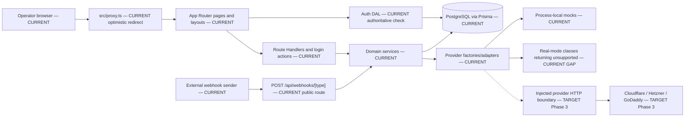
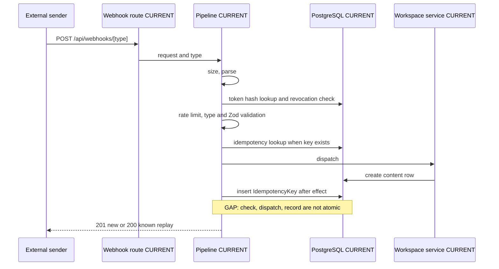
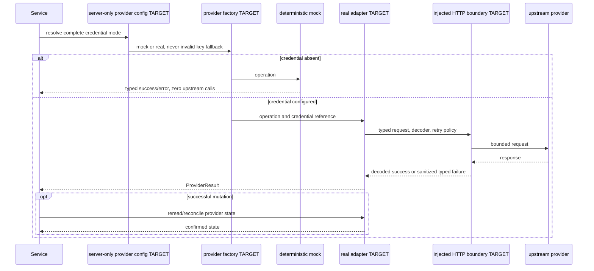

# Inspot Dashboard — Architecture

**Version:** 1.11
**Status:** Q-15 mail labels/filtering and VPS Metrics Agent verified; awaiting user verification
**Owner:** Architect
**Date:** 2026-07-24
**Normative inputs:** `docs/prd.md` v3.11, `docs/design.md` v2.12, Q-13, Q-14, Q-15, `specs/mail-label-filtering-plan.md` v0.3, `docs/remediation-plan.md`, `docs/progress.md`, `docs/idea.md`
**Implementation evidence:** repository state and retained Phase 5 runtime evidence on 2026-07-21

## 0. Reading contract

This document separates repository facts from planned work. Every behavioral statement uses one of these labels:

- **CURRENT** — verified in the repository.
- **GAP** — verified divergence between the repository and approved requirements or the intended boundary.
- **TARGET (Phase N)** — planned remediation. A target path or behavior does not exist until its phase implements and verifies it.

The repository is authoritative for **CURRENT**. PRD v3.1, Design v2, accepted Q-1…Q-13, and the remediation plan are authoritative for **TARGET**. Version 1.3 remains the approved pre-Q-13 snapshot; version 1.4 supersedes its Domains/Servers workspace exception but preserves the historical record.

### 0.1 Changelog

- **v1.11 (2026-07-24):** replaces the per-server `ServerAgentToken` state machine with universal API tokens. Migration `20260724100000_universal_api_tokens` drops the `ServerAgentToken` model and enum; workspace-level `WebhookToken` rows (`channelId: null`) now authenticate both webhook ingestion and `POST /api/server-metrics`, with member-level list/create/revoke/rotate lifecycle in Settings (new `POST /api/webhook-tokens/[id]/rotate`). Server identity is resolved per ingest from reported global IPv4 claims (claim match → provider discovery → agent-only auto-create), metrics states reduce to `not_configured`/`live`/`stale`, the ingestion response body is `{ code, localServerId }`, and the rate-limit key becomes `${tokenId}:${clientIp}`. Rewrites §7C.1–7C.3 and corrects the §4.1 model inventory (33 models).
- **v1.10 (2026-07-21):** reconciles Q-15 with the implemented schema, services, routes, UI, shared live/backfill matcher, one existing Mail scheduler, bounded historical batches, durable leases, retry API, and bounded status polling. Records verified migration, performance, encrypted restore, prior-runtime rollback, restart recovery, regression, and independent-review evidence.
- **v1.9 (2026-07-21):** documents the VPS Metrics Agent system as CURRENT: LocalServer/LocalServerAddress/ServerAgentToken/ServerMetricSnapshot models (4 new, 27 total), SHA-256 token enrollment with IPv4 provider matching, public `POST /api/server-metrics` ingestion endpoint with per-token rate limiting, provider reconciliation with discriminated union DTOs and metrics state composition, ordered credential/workspace deletion, Hetzner pagination, Python 3.12 Docker agent, and `ipaddr.js` IP validation. New section §7C.
- **v1.8 (2026-07-20):** documents the implemented workspace backup/restore slice as CURRENT: the `.inspot-backup` v1 binary container (AES-256-GCM + scrypt + gzip, `src/lib/backup/format.ts`), the versioned JSON payload and section→model mapping (`src/lib/backup/serialization.ts`), the owner-only `/settings/backup` page and `POST /api/backup/{export,import}` routes, single-transaction import with id regeneration/global collision skips, the `BACKUP_MAX_IMPORT_BYTES` / `BACKUP_IMPORT_TX_TIMEOUT_MS` env variables, and the streaming-NDJSON future-work boundary. New section §7B.
- **v1.7 (2026-07-20):** adds the checked-in OpenAPI 3.1.1 contract for the two public webhook ingress operations, the authenticated `/settings/api-docs` Swagger UI, and CI contract validation. Internal dashboard APIs, OIDC, and webhook-management routes remain outside the public specification.
- **v1.6 (2026-07-18):** documents the source-present channel-scoped webhook migration, management/public API contracts, atomic channel-message idempotency, structured message origin, legacy null-channel compatibility, and tokenized-path redaction requirement. Runtime status remains pending.
- **v1.5 (2026-07-18):** documents the implemented Q-14 multi-account mail client as CURRENT: the four-model mail cluster (`MailAccount`, `MailFolder`, extended `MailItem`, `MailAttachment`) with the `20260718130000_mail_client_multi_account` migration and webhook-mailbox backfill; the `src/lib/mail/` transport driver boundary (MOCK/REAL, imapflow + mailparser + nodemailer); the lease-locked sync engine and second in-process scheduler; the full `/api/mail/**` surface; new `MAIL_*` env variables; `serverExternalPackages` and the ES2020 TypeScript target; and the mail security posture (credential encryption, DOMPurify, attachment Content-Type allowlist, send rate limit, accepted private-range SSRF trade-off). Updates page/route/model counters and relaxes the Slice-0 "one migration" P-1 note (see §4.1). New section §7A.
- **v1.4 (2026-07-14):** defines the approved but unimplemented Q-13 target: every visible/operable area follows the active workspace; provider credentials remain deployment-scoped; exclusive resource bindings, repair/forward migrations, stale-context preconditions, durable provider leases, workspace-bound UI/cache/cursors, and facet gates are normative.
- **v1.3 (2026-07-14):** reconciles the document with Next.js 16.2.10, `src/proxy.ts`, 12 pages, 29 route files, 42 handlers, 15 Prisma models, active Settings routes, D-20, FR-MSG-003, AC-ALR-008, the verified webhook idempotency race, real-provider stubs, deployment gaps, and the Phase 3 provider target.
- **v1.2 (2026-07-13):** historical workspace revision.

## 1. Scope and system context

**CURRENT:** Inspot Dashboard is one Next.js App Router application backed by PostgreSQL through Prisma. It is a modular monolith deployed as one application container plus one database container. Browser operators use authenticated dashboard routes. External systems use the public webhook endpoint. Domains and Servers currently read deployment-wide provider-account inventory through provider adapters; this is a Q-13 isolation GAP.

**CURRENT:** The architecture has no microservices, queue, Redis dependency, provider-resource binding table, vault integration, or general provider SDK. The in-process webhook rate limiter and mock-provider state assume one application process; mutable mock state is shared across workspaces.

**TARGET (R2.1e, Phase 3):** Keep the modular monolith. Add local provider-resource binding/operation metadata, a validated provider configuration boundary, a thin injected HTTP boundary, complete adapters, typed error mapping, and tests. Do not persist credentials or provider snapshots, and do not add a queue, vault, general SDK, or separate service.



### 1.1 Architectural layers

| Label            | Layer                                                      | Current responsibility                                                                                   |
| ---------------- | ---------------------------------------------------------- | -------------------------------------------------------------------------------------------------------- |
| CURRENT          | `src/app`, `src/components`                                | App Router layouts/pages, Server Components, interactive Client Components, login actions, REST handlers |
| CURRENT          | `src/lib/auth`                                             | Cookie/session primitives and authoritative operator/workspace resolution                                |
| CURRENT / GAP    | `src/lib/services`                                         | Database-content workspace operations; provider orchestration currently omits workspace bindings         |
| CURRENT          | `src/lib/webhooks`                                         | Public ingest pipeline, dispatch, rate limiting, idempotency lookup/record                               |
| CURRENT          | `src/lib/providers`                                        | DNS/server contracts, factories, deterministic mocks, incomplete real-mode classes                       |
| CURRENT          | `src/lib/db.ts`, Prisma                                    | Prisma client and persisted PostgreSQL state                                                             |
| GAP              | Cross-layer Prisma imports                                 | Five runtime callers outside the intended service/Auth-DAL rule remain; §4.4 lists them                  |
| TARGET (Phase 3) | `src/lib/config/providers.ts`, `src/lib/providers/http.ts` | Central server-only provider configuration and thin injected HTTP behavior; both paths are absent now    |

## 2. Technology and deployment

### 2.1 Exact current stack

| Label   | Component                        | Declared       | Resolved / runtime contract         | Evidence                         |
| ------- | -------------------------------- | -------------- | ----------------------------------- | -------------------------------- |
| CURRENT | Next.js                          | `16.2.10`      | `16.2.10`                           | `package.json`, `pnpm-lock.yaml` |
| CURRENT | React / React DOM                | `19.1.0`       | `19.1.0`                            | `package.json`, `pnpm-lock.yaml` |
| CURRENT | Prisma CLI / client / PG adapter | `^7.8.0`       | `7.8.0`                             | `package.json`, `pnpm-lock.yaml` |
| CURRENT | `pg`                             | `^8.22.0`      | `8.22.0`                            | `package.json`, `pnpm-lock.yaml` |
| CURRENT | Zod                              | `^4.4.3`       | `4.4.3`                             | `package.json`, `pnpm-lock.yaml` |
| CURRENT | Tailwind CSS                     | `^4`           | `4.3.2`                             | `package.json`, `pnpm-lock.yaml` |
| CURRENT | TypeScript                       | `^5`           | `5.9.3`                             | `package.json`, `pnpm-lock.yaml` |
| CURRENT | Vitest                           | `^4.1.10`      | `4.1.10`                            | `package.json`, `pnpm-lock.yaml` |
| CURRENT | Playwright                       | `^1.61.1`      | `1.61.1`                            | `package.json`, `pnpm-lock.yaml` |
| CURRENT | ESLint                           | `^9`           | `9.39.5`                            | `package.json`, `pnpm-lock.yaml` |
| CURRENT | Swagger UI React                 | `5.32.9`       | `5.32.9`                            | `package.json`, `pnpm-lock.yaml` |
| CURRENT | Redocly CLI                      | `2.39.0`       | `2.39.0`                            | `package.json`, `pnpm-lock.yaml` |
| CURRENT | Package manager                  | `pnpm@11.12.0` | lockfile format `9.0`               | `package.json`, `pnpm-lock.yaml` |
| CURRENT | Application image                | —              | `node:24-slim` in all Docker stages | `Dockerfile`                     |
| CURRENT | Database image                   | —              | `postgres:16`                       | `docker-compose.yml`             |

**CURRENT:** A developer workstation may use Node 22, but workstation Node is not a deployment contract. The Docker contract is `node:24-slim`.

### 2.2 Deployment gaps

| Label                          | Finding                                                                                                                                                                                     | Required disposition                                                                                                                |
| ------------------------------ | ------------------------------------------------------------------------------------------------------------------------------------------------------------------------------------------- | ----------------------------------------------------------------------------------------------------------------------------------- |
| CURRENT                        | Compose maps application port `3800` to container port `3000` and database port `3832` to `5432`; the runtime runs migrations before `pnpm run start`.                                      | Preserve unless deployment validation changes the contract.                                                                         |
| CURRENT / PENDING REVALIDATION | Docker, CI, and Playwright use Node 24, Corepack, `pnpm@11.12.0`, and `pnpm-lock.yaml`; dependency installation is frozen-lockfile, and Playwright starts the built application.            | R2.0 implementation is complete; only the three-run `R2.0-G` runtime integration gate remains pending.                              |
| CURRENT                        | Provider credentials are not passed through environment variables at all; they live in the encrypted `ProviderCredential` store and are managed in the UI (`/settings/providers`).          | Preserve; only `CREDENTIAL_ENCRYPTION_KEY` is required in the environment.                                                          |
| CURRENT                        | `src/instrumentation.ts` imports base env validation at Node server startup. `src/lib/config/env.ts` validates database, pagination, webhook limits, and operator authentication variables. | Preserve fail-fast startup.                                                                                                         |
| GAP                            | Base env validation does not validate provider credentials or complete credential sets.                                                                                                     | TARGET (Phase 3): move provider mode selection to centralized, server-only validated configuration.                                 |
| REQUIRED BEFORE DEPLOYMENT     | Channel webhook credentials are embedded in `/api/webhooks/channels/<webhook-id>/<token>`. Default reverse-proxy access/error logging can therefore disclose the credential.                | Reverse proxies **MUST redact the full request path for `/api/webhooks/channels/*`**; verify sanitized log fixtures before rollout. |

## 3. App Router and presentation boundary

### 3.1 Complete current page tree

**CURRENT (2026-07-20):** The application contains 21 `page.tsx` files. The `(dashboard)` route group does not add a URL segment. Beyond the v1.3 table below, later slices added `/services`, `/services/[id]`, `/settings/providers`, `/settings/api-docs`, `/no-workspace`, `/settings/backup`, and — with the Q-14 mail client — `/settings/mail`.

| Label   | URL                   | File                                                      | Boundary and data source                                                                                       |
| ------- | --------------------- | --------------------------------------------------------- | -------------------------------------------------------------------------------------------------------------- |
| CURRENT | `/`                   | `src/app/page.tsx`                                        | Server Component; redirects to `/bookmarks`                                                                    |
| CURRENT | `/login`              | `src/app/login/page.tsx`                                  | Server Component; awaits `searchParams`, renders Client `LoginForm`                                            |
| CURRENT | `/bookmarks`          | `src/app/(dashboard)/bookmarks/page.tsx`                  | Server Component; `requireAuth()` plus workspace-scoped service read                                           |
| CURRENT | `/domains`            | `src/app/(dashboard)/domains/page.tsx`                    | Server Component; `requireAuth()` plus provider aggregation                                                    |
| CURRENT | `/servers`            | `src/app/(dashboard)/servers/page.tsx`                    | Authenticated Server Component shell; Client view fetches API                                                  |
| CURRENT | `/mail`               | `src/app/(dashboard)/mail/page.tsx`                       | Authenticated Server Component shell; Client three-pane mail client (`MailClientView`) fetches API             |
| CURRENT | `/settings/mail`      | `src/app/(dashboard)/settings/mail/page.tsx`              | Authenticated Server Component shell; Client mail-account management (owner-gated mutations)                   |
| CURRENT | `/messages`           | `src/app/(dashboard)/messages/page.tsx`                   | Authenticated Server Component shell; Client view fetches API                                                  |
| CURRENT | `/logs`               | `src/app/(dashboard)/logs/page.tsx`                       | Authenticated Server Component shell; Client view fetches API                                                  |
| CURRENT | `/alerts`             | `src/app/(dashboard)/alerts/page.tsx`                     | Authenticated Server Component shell; Client view fetches API                                                  |
| CURRENT | `/settings`           | `src/app/(dashboard)/settings/page.tsx`                   | Server Component under authenticated dashboard layout; links to active settings destinations                   |
| CURRENT | `/settings/api-docs`  | `src/app/[locale]/(dashboard)/settings/api-docs/page.tsx` | Authenticated Server Component imports the checked-in spec and passes it to a narrow Swagger Client Component  |
| CURRENT | `/settings/backup`    | `src/app/[locale]/(dashboard)/settings/backup/page.tsx`   | Authenticated Server Component computes the owner role; owner sees Client export/import forms, member a notice |
| CURRENT | `/settings/workspace` | `src/app/(dashboard)/settings/workspace/page.tsx`         | Server Component; workspace/member service read, Client mutation forms                                         |
| CURRENT | `/settings/webhooks`  | `src/app/(dashboard)/settings/webhooks/page.tsx`          | Authenticated Server Component shell; Client token management                                                  |

### 3.2 Complete current route-handler families

**CURRENT (2026-07-18):** `src/app/api` contains 48 `route.ts` files and 71 exported handlers: 24 GET, 21 POST, 12 PATCH, 13 DELETE, and 1 PUT. Beyond the v1.3 families below, later slices added Services (`/api/services/**`), provider credentials (`/api/credentials/**`), and Authentik OIDC (`/api/auth/authentik/**`); the Q-14 mail client expanded the Mail family as shown.

| Label   | Family                                 | Current URL patterns and methods                                                                                                                                                                                                                                                                                                          | Files / handlers |
| ------- | -------------------------------------- | ----------------------------------------------------------------------------------------------------------------------------------------------------------------------------------------------------------------------------------------------------------------------------------------------------------------------------------------- | ---------------- |
| CURRENT | Workspaces                             | `GET,POST /api/workspaces`; `PATCH,DELETE /api/workspaces/[id]`; `GET,POST /api/workspaces/[id]/members`; `DELETE /api/workspaces/[id]/members/[memberId]`; `POST /api/workspaces/switch`                                                                                                                                                 | 5 / 8            |
| CURRENT | Bookmark categories and bookmarks      | `POST /api/categories`; `PATCH,DELETE /api/categories/[id]`; `POST /api/bookmarks`; `PATCH,DELETE /api/bookmarks/[id]`                                                                                                                                                                                                                    | 4 / 6            |
| CURRENT | Domains and DNS records                | `GET /api/domains`; `GET,POST /api/domains/[providerId]/[domainId]/records`; `PATCH,DELETE /api/domains/[providerId]/[domainId]/records/[recordId]`                                                                                                                                                                                       | 3 / 5            |
| CURRENT | Servers and power                      | `GET /api/servers`; `GET /api/servers/[id]`; `POST /api/servers/[id]/power`                                                                                                                                                                                                                                                               | 3 / 3            |
| CURRENT | Mail (Q-14 client)                     | `GET /api/mail`; `GET,PATCH,DELETE /api/mail/[id]`; `POST /api/mail/[id]/move`; `GET /api/mail/[id]/attachments/[attachmentId]`; `POST /api/mail/send`; `GET,POST /api/mail/accounts`; `POST /api/mail/accounts/test`; `PATCH,DELETE /api/mail/accounts/[id]`; `POST /api/mail/accounts/[id]/sync`; `GET /api/mail/accounts/[id]/folders` | 10 / 14          |
| CURRENT | Message categories, channels, messages | `GET,POST /api/message-categories`; `PATCH,DELETE /api/message-categories/[id]`; `POST /api/channels`; `PATCH,DELETE /api/channels/[id]`; `GET /api/channels/[id]/messages`                                                                                                                                                               | 5 / 8            |
| CURRENT | Logs                                   | `GET /api/logs`                                                                                                                                                                                                                                                                                                                           | 1 / 1            |
| CURRENT | Alerts and alert categories            | `GET /api/alerts`; `GET,POST /api/alert-categories`; `PATCH,DELETE /api/alert-categories/[id]`                                                                                                                                                                                                                                            | 3 / 5            |
| CURRENT | API tokens (universal)                 | `GET,POST /api/webhook-tokens`; `DELETE /api/webhook-tokens/[id]`; `POST /api/webhook-tokens/[id]/rotate`                                                                                                                                                                                                                                 | 3 / 4            |
| CURRENT | Workspace backup (§7B)                 | `POST /api/backup/export`; `POST /api/backup/import`                                                                                                                                                                                                                                                                                      | 2 / 2            |
| CURRENT | Public webhook ingest                  | `POST /api/webhooks/[type]`                                                                                                                                                                                                                                                                                                               | 1 / 1            |

**GAP:** `src/app/api/channels/[id]/messages/route.ts` exports GET only. No authenticated human-message POST exists, so FR-MSG-003 and AC-MSG-009…014 are not implemented.

**TARGET (Phase 2.7):** Add authenticated `POST /api/channels/[id]/messages` to the existing route file. Derive operator identity from `requireAuth()`, reject blank content and foreign/missing channels, persist origin, and return failure without optimistic success.

**GAP:** No alert-delete handler or `src/app/api/alerts/[id]/route.ts` exists. AC-ALR-008 is not implemented.

**TARGET (Phase 2.5):** Add a workspace-scoped confirmed alert deletion. The minimal proposed route is `DELETE /api/alerts/[id]`; this path is explicitly absent from the current tree. Do not add acknowledge or resolve actions.

### 3.3 Special files and navigation states

| Label            | Finding                                                                                                                                         |
| ---------------- | ----------------------------------------------------------------------------------------------------------------------------------------------- |
| CURRENT          | `src/app/layout.tsx` is the root layout; `src/app/(dashboard)/layout.tsx` resolves auth/workspace and renders the shell.                        |
| CURRENT          | Only Bookmarks has route-level streaming UI: `src/app/(dashboard)/bookmarks/loading.tsx`.                                                       |
| GAP              | No `error.tsx`, `global-error.tsx`, or `not-found.tsx` exists under `src/app`. The other dashboard routes have no route-level loading boundary. |
| TARGET (Phase 4) | Add route-appropriate loading, error/retry, and not-found boundaries where Design v2 requires them. Keep error details sanitized.               |

### 3.4 Server/Client boundaries, fetching, mutation, navigation

**CURRENT:** Pages and layouts remain Server Components by default. They call `requireAuth()` and may call services directly. Interactive boards, dialogs, filters, pagination, power actions, and settings forms are narrow Client Components marked with `"use client"`.

**CURRENT:** Bookmarks and workspace settings load initial database state in Server Components and pass serializable props to Client Components. Domains aggregates providers in its Server Component. Servers, Mail, Messages, Logs, Alerts, and webhook-token settings fetch their Route Handlers from Client views.

**CURRENT:** Most mutations use Client `fetch()` helpers, then update local state or call `router.refresh()`. Login and logout use Server Actions. Internal navigation uses `next/link`, `redirect()`, and `useRouter`; `/` redirects to `/bookmarks`. After login, the Client applies one string-prefix check, `next.startsWith("/")`, before `router.push()`; this is not a validated target.

**GAP:** The prefix check also accepts protocol-relative values such as `//attacker.example`. The Client neither normalizes the value nor proves that it is a same-origin local path.

**TARGET (Phase 2.1):** Accept only a normalized same-origin local path. Reject `//`, encoded or normalized external forms, backslashes, and control characters where applicable; preserve safe deep links. Test malicious and valid targets.

**GAP:** Several Client sections cannot use route-level streaming because their initial read begins after hydration. This is a documented current boundary, not a claim that Client fetching is always preferred.

**TARGET (Phase 4):** Keep interactivity client-side, but move stable initial reads to Server Components when this removes a loading waterfall without duplicating state. Pass only serializable data and keep server-only modules outside the Client graph.

## 4. Persistence and workspace boundary

### 4.1 Exact current Prisma model inventory

**CURRENT (2026-07-24):** `prisma/schema.prisma` defines exactly 33 models. `ServerAgentToken` was dropped by migration `20260724100000_universal_api_tokens` (§7C.1):

1. `Operator`
2. `ExternalIdentity` (Authentik OIDC slice)
3. `Session`
4. `Workspace`
5. `WorkspaceMember`
6. `Category`
7. `Bookmark`
8. `MessageCategory`
9. `Channel`
10. `Message`
11. `MailAccount` (Q-14 mail client)
12. `MailFolder` (Q-14 mail client)
13. `MailItem` (extended by Q-14: account/folder ownership, addresses, bodies, flags, `uid BigInt?`)
14. `MailAttachment` (Q-14 mail client)
15. `MailLabel` (Q-15 labels/filtering)
16. `MailItemLabel` (Q-15 labels/filtering)
17. `MailFilterRule` (Q-15 labels/filtering)
18. `MailFilterRun` (Q-15 durable backfill runs)
19. `Activity` (activity journal slice)
20. `LogEntry`
21. `AlertCategory`
22. `Alert`
23. `Service` (Services slice)
24. `ServiceCheck` (Services slice)
25. `WebhookToken` (universal API tokens — null-channel rows authenticate webhook ingest **and** metrics ingest; channel-scoped rows are channel webhooks)
26. `IdempotencyKey`
27. `OutgoingWebhook` (outgoing webhooks slice)
28. `WebhookDelivery` (outgoing webhooks slice)
29. `ProviderResourceBinding` (Q-13 R2.1e)
30. `ProviderCredential` (provider credentials slice)
31. `LocalServer` (VPS Metrics Agent — durable workspace-local server identity)
32. `LocalServerAddress` (VPS Metrics Agent — IPv4/IPv6 address claims)
33. `ServerMetricSnapshot` (VPS Metrics Agent — latest-only metrics upsert per server)

**CURRENT — VPS Metrics Agent cluster (2026-07-24):**

- `LocalServer` — durable workspace-local identity keyed by `(workspaceId, providerCredentialId, providerRemoteId)`. `origin` enum (`PROVIDER`|`AGENT`) controls which fields are required: PROVIDER must have the provider credential FK and remoteId; AGENT must have null provider fields. CHECK constraint (`LocalServer_origin_provider_tuple_check`) enforces this at the database level. `providerMissingAt` tracks servers no longer reported by the provider.
- `LocalServerAddress` — per-server IP addresses with `family` (IPV4/IPV6), `scope` (GLOBAL/PRIVATE/LINK_LOCAL/LOOPBACK/RESERVED/OTHER), `source` (AGENT/PROVIDER), and enrollment claim management (`isCurrent`, `retiredAt`, `matchKey`, `isEnrollmentClaim`). Partial unique index `local_server_address_one_current_ipv4_claim` ensures at most one current global IPv4 claim per address string per workspace.
- Agent authentication — no dedicated token model. Migration `20260724100000_universal_api_tokens` dropped `ServerAgentToken` (and its state enum); metrics ingestion authenticates with universal API tokens: workspace-level `WebhookToken` rows with `channelId: null` (§7C.1). Server identity is resolved per ingest from reported global IPv4 claims, never from the token.
- `ServerMetricSnapshot` — latest-only upsert per `localServerId` (1:1). Stores CPU usage, load averages, memory/swap/filesystem totals and available bytes (BigInt), uptime, hostname, agent version. `receivedAt` drives the 180-second stale threshold.
  **CURRENT — P-1 note revision (2026-07-18):** the Slice-0 decision P-1 ("full schema in one initial migration, no per-slice incremental models") applied to the original 13-entity baseline. Later feature slices legitimately extend the schema with reviewed, hand-authored follow-on migrations (workspaces, Q-13 ownership, provider credentials, bookmark color, services, category hierarchy, external identity, and `20260718130000_mail_client_multi_account`). P-1 now means "no _unreviewed ad-hoc_ incremental models", not "the schema never grows"; the same note is updated in the `prisma/schema.prisma` header comment.

**CURRENT — Q-14 mail cluster:**

- `MailAccount` — per-workspace mailbox: `kind WEBHOOK|IMAP`, `mode` (existing `ProviderMode` MOCK/REAL), IMAP/SMTP host/port/`MailSecurity SSL|STARTTLS`, username, AES-256-GCM password payload (`encryptedData`/`iv`/`authTag`/`maskedHint` — same scheme as `ProviderCredential`), `isValid`/`lastCheckedAt`, and sync bookkeeping (`syncStatus IDLE|SYNCING|ERROR`, `syncError`, `lastSyncAt`, `nextSyncAt`, `syncLeaseExpiresAt`, `syncIntervalSeconds` default 300). Composite `@@unique([id, workspaceId])`; the scheduler due-query index `[isActive, nextSyncAt]` is intentionally not workspace-prefixed (cross-tenant sweep). At most one WEBHOOK account per workspace is enforced by a raw partial unique index in the migration SQL (`WHERE "kind" = 'WEBHOOK'`), plus lazy get-or-create in the service. The migration backfills a system WEBHOOK account and an «Входящие» INBOX folder for every existing workspace and re-homes legacy `MailItem` rows onto them.
- `MailFolder` — composite-FK child of `MailAccount` with `path`, Russian-mapped `specialUse` (`INBOX|SENT|DRAFTS|TRASH|JUNK|ARCHIVE|OTHER`), `position` (INBOX first), and IMAP sync positions `uidValidity BigInt?` / `lastSeenUid BigInt?`. `@@unique([accountId, path])` makes folder upserts idempotent.
- `MailItem` — extended, not replaced: renamed `sender`→`fromAddress` and `body`→`bodyText` (SQL `RENAME COLUMN`), plus `fromName`, JSON recipient lists, `replyToAddress`, `bodyHtml`, `snippet`, flags (`isRead`/`isAnswered`/`isFlagged`/`hasAttachments`), and `uid BigInt?` (null for webhook items). `@@unique([folderId, uid])` gives idempotent sync upserts; per-folder keyset and unread-count indexes exist alongside the preserved `[workspaceId, receivedAt, id]` index.
- `MailAttachment` — metadata captured at sync (`partId`, `filename`, `contentType`, `sizeBytes`, `contentId`, `isInline`) with lazily cached binary `content Bytes?` + `fetchedAt` (bytea-in-database storage: one container + PostgreSQL, database-only backups, free cascade on workspace deletion).

**CURRENT SOURCE / PENDING RUNTIME — channel webhooks:** migration `20260718170000_channel_webhooks` adds nullable `WebhookToken.channelId/channelWorkspaceId`, a strict both-null-or-both-present CHECK, workspace equality CHECK, and compound `Channel(id, workspaceId)` FK with cascade. Null-channel rows remain legacy workspace-wide tokens. `Message.origin` uses `MessageOrigin { LEGACY, OPERATOR, WEBHOOK }`; the migration default/backfill is `LEGACY`, while new operator and channel-webhook writes explicitly persist their origin. `Message.author` remains the immutable display-name snapshot. Channel deletion cascades its scoped tokens, then existing token→idempotency cascade removes their keys.

**BigInt boundary rule (CURRENT):** `uid`/`uidValidity` are `BigInt` and are always serialized with `.toString()` in DTOs; Prisma rows are never returned raw from mail routes. This required raising the TypeScript `target` to ES2020 (see §7A.5).

### 4.2 Current ownership boundary and Q-13 replacement

| Label                            | Data family         | Ownership and persistence                                                                                                                                                                                                                                                                                                |
| -------------------------------- | ------------------- | ------------------------------------------------------------------------------------------------------------------------------------------------------------------------------------------------------------------------------------------------------------------------------------------------------------------------ |
| CURRENT                          | Auth and workspace  | `Operator`, `Session`, `Workspace`, `WorkspaceMember` persist in PostgreSQL. `Session.activeWorkspaceId` selects the active workspace.                                                                                                                                                                                   |
| CURRENT                          | Bookmarks           | `Category.workspaceId` owns categories; `Bookmark` is a category child.                                                                                                                                                                                                                                                  |
| CURRENT                          | Messages            | `MessageCategory.workspaceId` owns categories; `Channel` and `Message` are children.                                                                                                                                                                                                                                     |
| CURRENT                          | Mail (Q-14)         | `MailAccount.workspaceId` owns accounts; `MailFolder` and `MailItem` are composite-FK children carrying both direct `workspaceId` and parent-workspace shadows; `MailAttachment` is a `MailItem` child. The system WEBHOOK account is workspace-unique via a partial unique index.                                       |
| CURRENT                          | Logs                | `LogEntry.workspaceId` directly owns rows.                                                                                                                                                                                                                                                                               |
| CURRENT                          | Alerts              | `AlertCategory.workspaceId` currently provides the only workspace path for `Alert`.                                                                                                                                                                                                                                      |
| CURRENT SOURCE / PENDING RUNTIME | Webhook tokens      | `WebhookToken.workspaceId` owns every token and `IdempotencyKey` is a token child. Null-channel tokens retain Q-9 workspace-wide behavior; non-null `channelId/channelWorkspaceId` creates a message-only capability for one channel.                                                                                    |
| CURRENT                          | Server Metrics      | `LocalServer.workspaceId` owns server identity; `LocalServerAddress` and `ServerMetricSnapshot` are children. Metrics ingestion authenticates with workspace-level universal API tokens (`WebhookToken`, `channelId: null`). Provider reconciliation upserts LocalServer rows per `(workspaceId, providerCredentialId, providerRemoteId)` tuple. Agent-only servers carry AGENT origin without provider binding. |
| CURRENT / GAP                    | Domains and Servers | Provider DTOs only. There are no local bindings, so every workspace sees the same provider-account and mutable mock inventory.                                                                                                                                                                                           |
| TARGET (Q-13, R2.1e)             | Domains and Servers | `ProviderResourceBinding` exclusively assigns each real or mock resource to one workspace. Reads and operations start from `(workspaceId, localBindingId)`; a foreign/missing binding returns non-disclosing 404 before provider access.                                                                                 |
| TARGET (Q-13)                    | Workspace lifecycle | Switching changes all content and operations. Workspace deletion removes idle local bindings and local content but never deletes upstream provider resources. Provider credentials remain deployment-level `.env` secrets.                                                                                               |

### 4.3 Verified ownership gaps

**GAP:** Bookmark categories are scoped correctly, but bookmark child mutations are not. `POST /api/bookmarks` discards the workspace from `requireAuth()` and accepts any `categoryId`. `PATCH` and `DELETE /api/bookmarks/[id]` operate by bookmark id alone. `src/lib/services/bookmarks.ts` therefore permits create, move, update, or delete without proving that the bookmark and target category belong to the active workspace.

**TARGET (Phase 2.1):** Pass `workspaceId` into every bookmark child mutation. Scope bookmark lookup through `category.workspaceId`, validate both source and destination ownership, return a non-disclosing not-found response for foreign ids, and add cross-workspace API/e2e tests.

**GAP:** `PATCH` and `DELETE /api/workspaces/[id]`, `GET` and `POST /api/workspaces/[id]/members`, and `DELETE /api/workspaces/[id]/members/[memberId]` call `requireAuth()` but do not authorize the target workspace or owner role. `src/lib/services/workspaces.ts` accepts arbitrary target ids, so membership in the active workspace does not prevent reading or mutating another workspace by id.

**TARGET (Phase 2.1):** Require target-workspace membership for member-list reads. Require the target workspace's owner role for rename, delete, add-member, and remove-member mutations, as defined by the PRD owner boundaries. Return a non-disclosing response for foreign ids, and add API/e2e isolation tests for member and non-member callers.

**GAP:** `Alert.alertCategoryId` is nullable with `onDelete: SetNull`, but `Alert` has no `workspaceId`. Deleting a category can therefore remove the only workspace ownership path. The current list query filters through `alertCategory.workspaceId`, so a null-category alert becomes inaccessible; a future id-only delete would also lack an ownership predicate.

**TARGET (Phase 2.5):** Add durable workspace ownership to `Alert` and scope list/delete by that field. Keep category optional if reassign-to-uncategorized remains the chosen no-orphan behavior. Backfill category-linked alerts during migration; explicitly disposition any legacy null-category rows whose workspace cannot be inferred before enforcing the relation.

**GAP:** `Message` stores optional `author` text but no explicit origin and no authoring operator relation. The current UI composer is demo-only and does not persist.

**TARGET (Phase 2.7):** Add persisted `operator | webhook` origin. Store the authenticated `operatorId` for operator posts; retain a sanitized available source for webhook posts. Backfill existing persisted messages as webhook-origin, because current operator compose does not write. Render origin in the feed.

### 4.4 Prisma access boundary

**CURRENT:** Exactly 13 files under `src` import `@/lib/db`: seven service modules and six files outside `src/lib/services`.

| Label   | Group                                   | Files                                                                                                                                                              |
| ------- | --------------------------------------- | ------------------------------------------------------------------------------------------------------------------------------------------------------------------ |
| CURRENT | Intended service callers                | `services/alerts.ts`, `bookmarks.ts`, `logs.ts`, `mail.ts`, `messages.ts`, `webhookTokens.ts`, `workspaces.ts`                                                     |
| CURRENT | Intended authoritative DAL              | `src/lib/auth/dal.ts`                                                                                                                                              |
| GAP     | Direct callers outside service/DAL rule | `src/app/login/actions.ts`, `src/app/api/workspaces/switch/route.ts`, `src/lib/auth/session.ts`, `src/lib/webhooks/idempotency.ts`, `src/lib/webhooks/pipeline.ts` |

**TARGET (Phase 2):** ADR-012 keeps services and the authoritative auth DAL as runtime Prisma entry points. Move membership lookup, session persistence, webhook token lookup, and idempotency persistence behind narrow service/DAL functions. `src/lib/db.ts` remains the only Prisma client constructor. `prisma/seed.ts` remains an operational bootstrap path, not a request-layer exception.

**CURRENT:** Mail, Logs, Alerts, and Messages use cursor pagination with timestamp/id tie-breakers and `LIST_PAGE_SIZE`. Text search uses Prisma case-insensitive `contains`; no trigram/full-text index exists.

**CURRENT:** The pagination-only substring-search fallback remains explicit. The 500 ms indexed-read objective does not cover substring scans. A future trigram/full-text change requires a measured need and a migration; it is not part of this rewrite.

### 4.5 Q-13 target relational contract — not implemented

**TARGET (R2.1a/e):** The schema below is normative for the Q-13 relational contract. The current 23-model schema (ten committed migrations as of 2026-07-18) implements it only partially; unimplemented rows remain TARGET.

| Model                           | Required Q-13 ownership and relation                                                                                                                                                                                                                                                                                                                                                                                       |
| ------------------------------- | -------------------------------------------------------------------------------------------------------------------------------------------------------------------------------------------------------------------------------------------------------------------------------------------------------------------------------------------------------------------------------------------------------------------------- |
| `WorkspaceMember`               | Replace free-form/default role with `WorkspaceRole { OWNER, MEMBER }`; preserve `@@unique([workspaceId, operatorId])`. A workspace and operator must each retain at least one membership, and a workspace must retain at least one owner.                                                                                                                                                                                  |
| `Session`                       | Add nullable `activeWorkspaceOperatorId`. Replace the direct `Session.activeWorkspaceId → Workspace.id` FK with composite `(activeWorkspaceId, activeWorkspaceOperatorId) → WorkspaceMember(workspaceId, operatorId) ON DELETE SET NULL`. SQL CHECK requires either both active fields NULL, or both non-NULL with `activeWorkspaceOperatorId = operatorId`; the application writes the authenticated `operatorId` shadow. |
| `Category → Bookmark`           | `Category` gains `@@unique([id, workspaceId])`. `Bookmark` gains required `workspaceId` and `categoryWorkspaceId`; CHECK `categoryWorkspaceId = workspaceId`; composite FK `(categoryId, categoryWorkspaceId) → Category(id, workspaceId) ON DELETE CASCADE`.                                                                                                                                                              |
| `MessageCategory → Channel`     | `MessageCategory` gains `@@unique([id, workspaceId])`. `Channel` gains required `workspaceId` and `messageCategoryWorkspaceId`; equality CHECK; composite parent FK with cascade.                                                                                                                                                                                                                                          |
| `Channel → Message`             | `Channel` gains `@@unique([id, workspaceId])`. `Message` gains required `workspaceId` and `channelWorkspaceId`; equality CHECK; composite parent FK with cascade.                                                                                                                                                                                                                                                          |
| `AlertCategory → Alert`         | `AlertCategory` gains `@@unique([id, workspaceId])` and `@@unique([workspaceId, name])`. `Alert` gains required `workspaceId` and nullable `alertCategoryWorkspaceId`; composite `(alertCategoryId, alertCategoryWorkspaceId) → AlertCategory(id, workspaceId) ON DELETE SET NULL`.                                                                                                                                        |
| `WebhookToken → IdempotencyKey` | `WebhookToken` gains `@@unique([id, workspaceId])`. `IdempotencyKey` gains required `workspaceId` and `tokenWorkspaceId`; equality CHECK; composite parent FK with cascade.                                                                                                                                                                                                                                                |
| Existing roots                  | `Category`, `MessageCategory`, `MailItem`, `LogEntry`, `AlertCategory`, and `WebhookToken` retain required direct `workspaceId`. `Workspace` gains inverse relations for every direct owner, including all new children and provider bindings.                                                                                                                                                                             |

The Alert optional-pair constraint is strict despite PostgreSQL `MATCH SIMPLE`:

```sql
CHECK (
  ("alertCategoryId" IS NULL AND "alertCategoryWorkspaceId" IS NULL)
  OR
  ("alertCategoryId" IS NOT NULL
   AND "alertCategoryWorkspaceId" IS NOT NULL
   AND "alertCategoryWorkspaceId" = "workspaceId")
)
```

`Session` uses this strict predicate: both active fields are NULL, or both are non-NULL and `activeWorkspaceOperatorId = operatorId`. Its composite FK still targets the active `(workspaceId, operatorId)` membership; partial-null rows must fail. The forward migration must drop these superseded single-column FKs after the compound FKs exist: `Bookmark_categoryId_fkey`, `Channel_messageCategoryId_fkey`, `Message_channelId_fkey`, `Alert_alertCategoryId_fkey`, and `IdempotencyKey_tokenId_fkey`. PostgreSQL 16 verification must prove their absence and exercise populated cascades, `Alert` composite `SET NULL`, and binding `RESTRICT` behavior.

Workspace-leading indexes are required on every scoped lookup path: category/child ordering; channel/message keyset pagination; mail/log/alert time cursors; alert category, severity, and source filters; token/idempotency lookup; and binding workspace/provider/type/mode/lease scans. Existing non-workspace indexes may remain only when a measured global operational query uses them.

### 4.6 `ProviderResourceBinding` target

**TARGET (R2.1e):** `ProviderResourceBinding` is local ownership/operation metadata, not a credential store or provider snapshot.

| Field family        | Contract                                                                                                                                                                                                                                                                                                                                                                                                                                                                                                                                                                                                                                                                      |
| ------------------- | ----------------------------------------------------------------------------------------------------------------------------------------------------------------------------------------------------------------------------------------------------------------------------------------------------------------------------------------------------------------------------------------------------------------------------------------------------------------------------------------------------------------------------------------------------------------------------------------------------------------------------------------------------------------------------- |
| Identity            | Local `id`; required `workspaceId` with `ON DELETE RESTRICT`; `provider`, exact `ProviderResourceType` values `{DOMAIN, SERVER}` in `resourceType`, and `mode`; non-secret stable `accountKey`; stable provider `remoteId`; `displayName`; optimistic `version`. Global uniqueness is `(provider, accountKey, resourceType, mode, remoteId)`, which makes one remote resource exclusive to one workspace.                                                                                                                                                                                                                                                                     |
| Mock identity       | `accountKey = 'mock:v1'`; `remoteId = 'mock:v1:<workspaceId>:<provider>:<key>'`. REAL rows cannot use a `mock:` prefix. No mutable module-global mock state remains.                                                                                                                                                                                                                                                                                                                                                                                                                                                                                                          |
| Identity validation | Application and SQL enforce UTF-8 bounds: `accountKey` 1–256 bytes, `remoteId` 1–512, `displayName` 1–512; values are trimmed and contain no control characters. Provider/resource-type pairs are restricted by CHECK.                                                                                                                                                                                                                                                                                                                                                                                                                                                        |
| Operation lease     | Exact fields are `operationState`, `operationId`, `operationKind`, `operationIntent`, `operationStartedAt`, `operationLeaseExpiresAt`, `lastReconciledAt`, and `version`. `operationState` is `IDLE`, `RUNNING`, or `RECONCILE_REQUIRED`; `operationId` is unique. The CHECK treats `operationId`, `operationKind`, credential-free canonical `operationIntent`, `operationStartedAt`, and `operationLeaseExpiresAt` as one active-evidence group: all are NULL in `IDLE`, and all are non-NULL in `RUNNING` or `RECONCILE_REQUIRED`. `lastReconciledAt` is optional reconciliation metadata outside that group. Intent is at most 16 KiB and must never contain credentials. |
| Indexes             | Required indexes are unique `(id, workspaceId)`, workspace-leading `(workspaceId, resourceType, provider, mode)`, lease `(operationState, operationLeaseExpiresAt)`, and global identity unique `(provider, accountKey, resourceType, mode, remoteId)`.                                                                                                                                                                                                                                                                                                                                                                                                                       |

`Workspace` deletion first requires all bindings `IDLE`, then deletes local binding rows in a controlled transaction; it never sends provider delete calls. The Prisma relation remains `Restrict` so an accidental cascade cannot bypass this gate.

### 4.7 Existing-database repair and forward migration

**TARGET (R2.1a):** Deployment enters maintenance mode before repair. A signed repair manifest covers every existing operator/content row exactly once: desired memberships; all roots (`Category`, `MessageCategory`, `MailItem`, `LogEntry`, `AlertCategory`, `WebhookToken`); every null-category `Alert`; every `Session`, including an explicit null destination; and every orphan disposition (attach or delete with data-loss acknowledgement). Preflight verifies source digest, full coverage, referential validity, reserved-value collisions, and zero guessing. It detects duplicate `AlertCategory (workspaceId, name)` groups; each group requires an explicit human merge/rename disposition in the manifest or the repair aborts.

Repair runs at `SERIALIZABLE` under an advisory lock and writes **only columns that already exist**: membership string roles, root `workspaceId`, existing child parent ids, `Session.activeWorkspaceId`, and `Alert.alertCategoryId`. A null-category Alert is transported through a temporary `AlertCategory` whose id is exactly `q13-repair-uncategorized:<workspaceId>` and whose reserved key is `(workspaceId, '__q13_repair_uncategorized__')`. Any collision aborts before writes.

The committed Q-13 forward migration is one explicit `BEGIN`/`COMMIT` unit:

1. Re-run guards and reserved-id/name collision checks.
2. Create `WorkspaceRole`; remove the legacy role default; convert only `owner`/`member` values.
3. Drop the old Session→Workspace FK, add/derive the operator shadow only for valid memberships, then add the composite membership FK and strict optional-pair CHECK.
4. Add direct child ownership and parent-workspace shadows; derive them from repaired parents; add equality CHECKs, parent composite uniques, and compound FKs; then remove superseded single-column FKs.
5. Add/derive durable Alert ownership from repaired categories. For sentinel Alerts, derive `workspaceId`, null both category columns, delete all sentinels, and assert zero sentinel ids/names/rows.
6. Add workspace-leading indexes, `ProviderResourceBinding`, identity/state CHECKs, and generated mock-resource inserts.
7. Commit only after every invariant query returns zero violations.

If repair commits but the forward migration fails, PostgreSQL rolls back the forward transaction completely. The repaired rows remain compatible with the old binary; maintenance stays enabled, the new binary is prohibited, and operators inspect Prisma/PostgreSQL diagnostics before retrying. No guessed down migration or data rewrite is allowed.

Fresh installation remains an exact historical replay: `init` → historical workspace migration with zero operator/content → Q-13 forward migration with zero workspace/mock rows → updated transactional seed. The seed creates the operator, workspace, `OWNER` membership, and mock bindings. Do not squash, edit, or baseline old migrations.

### 4.8 Canonical mock manifest and migration parity

`prisma/mock-provider-resources.v1.json` is the canonical mock catalog. A deterministic pre-release generator canonicalizes JSON, computes SHA-256, and writes an immutable version/hash header plus a marked SQL `VALUES` region into the checked-in Q-13 migration. The SQL performs `Workspace CROSS JOIN VALUES` inside the migration transaction and uses the exact global identity conflict key. PostgreSQL never imports JSON at runtime.

CI regenerates the SQL region and compares version, SHA-256, and bytes. Prisma's migration checksum remains authoritative. `seed`, `createWorkspace`, and provider adapters read the same JSON. A changed catalog requires a new versioned JSON file and a new forward migration; editing an applied migration is forbidden.

Production order is fixed: maintenance on → preflight → manifest repair → repair verification → `prisma migrate deploy` → `pg_constraint`/index/manifest parity inspection → application smoke → maintenance off. Repair and migration execute with provider credentials unavailable and must make zero network/provider calls.

The mandatory PostgreSQL 16 gate covers fresh replay, repaired replay, forced forward failure/retry, sentinel success/collision/zero-remnant checks, partial-null rejection, composite cascades/`SET NULL`, binding `RESTRICT`, identity length/control/prefix checks, lease-state checks, JSON↔SQL byte parity, Prisma validate/checksum, and zero provider/network access.

**CURRENT:** `src/proxy.ts` is an optimistic redirect layer. It checks only whether the `session` cookie exists. It redirects missing-cookie requests to `/login?next=<pathname>` and excludes login, public webhooks, framework assets, and the favicon from its matcher. It performs no database authorization.

## 5. Authentication, session, and proxy

**CURRENT:** `src/lib/auth/dal.ts` is authoritative. `requireOperator()` verifies a live database session and operator. `requireAuth()` additionally verifies `Session.activeWorkspaceId` membership; if invalid or unset, it selects the earliest membership and updates the session. Dashboard layout and authenticated Route Handlers use this server-side result.

**CURRENT:** Session ids are opaque random values stored in PostgreSQL. The cookie is HTTP-only, secure, same-site `lax`, path `/`, and expires after seven days. Logout deletes the database session and cookie. Password verification uses scrypt. Base env validation accepts `OPERATOR_PASSWORD_HASH` as preferred and `OPERATOR_PASSWORD` as a development convenience; if both exist, the hash wins.

**GAP:** Cookie presence in the proxy never proves identity or workspace membership. Any document or test that treats the proxy as authoritative is incorrect.

**GAP:** Active-workspace resolution does not authorize a different workspace id supplied to an administration handler. §4.3 records this target-workspace ownership gap.

**TARGET (Phase 2.1):** Preserve the two-tier design: fast optimistic redirect in `src/proxy.ts`, authoritative database validation in the DAL on every protected request. Add coverage for expired sessions, removed membership, workspace fallback, and switch authorization. Enforce the workspace-administration boundary in §4.3 and the safe login target in §3.4 while preserving valid deep links.

**TARGET (Phase 3):** Add `import "server-only"` guards to database, auth, config, and provider modules where applicable. This prevents accidental import into a Client Component; it does not replace request-time authorization.

### 5.1 Q-13 request-context and authorization order — not implemented

**TARGET (R2.1b/c):** `WorkspaceRole` has exactly `OWNER` and `MEMBER`. A member may use normal content, DNS record operations, server power actions, create a new workspace, and list members. An owner additionally renames/deletes the workspace, adds/removes members, discovers/claims/removes provider bindings, and participates in binding transfer. The service layer rejects removal of the last owner or an operator's last workspace membership. Session fallback is deterministic. Mutations acquire locks in this order: workspace → operator → membership → provider binding.

Workspace creation trims the name and rejects an empty result. It produces a nonempty ASCII slug; a Cyrillic-only name uses a deterministic nonempty ASCII fallback. Slug candidates are `base`, `base-2`, and so on, with at most five candidates. Each candidate runs in a fresh top-level transaction that creates the workspace and caller's `OWNER` membership. Catch occurs outside the transaction callback: retry only the named `Workspace_slug_key` constraint, fail every non-slug error immediately, and return a typed conflict when the bound is exhausted. Tests must prove the fresh-transaction boundary, retry-only behavior, non-slug immediate failure, Cyrillic fallback, and five-candidate exhaustion.

Every session-authenticated browser API method requires `X-Inspoter-Workspace`, including workspace list, create, administration, and switch. Login, logout, public webhook ingest, static assets, and direct Server Component reads are the only exceptions. The header is non-empty ASCII, at most 128 bytes, and comes from the workspace rendered by the initial RSC response.

The server processes a request in this exact order:

1. Validate the session and resolve its active membership from the database.
2. Parse the expected-workspace header. Missing or malformed returns `400` with `WORKSPACE_CONTEXT_REQUIRED`.
3. Compare the header with the session workspace. Mismatch returns `409` with `WORKSPACE_CONTEXT_STALE`.
4. Apply target-resource membership/role authorization.
5. Only then perform a business query, cache read, write, binding lookup, or provider/network call.

The header is a stale-session precondition, never a workspace selector or authority. The switch request sends the current workspace in the header and the destination membership in the body. A foreign or missing local id returns the same non-disclosing 404 before provider access.

### 5.2 Q-13 browser, cache, and cursor boundary — not implemented

The dashboard renders a keyed `WorkspaceBoundary`. On switch or `409 WORKSPACE_CONTEXT_STALE`, the client aborts old requests, discards old response state, clears workspace-bound client caches, refreshes the RSC tree, and remounts by workspace id. GET reads may refetch after refresh; mutations never retry automatically.

Workspace responses are private and non-cacheable: `Cache-Control: private, no-store, max-age=0`, with `Vary: Cookie, X-Inspoter-Workspace`. Do not use shared Next.js caches for workspace data. Any future cache key includes workspace id and authorization dimension. Every cursor is an opaque versioned envelope bound to workspace, normalized filter, and sort/order; malformed envelopes and replays under any mismatched binding are rejected before a database query.

Domains, DNS records, Servers, Bookmarks, Mail, Messages, Logs, Alerts, Settings, and tokens all obey this boundary. A stale in-flight response cannot repaint a newly selected workspace.

## 6. Public webhook architecture

### 6.1 Current ordered pipeline

**CURRENT:** The public token-authenticated Route Handler families are legacy `POST /api/webhooks/[type]` and channel-scoped `POST /api/webhooks/channels/[webhookId]/[token]`; neither requires a session. `/login` and its login Server Action are the separate public human-authentication surface. `src/lib/webhooks/pipeline.ts` processes legacy requests in this order:

1. Enforce declared and streamed body-size limits.
2. Parse JSON.
3. Parse Bearer authorization, hash the token, load `WebhookToken`, and reject missing, invalid, or revoked tokens.
4. Apply the process-local fixed-window rate limit by token id.
5. Resolve the type schema and validate the payload with Zod.
6. Check an optional token-scoped idempotency key.
7. Dispatch synchronously to the workspace-scoped Mail, Message, Log, or Alert service.
8. Insert the idempotency record after dispatch.
9. Return `201` for a new effect or `200` for a previously recorded key.

**CURRENT:** The endpoint returns structured errors for 401, 400, 413, and 429. It sets `Retry-After` for its own rate limit. A missing idempotency key intentionally permits duplicate effects under retry.



### 6.2 Idempotency invariant

**CURRENT:** Prisma enforces `@@unique([tokenId, key])` on `IdempotencyKey`.

**GAP:** The code performs check → dispatch → record outside a transaction. Concurrent requests with the same new key can both create effects before one idempotency insert loses the unique race. The losing insert error is swallowed, so uniqueness protects only the key table, not the side effect.

**TARGET (Phase 2.2):** Claim the token/key before dispatch and keep claim, content creation, and final target id under transaction semantics. A duplicate completed claim returns `200` with the stored id; a new claim returns `201` after commit. A failed transaction must not leave a successful-looking claim. Add concurrent same-key tests that prove exactly one effect, replay tests, no-key duplicate tests, and failure/rollback tests.

**CURRENT:** The rate limiter is a module-scope map. It resets on restart and is not shared across replicas.

**TARGET (Phase 2.2):** Keep the in-process limiter for the single-process deployment and test its exact limits. A shared limiter becomes necessary only if deployment topology changes.

### 6.3 Channel-scoped message webhooks — current source, runtime pending

Authenticated management routes call `requireAuthWithWorkspaceHeader`; all workspace members may manage webhooks, and foreign channel/webhook ids are mapped to non-disclosing `404`:

| Method and route                                 | Request                         | Success                                                               |
| ------------------------------------------------ | ------------------------------- | --------------------------------------------------------------------- |
| `GET /api/channels/[id]/webhooks`                | no body                         | `200` metadata array without secret/hash                              |
| `POST /api/channels/[id]/webhooks`               | strict `{ name }`, trimmed 1–80 | `201 { webhook, url }`; `url` is a relative tokenized path shown once |
| `DELETE /api/channels/[id]/webhooks/[webhookId]` | no body                         | `204`, including repeated revoke of the same existing webhook         |

Legacy `/api/webhook-tokens/**` service queries explicitly require `channelId: null`, so they cannot list or revoke channel credentials. Creation generates 24 random bytes encoded as 48 hex characters; persistence contains only SHA-256 and the 12-character prefix. The browser accepts only a single-leading-slash path, resolves it against `window.location.origin`, verifies same-origin, and keeps URL/cURL in component state until the dialog closes.

`src/lib/webhooks/channelPipeline.ts` enforces declared/streamed body limit → JSON parse → exact id+SHA-256 credential lookup → per-token rate limit → strict payload validation → optional idempotency-key validation → message create. Payload is `{ content: string, author?: string }`, with trimmed content 1–4000 and optional trimmed author 1–80; unknown keys such as `channelId` fail `400`, and absent author uses the configured webhook name. `Idempotency-Key`, when present, is 1–128 printable ASCII.

For keyed delivery, lookup, `Message(origin=WEBHOOK)` insert, and `IdempotencyKey` insert share one transaction. A `P2002` loser reads the winner after rollback and returns `200 { id }`; a new commit returns `201 { id }`. Invalid/revoked/cascade-deleted credentials return `401`; malformed JSON/schema/key `400`; oversized body `413`; throttle `429` with `Retry-After`. No-key retries remain at-least-once. Responses set `Cache-Control: no-store`, `Referrer-Policy: no-referrer`, and `X-Content-Type-Options: nosniff`.

Management responses pass through `jsonResponse`/`emptyResponse`, which add `Cache-Control: private, no-store` and workspace `Vary`; GET/POST additionally set `Referrer-Policy: no-referrer`. This is source-present and unit-asserted, but runtime revalidation remains pending. Application and proxy logs must never record route parameters; reverse-proxy path redaction is a deployment gate because application response headers cannot sanitize upstream access logs.

### 6.4 Public OpenAPI and protected Swagger UI

**CURRENT:** `specs/openapi.json` is the repository artifact for OpenAPI 3.1.1. It declares only `POST /api/webhooks/{type}` and `POST /api/webhooks/channels/{webhookId}/{token}`. Internal dashboard APIs, Authentik OIDC, and webhook-management routes are outside its scope. Both ingress routes derive the workspace from the webhook credential and omit `X-Inspoter-Workspace`.

The localized `/settings/api-docs` page stays inside the authenticated dashboard layout. Its Server Component imports the JSON artifact and passes the object to a Client Swagger component; the client bundle does not import the specification directly. The application exposes no `/openapi.json`, `url`, or `configUrl` endpoint. Swagger receives `spec` with POST-only submission, disabled authorization persistence and query configuration, and no external validator.

The legacy operation uses HTTP Bearer authentication. The channel operation declares `security: []` because its credential is the required path `token`; the schema marks that parameter as sensitive and supplies no example or default. API descriptions and examples are English, while the surrounding page follows the dashboard locale. Channel webhook URLs remain secrets and must stay out of logs, storage, snapshots, screenshots, and CI artifacts.

`pnpm openapi:check` runs Redocly lint and `scripts/check-public-openapi.mjs`. The checker pins the two-path/two-POST boundary, confirms the route files export `POST`, and rejects workspace headers, external server URLs, and secret examples. The full CI profile runs this gate before lint, type checking, database setup, tests, and build; the e2e-only profile remains unchanged.

## 7. Provider architecture

### 7.1 Current contracts and mode selection

**CURRENT:** Provider operations return exactly one of these `ProviderResult<T>` shapes:

| Label   | Shape                                                   | Current HTTP mapping                                    |
| ------- | ------------------------------------------------------- | ------------------------------------------------------- |
| CURRENT | `{ ok: true, data: T }`                                 | configured success status; `undefined` data becomes 204 |
| CURRENT | `{ ok: false, kind: "error", message: string }`         | 502                                                     |
| CURRENT | `{ ok: false, kind: "unsupported", operation: string }` | 501                                                     |

**CURRENT:** DNS factories return Cloudflare, Hetzner DNS, and GoDaddy providers. Server factory returns Hetzner Cloud. Providers are built exclusively from workspace `ProviderCredential` records (managed in the UI at `/settings/providers`, encrypted with `CREDENTIAL_ENCRYPTION_KEY`). There is no env-var or mock fallback: a workspace without credentials gets an empty provider list, and `/domains` / `/servers` render empty states.

**GAP:** Every real-mode operation currently returns `unsupported`; no upstream request exists. Credential presence therefore does not mean a working real integration.

**CURRENT / GAP:** DNS and server mocks make zero external requests. Their mutable module state resets at process restart and is shared across all workspaces, violating Q-13. Domains aggregation uses `Promise.allSettled`, so one provider failure does not remove healthy providers.

**GAP:** Mock mutations are ephemeral and not workspace-scoped. Q-13 rejects this shared mutable state. R2.1e replaces it with deterministic workspace-exclusive bindings generated from the canonical manifest.

### 7.2 Target provider modes and configuration

**TARGET (Phase 3):** Add a centralized `server-only` provider configuration module. Resolve each provider independently:

- Cloudflare DNS requires its complete credential.
- Hetzner Cloud requires its complete credential.
- Hetzner DNS requires its complete credential.
- GoDaddy requires both key and secret.
- An absent credential set yields an empty provider list and causes zero upstream calls.
- A complete configured set selects real mode.
- An incomplete set fails configuration explicitly; it does not silently choose mock.
- Invalid or revoked real credentials produce typed provider authentication failure and never fall back to mock.

**TARGET (Phase 3):** Keep provider credentials in the encrypted `ProviderCredential` store, managed only through the UI — never in environment variables. Never return decrypted credentials through APIs, render them, or log them.

### 7.3 Target HTTP boundary

**TARGET (Phase 3):** Add `src/lib/providers/http.ts`. This path is absent now. Keep it thin and provider-neutral. Inject `fetch`, timeout, sleeper, clock, and random source. Use `AbortSignal` for deadlines. Parse provider envelopes through typed decoders and return sanitized metadata only.

**TARGET (Phase 3):** Provider adapters own provider-specific URL construction, authentication headers, payloads, response envelopes, pagination, and DTO mapping. The HTTP boundary owns transport timeout, retry scheduling, `Retry-After` parsing, safe body limits, and redaction. Do not build a general external-service SDK.

### 7.4 Target result and HTTP mapping

| Label            | Target `ProviderResult` category | Route response                                                      |
| ---------------- | -------------------------------- | ------------------------------------------------------------------- |
| TARGET (Phase 3) | success                          | operation-specific 2xx                                              |
| TARGET (Phase 3) | `auth`                           | 502; provider-account authentication is not operator authentication |
| TARGET (Phase 3) | `rate_limit`                     | 429 plus sanitized `Retry-After`                                    |
| TARGET (Phase 3) | `not_found`                      | 404                                                                 |
| TARGET (Phase 3) | `validation`                     | 422                                                                 |
| TARGET (Phase 3) | `conflict`                       | 409                                                                 |
| TARGET (Phase 3) | `upstream` or malformed response | 502                                                                 |
| TARGET (Phase 3) | `timeout`                        | 504                                                                 |
| TARGET (Phase 3) | `unsupported`                    | 501                                                                 |

**TARGET (Phase 3):** Client responses expose a stable category and safe message, never upstream response bodies, credentials, authorization headers, or sensitive query values.

### 7.5 Target timeout and retry policy

**TARGET (Phase 3):** Retry only network failures and HTTP 408, 425, 429, and 5xx. Honor `Retry-After` in delta-seconds and HTTP-date forms. Use at most three total attempts with capped exponential backoff and jitter.

**TARGET (Phase 3):** Never retry authentication, authorization, validation, unsupported, not-found, or conflict results. Reads may retry. Mutations retry only when the provider operation and idempotency mechanism make replay safe.

**TARGET (Phase 3):** Do not retry DNS create, server reboot/restart, or any ambiguous commit without provider-supported idempotency or an explicit reconciliation/readback algorithm. After a successful mutation, reread provider state as required by AC-REAL. If transport fails after a possible commit, reconcile before deciding whether another mutation is safe.

### 7.6 Target observability, redaction, and tests

**TARGET (Phase 3):** Structured provider logs contain only `provider`, `operation`, result `category`, safe status, attempts, duration, timeout/retry flags, and sanitized request id. Redact credentials, authorization headers, sensitive query values, and upstream bodies before logging or returning an error.

**TARGET (Phase 3):** Inject test seams for fetch, time, sleep, and randomness. Required coverage:

- unit tests for timeout, retry eligibility, backoff cap/jitter, both `Retry-After` forms, typed parsing, and redaction;
- provider fixture contract tests for success and every supported error envelope;
- mutation readback/reconciliation tests for AC-REAL;
- invalid/revoked credential tests proving typed auth and no mock fallback;
- optional real-account smoke tests outside normal CI, with no secrets in artifacts.

### 7.7 Q-11 rollout

| Label              | Order | Provider       | Exit evidence                                                                                                                                     |
| ------------------ | ----- | -------------- | ------------------------------------------------------------------------------------------------------------------------------------------------- |
| TARGET (Phase 3.1) | 1     | Cloudflare DNS | list zones/records; create/update/delete confirmed by reread; AC-REAL-CF-001…004                                                                  |
| TARGET (Phase 3.2) | 2     | Hetzner Cloud  | list/status; start/stop/restart confirmed by polling; AC-REAL-HC-001…004                                                                          |
| TARGET (Phase 3.3) | 3     | Hetzner DNS    | list zones/records; mutations confirmed by reread; AC-REAL-HD-001…004                                                                             |
| TARGET (Phase 3.4) | 4     | GoDaddy DNS    | list domains/records; mutations confirmed by reread; AC-REAL-GD-001…004 or evidenced account/API ineligibility plus dated explicit user exclusion |

**TARGET (Phase 3):** Credentials arrive incrementally through `.env`. Missing credentials alone do not exclude GoDaddy or satisfy its release gate.

### 7.8 Q-13 provider identity, claim, transfer, and lease — not implemented

A provider adapter must return a stable non-secret `accountKey` and stable remote resource id. Credential rotation preserves `accountKey`. Invalid/revoked credentials return typed auth failure without mock fallback. If the configured account identity changes, existing bindings block; neither display names nor account labels may auto-match, reassign, or claim resources.

Owner-only discovery performs provider I/O outside a database transaction and omits resources already assigned to another workspace. Claim repeats fresh discovery, then inserts by the global identity key with `ON CONFLICT`: the same workspace receives the existing local binding idempotently; a different workspace receives generic `409` without identity disclosure.

Provider mutations use a durable lease/reconciliation state machine:

1. Short transaction locks `(workspaceId, localBindingId)`, verifies role/context/version and `IDLE`, writes unique operation id, kind, credential-free canonical intent, start/expiry, and `RUNNING`, then commits.
2. Provider mutation and readback execute outside every database transaction.
3. A short compare-and-swap transaction clears operation fields and advances version after confirmed success. Ambiguous transport or readback moves to `RECONCILE_REQUIRED`.
4. An expired lease is never stolen. Reconciliation is read-only provider inspection. Any `RUNNING` or unresolved binding blocks mutation, transfer, removal, and workspace deletion.

Transfer requires owners of both workspaces, operates on local metadata only, and acquires locks in §5.1 order. Only a REAL binding can transfer. A MOCK binding is non-transferable because its `remoteId` embeds `workspaceId`; rejection occurs before provider access and makes zero provider calls. Removal is owner-only and deletes only the local idle binding. Workspace deletion follows the same rule. None of claim, transfer, removal, or workspace deletion deletes or mutates the upstream resource.

Provider-specific identity, capability, pagination, and reconciliation facts remain R3.1–R3.4 validation work. Q-13 does not invent an upstream capability before fixture and real-account evidence exists.

## 7A. Mail client architecture — CURRENT (Q-14, 2026-07-18)

The Q-14 mail client follows the provider playbook (§7): a narrow driver contract, a deterministic mock, a real adapter, and a factory that selects by mode. Unlike DNS/server providers, mail state is persisted locally (accounts/folders/messages/attachments, §4.1) and kept fresh by a sync engine.

### 7A.1 Transport driver (`src/lib/mail/`)

| File           | Responsibility                                                                                                                                                                                                                                                                                                                                                                                                |
| -------------- | ------------------------------------------------------------------------------------------------------------------------------------------------------------------------------------------------------------------------------------------------------------------------------------------------------------------------------------------------------------------------------------------------------------- |
| `types.ts`     | `MailDriver` interface: `verify()`, `listFolders()`, `fetchMessages(path, {afterUid?, initialLimit?})`, `listUidsWithFlags(path, uids)` (flag down-sync + deletion detection), `setSeen`, `move`, `downloadAttachment(path, uid, partId)`, `send(msg)` (returns the raw RFC 822 message), `append(path, raw, flags)`, `close()`; DTO types `MailAddress`, `RemoteFolder`, `RemoteMessage`, `OutgoingMessage`. |
| `imap-smtp.ts` | `ImapSmtpMailDriver` — real driver on `imapflow` (IMAP, SPECIAL-USE detection with name-based fallback) + `mailparser` (MIME → text/html/attachments) + `nodemailer` (SMTP send and raw build for APPEND to Sent). Lazy connections, ~15 s timeouts, TLS-only (`SSL` or `STARTTLS`), no `rejectUnauthorized: false`.                                                                                          |
| `mock.ts`      | `MockMailDriver` — deterministic in-memory dataset per account id (INBOX with HTML bodies and attachments, Sent/Trash/Archive folders); mutations change the shared store; `send` writes to an exported outbox so unit/e2e tests can assert sends. Used for dev and the whole e2e suite — no real IMAP server is ever needed.                                                                                 |
| `index.ts`     | `getMailDriver(account)` factory: decrypts the password via `src/lib/crypto/credentials.ts` (`MAIL_PASSWORD` member of the `CredentialData` union), returns the mock driver for `mode === "MOCK"`, and throws for WEBHOOK accounts (they have no transport).                                                                                                                                                  |

### 7A.2 Sync engine and scheduler #2

`src/lib/services/mail-sync.ts` — `syncAccount(accountId, workspaceId)`:

1. **Lease lock:** one atomic `updateMany` (`syncStatus != SYNCING OR lease expired` → `SYNCING` + 5-minute `syncLeaseExpiresAt`); `count === 0` means another sync is running → skip/409. Expired leases are reclaimed, never stolen mid-run.
2. **Folders:** `listFolders()` → upsert by `[accountId, path]`, delete vanished folders (cascade), position INBOX=0 → special-use → alphabetical.
3. **Per folder, sequentially:** UIDVALIDITY change → wipe + full resync; initial sync (`lastSeenUid == null`) imports the newest `MAIL_INITIAL_SYNC_LIMIT` messages; incremental sync fetches `afterUid: lastSeenUid`; upsert by `[folderId, uid]`; flag down-sync + server-deletion detection via `listUidsWithFlags` in chunks of 500 over the locally stored window.
4. **Finalize:** `IDLE`/`ERROR` + truncated `syncError`, `lastSyncAt`, `nextSyncAt = now + syncIntervalSeconds` (also on error — no hot-loop), driver `close()` in `finally`.

Flag **up-sync is not in the engine:** the PATCH/DELETE/move routes call the driver synchronously (server first, database second; a driver failure maps to 502 without touching local state). WEBHOOK items mutate the database only.

`src/lib/services/mail-scheduler.ts` is a copy of the `scheduler.ts` pattern (module-global guard + `tickInFlight`): tick every `MAIL_SYNC_TICK_MS` (30 s), pick due accounts by `[isActive, nextSyncAt]`, sync in chunks of 3 (IMAP syncs are heavier than HTTP checks). Registered next to the services scheduler in `src/instrumentation.ts`, so the single Node process now runs **two** in-process schedulers. Manual sync is `POST /api/mail/accounts/[id]/sync` (busy → 409 `SYNC_IN_PROGRESS`); account creation fire-and-forgets a first sync.

### 7A.3 API surface

The full family table is in §3.2. Contract highlights: all routes use `requireAuthWithWorkspaceHeader`; account mutations additionally require the workspace owner role (shared `requireWorkspaceOwner` in `src/lib/services/workspace-auth.ts`); `GET /api/mail` returns a list projection (snippet, no bodies) with keyset pagination and `accountId`/`folderId`/`unread=1` filters; `DELETE /api/mail/[id]` is trash-first (permanent only from TRASH); `POST /api/mail/send` enforces ≤50 recipients, ≤500 KB body, and the per-workspace rate limit (429); the attachment route streams from the database cache or lazily fetches from IMAP (413 over `MAIL_MAX_ATTACHMENT_BYTES`, 409 before first sync). Error mapping: `MailTransportError` → 502, `SyncInProgressError` → 409, `WorkspaceOwnerRequiredError` → 403, `EncryptionNotConfiguredError` → 503. Zod schemas live in `src/lib/validation/mail.ts`. `POST /api/webhooks/mail` is untouched; `mailService.create` resolves the webhook account + INBOX internally.

### 7A.4 Environment variables

All validated in `src/lib/config/env.ts` with defaults and documented in `.env.example`:

| Variable                    | Default           | Meaning                                           |
| --------------------------- | ----------------- | ------------------------------------------------- |
| `MAIL_SYNC_TICK_MS`         | 30000             | mail scheduler tick                               |
| `MAIL_INITIAL_SYNC_LIMIT`   | 200               | newest messages imported per folder on first sync |
| `MAIL_MAX_ATTACHMENT_BYTES` | 26214400 (25 MiB) | attachment download/cache cap → 413               |
| `MAIL_SEND_RATE_LIMIT`      | 30                | sends per workspace per window → 429              |
| `MAIL_SEND_RATE_WINDOW_MS`  | 3600000 (1 h)     | send rate-limit window                            |

`CREDENTIAL_ENCRYPTION_KEY` (already required for provider credentials) also encrypts mail passwords and is allowlisted in `scripts/test-env.mjs` for the test harness.

### 7A.5 Build and runtime configuration

- `next.config.ts` declares `serverExternalPackages: ["imapflow", "mailparser", "nodemailer"]` so Turbopack leaves the Node-native mail stack external (verified by `pnpm build`).
- `tsconfig.json` `target` was raised to **ES2020** for native `BigInt` literals/serialization (IMAP `uid`/`uidValidity`).
- `dompurify` is a client-side dependency for HTML body sanitization (§7A.6).

### 7A.6 Security posture

| Concern              | Disposition                                                                                                                                                                                                                                                                       |
| -------------------- | --------------------------------------------------------------------------------------------------------------------------------------------------------------------------------------------------------------------------------------------------------------------------------- |
| Credentials at rest  | AES-256-GCM via `CREDENTIAL_ENCRYPTION_KEY` (same primitive as `ProviderCredential`); APIs return only `maskedHint`; blank-password-means-keep on edit; decrypted values never logged or rendered.                                                                                |
| XSS from mail bodies | `bodyHtml` is rendered only through client-side `DOMPurify.sanitize` (style/form/input forbidden; links forced `target="_blank"` + `rel="noopener noreferrer"`); plain-text fallback otherwise. The unsanitized prototype pattern was explicitly not copied.                      |
| SSRF                 | Zod hostname validation (no schemes/paths), ports 1–65535, TLS-only modes, driver timeouts. **Private-range IMAP/SMTP hosts are deliberately allowed** — self-hosted mail servers on private networks are a primary use case; trade-off accepted (PRD §3.4 Known Limitations #6). |
| Attachment delivery  | `Content-Disposition: attachment` with RFC 5987 filename; Content-Type allowlist with `application/octet-stream` fallback; size cap → 413.                                                                                                                                        |
| Send abuse           | Per-workspace in-memory fixed-window rate limit (pattern of `src/lib/webhooks/ratelimit.ts`, ADR-006 single-process caveat applies), ≤50 recipients, ≤500 KB body.                                                                                                                |

### 7A.7 Known limitations (mirror of PRD §3.4)

Local-only `isAnswered` on reply (overwritten by the next flag down-sync); possible transient duplicate after move/trash until a `Message-ID`-based match is implemented (moved rows carry `uid: null` and are skipped by deletion detection); in-memory per-process send rate limit; plain-text compose without attachment forwarding; no OAuth; webhook-mailbox compose falls back to the first IMAP account.

## 7B. Workspace backup and restore — CURRENT (2026-07-20)

Per-workspace manual export/import: an owner seals selected sections of the active workspace into one encrypted `.inspot-backup` file and later restores it into any workspace on any deployment. Surface: `/settings/backup` (owner-only forms, member notice), `POST /api/backup/export` (JSON `{passphrase, sections}` → binary download `inspot-backup-<slug>-<timestamp>.inspot-backup`), `POST /api/backup/import` (multipart `{file, passphrase, mode: replace|merge}` → JSON summary `{mode, imported, skipped}`). Both routes use `requireAuthWithWorkspaceHeader` plus `requireWorkspaceOwner` (403), and 503 when `CREDENTIAL_ENCRYPTION_KEY` is not configured. New modules: `src/lib/backup/{format,serialization}.ts`, `src/lib/services/backup.ts`, `src/lib/validation/backup.ts`, `src/app/api/backup/{errors.ts,export,import}`, `src/components/backup/{api.ts,export-form.tsx,import-form.tsx}`.

### 7B.1 Archive binary container (format v1)

`src/lib/backup/format.ts` — fixed 53-byte header followed by ciphertext:

| Offset | Length | Field                                                                    |
| ------ | ------ | ------------------------------------------------------------------------ |
| 0–7    | 8      | Magic `INSPOTBK` (ASCII)                                                 |
| 8      | 1      | Format version byte (`1`)                                                |
| 9–24   | 16     | scrypt salt (random per archive)                                         |
| 25–36  | 12     | AES-GCM IV                                                               |
| 37–52  | 16     | AES-GCM auth tag                                                         |
| 53–…   | n      | Ciphertext = AES-256-GCM(key = scrypt(passphrase, salt, 32), gzip(JSON)) |

Open-side errors: bad magic or a file shorter than the header → `BackupInvalidFileError` (`BACKUP_INVALID_FILE`); version ≠ 1 → `BackupUnsupportedVersionError` (`BACKUP_UNSUPPORTED_VERSION`); any decipher/auth failure → `BackupPassphraseInvalidError` (`BACKUP_PASSPHRASE_INVALID_OR_CORRUPT`). A wrong passphrase and a tampered/truncated ciphertext are deliberately indistinguishable — AES-GCM authentication fails identically for both.

### 7B.2 Payload schema and serialization rules

`src/lib/backup/serialization.ts` — the sealed JSON is `{ manifest, data }`, validated with Zod (`backupPayloadSchema`, `schemaVersion` literal 1):

- **manifest:** `schemaVersion`, `exportedAt`, `appVersion` (from `package.json`), `workspace {id, name, slug, hiddenSections}`, `sections` (the exported subset), `counts` (per-model row counts).
- **data:** one optional record array per model; only the models of the selected sections are present. Per-model schemas mirror `prisma/schema.prisma` minus `workspaceId`/composite `*WorkspaceId` shadow columns (recomputed at import) and minus at-rest secret ciphertext.
- **Serialization:** `Date` → ISO-8601 string, `BigInt` (`uid`, `uidValidity`, `lastSeenUid`) → decimal string, `Bytes` (attachment content) → base64, `Json` columns pass through.

### 7B.3 Section → model mapping

| Section             | Models exported                                           |
| ------------------- | --------------------------------------------------------- |
| `bookmarks`         | `Category`, `Bookmark`                                    |
| `messages`          | `MessageCategory`, `Channel`, `Message`                   |
| `mail`              | `MailAccount`, `MailFolder`, `MailItem`, `MailAttachment` |
| `logs`              | `LogEntry`                                                |
| `alerts`            | `AlertCategory`, `Alert`                                  |
| `services`          | `Service`, `ServiceCheck`                                 |
| `webhooks`          | `WebhookToken`, `OutgoingWebhook`                         |
| `providers`         | `ProviderResourceBinding`, `ProviderCredential`           |
| `workspaceSettings` | none — lives in `manifest.workspace`, not `data`          |

### 7B.4 Inclusion/exclusion rationale

- **Excluded:** `Operator`, `WorkspaceMember`, `Session`, `ExternalIdentity` (identity/auth is deployment-local, never portable), `WebhookDelivery` (transient delivery attempts), `IdempotencyKey` (replay-protection state is meaningless after token ids change), and the `Workspace` row itself — import targets an existing workspace; only `hiddenSections` from the manifest is applied, and only in replace mode.
- **Secrets travel decrypted inside the sealed archive:** `MailAccount` passwords, `OutgoingWebhook` signing secrets, and `ProviderCredential` payloads are decrypted at export into `secretData` and re-encrypted with the **local** `CREDENTIAL_ENCRYPTION_KEY` at import. The archive passphrase is the sole in-transit protection, which is exactly what makes an archive portable across deployments with different encryption keys. A secret that fails to decrypt at export raises `BACKUP_SECRET_DECRYPT_FAILED` (500).

### 7B.5 Import semantics: id regeneration, deletion order, collision skips

`src/lib/services/backup.ts` runs the whole import in **one interactive transaction** (`db.$transaction(..., { timeout: BACKUP_IMPORT_TX_TIMEOUT_MS, maxWait: 10 s })`; export snapshots reads in a transaction with the same timeout):

- **Both modes regenerate every id** (`crypto.randomUUID()`) with in-memory FK remap maps, inserting in dependency tiers: self-referential `Category` (topological) → independent parents → children → `MailItem`/`Message` → `MailAttachment`. `createMany` is chunked by 500.
- **Replace deletes only the sections present in the archive**, children first (`MailAttachment`/`WebhookDelivery`/`IdempotencyKey` → `Message`/`MailItem`/`ServiceCheck`/`Bookmark`/`WebhookToken`/`Alert` → `Channel`/`MailFolder`/`Category` → category/account/service/webhook/provider parents), then applies `manifest.workspace.hiddenSections` to the target workspace.
- **Transient state is reset:** mail `syncStatus` → `IDLE`, `syncError`/`syncLeaseExpiresAt` → null, `nextSyncAt` → now; `Service.nextCheckAt` → now; `ProviderResourceBinding.operationState` → `IDLE` with all operation-lease fields nulled and `version` reset to 1.
- **Collision rules:** `WebhookToken.tokenHash` is globally unique → colliding rows are skipped and counted in `skipped.webhookTokens`; `ProviderResourceBinding` global natural key `(provider, accountKey, resourceType, mode, remoteId)` → skip + `skipped.providerResourceBindings`; a same-name `AlertCategory` is reused in merge; a WEBHOOK-kind `MailAccount` in merge is remapped onto the workspace's existing system account (partial unique index allows only one) with folders reused by `path`. **The token/binding guards are global to the instance:** importing an archive while its source workspace still exists on the same instance skips those rows. This is intended — the disaster-recovery path (source workspace gone) imports them fully.
- A webhooks-only archive imported without the `messages` section nulls `WebhookToken.channelId` (the channel cannot be remapped), preserving the token as a legacy workspace-wide credential.

### 7B.6 Bounds, environment variables, error codes

v1 is **memory-bound**: the whole archive (and its parsed payload) is held in memory on both export and import. Validated in `src/lib/config/env.ts`, documented in `.env.example` and the README:

| Variable                      | Default             | Meaning                                           |
| ----------------------------- | ------------------- | ------------------------------------------------- |
| `BACKUP_MAX_IMPORT_BYTES`     | 536870912 (512 MiB) | max accepted import archive size → 413            |
| `BACKUP_IMPORT_TX_TIMEOUT_MS` | 300000 (5 min)      | interactive-transaction timeout for export/import |

Error mapping (`src/app/api/backup/errors.ts`): `BACKUP_INVALID_FILE` / `BACKUP_UNSUPPORTED_VERSION` / `BACKUP_PASSPHRASE_INVALID_OR_CORRUPT` → 400, `BACKUP_TOO_LARGE` → 413, `BACKUP_SECRET_DECRYPT_FAILED` → 500, `WorkspaceOwnerRequiredError` → 403, `EncryptionNotConfiguredError` → 503. The export response is `application/octet-stream` with RFC 6266/5987 `Content-Disposition` and `Cache-Control: private, no-store`.

**Future work (out of v1):** a streaming NDJSON payload (record-per-line inside the same sealed container) to lift the whole-archive-in-memory bound for very large workspaces; no scheduled/automatic backups — export is a manual owner action.

Tests: `tests/unit/backup/format.test.ts` (10 — container round-trip, tamper/truncation/magic/version rejects, payload schema) and `tests/unit/services/backup.test.ts` (29 on a real test database — AC-BCK-001..008).

## 7C. VPS Metrics Agent architecture — CURRENT (2026-07-24)

The VPS Metrics Agent system adds OS-level metrics collection to servers managed through the dashboard. A Dockerized Python agent runs on each monitored host and pushes metrics to a public dashboard endpoint every 60 seconds.

### 7C.1 Universal API tokens and per-ingest identity resolution (`src/lib/services/serverMetrics.ts`)

**CURRENT (2026-07-24):** The per-server `ServerAgentToken` state machine (UNBOUND→BOUND→REVOKED, one-active-bound-per-server) was removed by migration `20260724100000_universal_api_tokens`. Agents authenticate with **universal API tokens**: the existing workspace-level `WebhookToken` rows with `channelId: null` now authenticate both webhook ingestion (§6) and `POST /api/server-metrics`. A token is never bound to a server; server identity is resolved on every ingest from the reported IP addresses.

| Stage                      | Behavior                                                                                                                                                                                                                                                                                                              |
| -------------------------- | --------------------------------------------------------------------------------------------------------------------------------------------------------------------------------------------------------------------------------------------------------------------------------------------------------------------- |
| Token lifecycle            | `src/lib/services/webhookTokens.ts`: list/create/revoke plus `rotate()` — transactionally revokes the old token and creates a new one with the same name; the new raw secret is shown once. Managed in Settings by any workspace member; there is no owner-only gate. Only the SHA-256 hash is stored.                                                                                                                           |
| Authentication             | `authenticateMetricsToken()` hashes the bearer secret and loads the `WebhookToken`. Missing/revoked/channel-scoped tokens → null (channel webhooks are a distinct, non-universal token kind). `lastUsedAt` refreshes best-effort.                                                                                                                                                                                                           |
| Cheap path (claim match)   | `processMetricsIngestion()` first matches reported global IPv4s against current `LocalServerAddress` enrollment claims in the token's workspace. Exactly one claimed server → steady-state ingestion: refresh address observations/claims and upsert `ServerMetricSnapshot` (latest-only, out-of-order `capturedAt` ignored) without provider discovery. |
| Provider match             | No claim match → discover provider servers (45s `AbortSignal` deadline) and match reported IPv4s against provider inventory. One match → create/link the PROVIDER-origin `LocalServer`, write address claims, upsert the snapshot — all in one Prisma `$transaction`.                                                                                                                                                                                                                                          |
| Agent-only create          | No provider match → auto-create an AGENT-origin `LocalServer` with address claims. A NAT-only host reporting no global IPv4 reuses a prior AGENT-origin enrollment with the same hostname instead of creating a duplicate.                                                                                                                                                                                                                          |

Candidate selection is IPv4-only in v1. Multiple matching servers → `SERVER_MATCH_AMBIGUOUS` (409). A reported IPv4 already claimed by another server — including a concurrent enrollment losing the `local_server_address_one_current_ipv4_claim` race — → `ADDRESS_CONFLICT` (409). Provider outage → `PROVIDER_INVENTORY_UNAVAILABLE` (503). All failures before atomic commit produce zero database writes.

### 7C.2 Public ingestion endpoint (`src/app/api/server-metrics/route.ts`)

`POST /api/server-metrics` — public, no session auth. Pipeline:

1. Body size check (16 KiB) → 413
2. Bearer token authentication (universal API token) → 401
3. Rate limit keyed by `${tokenId}:${clientIp}` (fixed-window, 12 req/60s, configurable via `SERVER_METRICS_RATE_LIMIT` / `SERVER_METRICS_RATE_WINDOW_MS`; a shared universal token is throttled per source IP, not globally) → 429 + `Retry-After`
4. Payload validation (Zod + ipaddr.js for IP classification) → 400/422
5. Ingestion processing → 200 (existing) / 201 (first enrollment) / 409 (`SERVER_MATCH_AMBIGUOUS` / `ADDRESS_CONFLICT`) / 503 (provider unavailable)

The success body is `{ code, localServerId }` — there is no `tokenState` field. The Python agent switches to its steady-state loop on any 2xx response carrying `localServerId`. Proxy exemption in `src/proxy.ts`: exact pathname match `"/api/server-metrics"` only. Token management lives on the session-protected `/api/webhook-tokens/**` routes; the former `/api/server-metrics/tokens/**` routes no longer exist.

### 7C.3 Provider reconciliation (`src/lib/services/servers.ts`)

`listServers()` now reconciles provider inventory with persistent `LocalServer` rows:

1. Query all providers for the workspace (paginated, Hetzner `per_page=50` with `next_page` following).
2. For each provider server: upsert `LocalServer` by `(workspaceId, providerCredentialId, providerRemoteId)`.
3. Mark servers absent from a successful complete listing as missing (`providerMissingAt`).
4. Compose discriminated union DTOs: `ProviderServerDto | AgentOnlyServerDto` with computed `MetricsState` — `not_configured` (no snapshot) | `live` (snapshot younger than 180 s) | `stale` (older). The former token-derived `waiting`/`revoked` states were removed with `ServerAgentToken`.
5. Per-provider error isolation: one failing provider does not remove servers from working providers.

BigInt fields (`memoryTotalBytes`, `uptimeSeconds`, etc.) are serialized as decimal strings in JSON responses.

### 7C.4 Metrics agent (`metrics-agent/`)

Python 3.12-slim Docker container, stdlib only (no pip). Collects from `/host/proc/stat` (CPU delta), `/host/proc/meminfo`, `/host/proc/loadavg`, `/host/proc/uptime`, `os.statvfs("/host/rootfs-probe")`, and hostname. Pushes via `urllib.request` with Bearer token every 60 seconds. Non-root, read-only filesystem, `cap_drop: ALL`.

### 7C.5 Ordered deletion (`src/lib/services/credentials.ts`, `src/lib/services/workspaces.ts`)

Credential and workspace deletion now use ordered transactions to respect LocalServer FK constraints. Credential deletion detaches servers with an active agent (existing metric snapshot) — switching origin to AGENT and clearing the provider tuple — or deletes agent-less LocalServer rows. Workspace deletion removes LocalServer rows first, then the workspace.

### 7C.6 IP validation (`src/lib/validation/server-metrics.ts`)

Uses `ipaddr.js` (not regex) for IP parsing and classification. Exported `parseAndClassifyAddress()` returns family, scope, and `matchKey` (non-null only for global IPv4 — enrollment-eligible). Payload validation via Zod enforces strict invariants: `schemaVersion === 1`, max 16 unique IPs, `0 ≤ cpuUsagePercent ≤ 100`, `availableBytes ≤ totalBytes`, non-negative load/uptime, UTC `capturedAt` within 5 minutes of server time.

## 7D. Mail labels and filtering — CURRENT (Q-15, Phases 2–5)

### 7D.1 Persistence and workspace trust boundary

Labels are local Inspoter data. They never mutate Gmail labels, IMAP keywords,
or any remote mailbox state. `MailLabel` belongs directly to one workspace;
`MailFilterRule` belongs to one workspace and references exactly one account and
one target label in that workspace. `MailItemLabel` persists the many-to-many
message assignment instead of deriving it at list time or storing label ids in
JSON. This preserves manual assignments and historical rule results, supports
indexed label filtering, and keeps pagination deterministic after a rule is
edited, disabled, or deleted.

Every relation that crosses these models uses compound workspace-safe foreign
keys. `MailItemLabel` carries direct `workspaceId` plus message/label workspace
shadows; database checks require all three workspace values to agree. Foreign
label, rule, account, and message ids resolve through active-workspace queries
and return the existing non-disclosing 404 response without writes. List DTOs
contain bounded `{ id, name, color }` label metadata only; message bodies and
attachment bytes remain excluded.

Owners may create, rename, recolor, reorder, and delete label definitions and
may create or mutate filter rules. Owners and members may assign/remove existing
labels on messages and filter Mail by label. Limits are 100 labels per workspace
and 100 active rules per account; count-and-write operations execute under the
scoped transactional lock so concurrent requests cannot exceed either limit.

### 7D.2 Canonical matching and eligible messages

One pure TypeScript matcher serves webhook ingestion, IMAP import, and historical
application. Matching applies Unicode NFKC, surrounding-whitespace trim, and
locale-stable lowercase conversion. Sender uses exact comparison; subject uses
substring comparison; populated predicates combine with AND; at least one
predicate is required. PostgreSQL `ILIKE` is not a matcher substitute because
database and JavaScript collation behavior can diverge.

Rules target one account, one label, and incoming/imported messages whose folder
has `specialUse = INBOX`. Archive, Junk/Spam, Trash, Drafts, and Sent are
ineligible. Moving an existing message into INBOX does not trigger evaluation.
SMTP Sent-copy persistence stays outside this boundary.

### 7D.3 Shared persistence seam and advisory-lock protocol

Webhook creation and IMAP import call one shared message-persistence seam. Each
eligible persistence transaction and every mutation of a rule for the account
acquires the same PostgreSQL transaction-scoped advisory lock derived from the
account id. No remote IMAP I/O occurs while this lock is held.

After acquiring the lock, the transaction loads active rules in `(position, id)`
order, persists the message and attachment metadata, evaluates the snapshot, and
inserts assignments with conflict-safe writes against unique
`(mailItemId, labelId)`. Message state and all assignments commit atomically.
Webhook events emit only after commit. A mutation committed before the post-lock
snapshot affects the message; one committed after it does not.

### 7D.4 Historical-run and scheduler ownership

Phase 5 uses durable `MailFilterRun` rows with immutable rule/account/label and
criteria snapshots, inclusive cutoff and exclusive cursor tuples, processed and
matched counts, lease/attempt state, and one pending/running run per rule. Work
uses ascending `(createdAt, id)` keyset batches of at most 200 rows and commits
assignments, counts, and cursor atomically. `processed` counts eligible rows
inspected; `matched` counts predicate matches even when assignment already
exists. Five-minute leases may be renewed or taken over after expiry; three
consecutive worker failures produce `FAILED`; manual retry preserves committed
snapshot/progress and resets consecutive attempts.

`src/lib/services/mail-scheduler.ts` owns this bounded work alongside account
sync. One tick owns at most three runs, renews retained claim leases, and
processes one 200-row batch per run. Nonterminal claims remain in process for
the next tick; completed, failed, or lease-lost claims are removed. IMAP work
and run work share the existing reentrancy guard.
`src/instrumentation.ts` keeps its existing Mail scheduler registration; the
feature adds neither a third scheduler nor another interval. With
`MAIL_LABELS_ENABLED=false`, claims stay dark. Expired durable leases recover on
a later tick after restart. Live-message evaluation remains the only path for
messages created after the captured cutoff.

### 7D.5 UIDVALIDITY limitation

A UIDVALIDITY change currently deletes and recreates folder messages. Automatic
labels reapply when eligible INBOX messages are re-imported. Manual assignments
may be lost because the recreated row has a new local identity. Nullable or
non-unique `Message-ID` values must not be used to guess correspondence; this
remains an explicit limitation until a reliable reconciliation identity exists.

## 8. Request sequences

### 8.1 Authenticated dashboard read and mutation — CURRENT

```mermaid
sequenceDiagram
    participant Browser
    participant Proxy as src/proxy.ts
    participant Layout as Dashboard layout
    participant DAL as Auth DAL
    participant Page as Server or Client view
    participant Route as Authenticated Route Handler
    participant Service
    participant Store as PostgreSQL or provider mock/stub
    Browser->>Proxy: navigation with cookie
    Proxy->>Layout: cookie exists; optimistic pass
    Layout->>DAL: requireAuth()
    DAL->>Store: validate session, operator, membership
    DAL-->>Layout: operator and active workspace
    Layout->>Page: render
    alt Server initial read
        Page->>Service: workspace id or provider inventory request
        Service->>Store: query
        Store-->>Page: serializable data
    else Client read or mutation
        Browser->>Route: fetch API
        Route->>DAL: requireAuth()
        Route->>Service: validated input and workspace id
        Service->>Store: read or mutation
        Route-->>Browser: JSON / no-content
        Browser->>Layout: router.refresh when server state must refresh
    end
```

**GAP:** Bookmark child mutations and workspace administration bypass target-workspace ownership or role predicates inside this sequence; §4.3 defines both corrections.

### 8.2 Real-provider read or mutation — TARGET (Phase 3)



## 9. Current-versus-target project tree

**CURRENT:** The complete page and Route Handler families are in §3. This focused tree shows architectural boundaries and every new path proposed by v1.3.

```text
src/
├── proxy.ts                                             [CURRENT]
├── instrumentation.ts                                  [CURRENT]
├── app/
│   ├── layout.tsx                                      [CURRENT]
│   ├── page.tsx                                        [CURRENT]
│   ├── login/{page.tsx,login-form.tsx,actions.ts}      [CURRENT]
│   ├── (dashboard)/{layout,bookmarks,domains,servers,
│   │   mail,messages,logs,alerts,settings}/...          [CURRENT]
│   ├── api/channels/[id]/messages/route.ts             [CURRENT GET; TARGET Phase 2.7 POST]
│   ├── api/alerts/route.ts                              [CURRENT GET]
│   ├── api/alerts/[id]/route.ts                         [TARGET Phase 2.5; ABSENT]
│   └── api/webhooks/[type]/route.ts                     [CURRENT POST]
└── lib/
    ├── auth/{dal,password,session}.ts                   [CURRENT]
    ├── config/env.ts                                    [CURRENT base config + MAIL_* vars]
    ├── config/providers.ts                              [TARGET Phase 3; ABSENT]
    ├── db.ts                                            [CURRENT]
    ├── services/...                                     [CURRENT]
    ├── services/{mail-accounts,mail-sync,mail-scheduler,
    │   mail-actions,mail-attachments}.ts                [CURRENT Q-14 mail client]
    ├── services/{mail-labels,mail-filter-rules,
    │   mail-filter-runs}.ts                             [CURRENT Q-15 Phases 2–5]
    ├── validation/mail.ts                               [CURRENT Q-14 mail client]
    ├── mail/{types,imap-smtp,mock,index}.ts             [CURRENT Q-14 mail driver boundary]
    ├── webhooks/{pipeline,dispatch,idempotency,
    │   ratelimit}.ts                                    [CURRENT]
    └── providers/
        ├── result.ts                                    [CURRENT narrow result]
        ├── http.ts                                      [TARGET Phase 3; ABSENT]
        ├── dns/{index,types,mock,cloudflare,hetzner,
        │   godaddy}.ts                                  [CURRENT mocks + real stubs; TARGET Phase 3 adapters]
        └── servers/{index,types,mock,hetzner}.ts        [CURRENT mock + real stub; TARGET Phase 3 adapter]
```

## 10. Architecture decisions

| ADR     | Label                            | Decision                                                                                                                                                                                                                                                                                                                                                  |
| ------- | -------------------------------- | --------------------------------------------------------------------------------------------------------------------------------------------------------------------------------------------------------------------------------------------------------------------------------------------------------------------------------------------------------- |
| ADR-001 | CURRENT / TARGET                 | Use one Next.js modular monolith and PostgreSQL. Q-13 adds binding/lease metadata, not credentials or provider snapshots. No queue, microservices, Redis dependency, vault, general provider SDK, or separate service.                                                                                                                                    |
| ADR-002 | CURRENT                          | Use database-backed opaque sessions and scrypt password verification. Logout invalidates the database session.                                                                                                                                                                                                                                            |
| ADR-003 | CURRENT                          | `src/proxy.ts` performs optimistic cookie-presence redirects; `requireOperator()` and `requireAuth()` are authoritative. Never authorize from proxy presence alone.                                                                                                                                                                                       |
| ADR-004 | CURRENT / GAP / TARGET R2.1e     | Domains, DNS records, and Servers are currently deployment-wide read-through DTOs. Q-13 adds exclusive local `ProviderResourceBinding` ownership; provider resources themselves remain upstream and are never mirrored as Prisma snapshots.                                                                                                               |
| ADR-005 | CURRENT                          | Use one public `POST /api/webhooks/[type]` pipeline for mail, message, log, and alert ingest.                                                                                                                                                                                                                                                             |
| ADR-006 | CURRENT                          | Use a token-keyed in-process rate limiter while deployment remains one application process.                                                                                                                                                                                                                                                               |
| ADR-007 | GAP                              | `@@unique([tokenId,key])` exists, but current check → dispatch → record is non-atomic. Atomic claim/dispatch semantics exist only as TARGET (Phase 2.2).                                                                                                                                                                                                  |
| ADR-008 | CURRENT                          | Providers return in-band `success`, generic `error`, or `unsupported`; Route Handlers map generic errors to 502 and unsupported to 501.                                                                                                                                                                                                                   |
| ADR-009 | CURRENT                          | Use keyset pagination. Keep substring search as an explicit pagination-only fallback without a numeric latency guarantee.                                                                                                                                                                                                                                 |
| ADR-010 | CURRENT                          | Share Zod validation where contracts overlap; keep request-specific validation near its boundary.                                                                                                                                                                                                                                                         |
| ADR-011 | CURRENT / TARGET R2.1a-c         | Keep workspace out of URLs and resolve it from the session. Replace the direct Session→Workspace FK with a strict optional composite membership FK. Require `X-Inspoter-Workspace` only as a stale-context precondition after auth/membership, never as authority.                                                                                        |
| ADR-012 | GAP                              | Intended runtime Prisma callers are services and the authoritative auth DAL. Five current exceptions are recorded in §4.4 and must move behind those boundaries.                                                                                                                                                                                          |
| ADR-013 | CURRENT / TARGET R2.1a           | Replace indirect child ownership with required direct `workspaceId`, compound parent FKs, equality CHECKs, and workspace-leading indexes. Alert uses a strict nullable composite category pair with `SET NULL`.                                                                                                                                           |
| ADR-014 | CURRENT                          | New operators join through workspace administration; public self-registration and extended RBAC remain out of scope.                                                                                                                                                                                                                                      |
| ADR-015 | TARGET (Phase 3)                 | Select each provider independently from a complete credential set. Absent selects zero-network mock; configured invalid/revoked returns typed auth; never fall back.                                                                                                                                                                                      |
| ADR-016 | TARGET (Phase 3)                 | Centralize timeout, safe retry, `Retry-After`, decoding seams, and redaction in a thin injected HTTP boundary.                                                                                                                                                                                                                                            |
| ADR-017 | TARGET (Phase 3)                 | Expand provider failures to typed, sanitized categories and map them consistently as defined in §7.4.                                                                                                                                                                                                                                                     |
| ADR-018 | CURRENT GAP / TARGET R2.1e       | Current process-local mock state is shared and restart-ephemeral. Q-13 replaces it with manifest-derived workspace-exclusive mock bindings; only provider credentials remain deployment-global.                                                                                                                                                           |
| ADR-019 | TARGET R2.1a                     | Repair historical columns under a full-coverage manifest before adding shadow columns; then apply one transactional forward migration. Fresh databases replay history, Q-13 forward, then transactional seed.                                                                                                                                             |
| ADR-020 | TARGET R2.1c-d                   | Apply auth → expected-workspace header → target authorization before business/cache/provider work; remount a keyed workspace boundary and never retry stale mutations.                                                                                                                                                                                    |
| ADR-021 | TARGET R2.1e                     | Real and mock resources use exclusive global identity bindings. Local removal/deletion never deletes upstream resources.                                                                                                                                                                                                                                  |
| ADR-022 | TARGET R2.1e / R3.x              | Execute provider I/O outside database transactions under durable lease/readback/CAS/reconciliation semantics.                                                                                                                                                                                                                                             |
| ADR-023 | TARGET R2.1a                     | Generate checked-in mock SQL from versioned canonical JSON and enforce version/SHA/byte/checksum parity.                                                                                                                                                                                                                                                  |
| ADR-024 | CURRENT (Q-14)                   | Mail uses a driver boundary (`src/lib/mail/`, MOCK/REAL like providers) with locally persisted mail state and a lease-locked pull-sync engine on a second in-process scheduler. Actions are server-first (driver, then database; 502 on driver failure). Attachments store lazily-fetched bytea in PostgreSQL. Accepted trade-offs are recorded in §7A.7. |
| ADR-025 | CURRENT SOURCE / PENDING RUNTIME | Preserve legacy null-channel webhook tokens and their `/api/webhooks/[type]` contract; create all channel webhooks as one-channel message capabilities using token-in-URL delivery. All workspace members may manage them. The channel pipeline uses transactional idempotency; reverse-proxy full-path redaction is mandatory.                           |
| ADR-026 | CURRENT                          | Workspace backup is an owner-only, passphrase-sealed single-file export/import (§7B): AES-256-GCM + scrypt + gzip container, decrypted secrets inside the sealed archive re-encrypted with the local key at import, full id regeneration in one interactive transaction, global collision skips, memory-bound v1 with streaming NDJSON as future work.    |
| ADR-027 | CURRENT (Q-15 Phases 2–5)        | Persist workspace-local Mail label assignments; evaluate webhook, IMAP, and historical candidates through one TypeScript matcher; serialize account rule mutations and eligible persistence with one transaction advisory lock; reuse the existing Mail scheduler for durable backfill. Provider label synchronization is excluded (§7D).                 |

## 11. Decision and requirement traceability

### 11.1 Accepted Q decisions

| Decision | Label                          | Architectural consequence                                                                                                                                                   |
| -------- | ------------------------------ | --------------------------------------------------------------------------------------------------------------------------------------------------------------------------- |
| Q-1      | TARGET (Phase 4)               | Visible UI is Russian-only under the PRD allowlist; current mixed copy remains a UI gap.                                                                                    |
| Q-2      | CURRENT                        | Light theme is primary; dark theme and a switcher are deferred.                                                                                                             |
| Q-3      | TARGET (Phase 4)               | `specs/prototype/`, `specs/inspot-design/`, and `specs/ui.md` govern design subject to explicit PRD exceptions.                                                             |
| Q-4      | GAP / TARGET (Phases 2.7, 4.3) | FR-MSG-003 requires persisted operator posting and visible operator/webhook origin; current compose is demo-only.                                                           |
| Q-5      | SUPERSEDED by Q-14             | Historical read-only constraint. Q-14 (2026-07-18) delivered the full multi-account mail client (§7A) as CURRENT.                                                           |
| Q-14     | CURRENT                        | Multi-account IMAP/SMTP mail client: mail model cluster (§4.1), driver boundary, sync engine, second scheduler, `/api/mail/**` surface, and mail security posture (§7A).    |
| Q-15     | CURRENT (Phases 2–5)           | Workspace-local labels, member assignments/filtering, owner-managed account rules, canonical incoming matching, persisted assignments, and optional durable backfill (§7D). |
| Q-6      | CURRENT                        | Servers exposes inventory/status and start, stop, restart only. No lifecycle expansion is planned.                                                                          |
| Q-7      | GAP / TARGET (Phase 2.5)       | Alerts keeps view, organization, and confirmed deletion; deletion is missing, acknowledge/resolve remain excluded.                                                          |
| Q-8      | CURRENT                        | Webhook to a missing channel returns 4xx; auto-create stays disabled and AC-MSG-008 inactive.                                                                               |
| Q-9      | PARTIALLY SUPERSEDED           | Legacy null-channel tokens remain workspace-wide; every new channel webhook is a workspace-owned, message-only capability bound to one channel.                             |
| Q-10     | CURRENT                        | No automatic retention. Growth risk R-5 remains accepted.                                                                                                                   |
| Q-11     | TARGET (Phase 3)               | Roll out Cloudflare DNS → Hetzner Cloud → Hetzner DNS → GoDaddy through incremental env credentials.                                                                        |
| Q-12     | TARGET (Phase 4.4)             | Add an optional idempotent `db:seed:demo`, separate from production bootstrap.                                                                                              |

### 11.2 Key normative traces

| Requirement                              | CURRENT / GAP                                                                                                                                                                                           | TARGET and verification owner                                                                                                                                         |
| ---------------------------------------- | ------------------------------------------------------------------------------------------------------------------------------------------------------------------------------------------------------- | --------------------------------------------------------------------------------------------------------------------------------------------------------------------- |
| D-20                                     | **SUPERSEDED by Q-13/D-21.** The former Domains/Servers exception is historical and non-normative.                                                                                                      | Preserve as history only.                                                                                                                                             |
| Q-13 / D-21                              | Every section, provider binding, mock, cache, cursor, read, and mutation follows the active workspace.                                                                                                  | R2.1a–e establishes the foundation; R2.2–R2.7 close facets; R2.8 proves the two-workspace/two-member all-section contract.                                            |
| FR-WS-001..003; AC-WS-003..007           | Workspace administration authenticates the caller but does not authorize the target workspace or owner role.                                                                                            | Phase 2.1: membership-gated reads, owner-only mutations, non-disclosing foreign-id responses, and API/e2e isolation tests.                                            |
| AC-AUTH-001..003                         | Proxy and DAL responsibilities are separated, but the login `next` prefix check accepts protocol-relative values.                                                                                       | Phase 2.1: malicious-target rejection and valid deep-link tests against normalized same-origin local paths.                                                           |
| Q-13                                     | TARGET (R2.1a–e, R2.2–R2.8)                                                                                                                                                                             | Every visible/operable area follows the active workspace; credentials alone remain deployment-scoped. R2.8 alone closes AC-WS-008/010/011 and 11/11.                  |
| FR-MSG-003; AC-MSG-009…014               | Operator POST, `MessageOrigin`, origin labels, refetch-after-send, draft retention, and paginated scroll-back are present in source; runtime revalidation is pending.                                   | Run targeted unit + real-DB desktop/mobile/Axe journeys before recording PASS.                                                                                        |
| FR-WH-001..002; AC-WH-001..011           | Legacy tokens remain null-channel; channel management and tokenized public delivery are present in source. Private/no-store management headers are source-present; proxy redaction is deployment-owned. | Run migration/service/route/concurrency/E2E tests and retain redacted proxy-log evidence.                                                                             |
| FR-MAIL-008..009; AC-MAIL-031..045       | Schema, label/rule/run services and routes, shared webhook/IMAP/backfill matcher, UI, bounded polling, and scheduler integration are implemented and verified.                                          | Guarded fresh/populated replay, performance, encrypted restore, prior-binary rollback, restart recovery, full regression, and review pass; user verification remains. |
| AC-ALR-008                               | No alert delete route or UI action.                                                                                                                                                                     | Phase 2.5: confirmed workspace-scoped delete; acknowledge/resolve absent.                                                                                             |
| FR-REAL-001; AC-REAL-CF/HC/HD/GD-001…004 | Real-mode classes exist but every operation returns unsupported.                                                                                                                                        | Phase 3 in Q-11 order: fixture contracts, optional real smoke, reread/reconciliation, secret inspection.                                                              |
| NFR-SEC-002                              | Webhook tokens are hashed and raw token is revealed only at creation; provider secrets are read from env names but provider config/redaction is incomplete.                                             | Phases 2.2 and 3: response/log inspection, server-only guards, typed sanitized provider failures.                                                                     |
| PRD v3 / Design v2                       | Approved normative inputs; implementation still has known UI and behavior deltas.                                                                                                                       | Phases 2–4; do not mark product complete before Phase 5 acceptance.                                                                                                   |

## 12. Residual risks and dependencies

| Priority     | Label                | Risk / dependency                                                                                                         | Required control                                                                                                                                |
| ------------ | -------------------- | ------------------------------------------------------------------------------------------------------------------------- | ----------------------------------------------------------------------------------------------------------------------------------------------- |
| High         | GAP                  | Concurrent same-key webhooks can duplicate effects.                                                                       | Phase 2.2 atomic claim and concurrency tests.                                                                                                   |
| High         | GAP                  | Bookmark child ids can cross workspace boundaries.                                                                        | Phase 2.1 ownership predicates and isolation tests.                                                                                             |
| High         | GAP                  | Authenticated operators can target workspace-administration ids without target membership or owner authorization.         | Phase 2.1 target-workspace predicates, owner checks, and isolation tests.                                                                       |
| High         | GAP                  | Alert `SetNull` can erase the only workspace ownership path.                                                              | Phase 2.5 schema migration, legacy-null disposition, scoped delete/list tests.                                                                  |
| High         | PENDING REVALIDATION | Node 24/Corepack/`pnpm@11.12.0`, frozen-lockfile Docker/CI, and the Playwright production-server command are implemented. | Complete the three-run `R2.0-G` runtime integration gate.                                                                                       |
| High         | GAP                  | Real-mode provider classes are stubs; configured credentials do not deliver real value.                                   | Phase 3 AC-REAL implementation and evidence.                                                                                                    |
| Medium       | GAP                  | Provider config is unvalidated, GoDaddy selection ignores the secret, and compose passes no provider variables.           | Phase 3 complete-set validation and deployment wiring.                                                                                          |
| Medium       | GAP                  | The login `next` prefix check accepts protocol-relative or externally normalized targets.                                 | Phase 2.1 same-origin normalization and malicious/valid target tests.                                                                           |
| High         | GAP                  | Mock/provider inventory is deployment-wide and mutable mock state is shared across workspaces.                            | R2.1e bindings plus manifest-derived mock identity; two-workspace isolation and zero foreign-provider-call tests.                               |
| Medium       | GAP                  | Five runtime Prisma callers bypass the intended service/DAL boundary.                                                     | Phase 2 boundary cleanup with unchanged external contracts.                                                                                     |
| Medium       | GAP                  | Most routes lack App Router loading/error/not-found boundaries.                                                           | Phase 4 state implementation and accessibility tests.                                                                                           |
| Accepted     | CURRENT              | No automatic retention; database growth risk R-5 remains.                                                                 | Monitor storage operationally; do not invent retention without a new decision.                                                                  |
| Dependency   | TARGET (Phase 3)     | Real smoke tests require credentials and eligible accounts in Q-11 order.                                                 | Keep them optional outside normal CI; never expose secrets in artifacts.                                                                        |
| Dependency   | TARGET (Phase 3.4)   | GoDaddy account/API eligibility may block integration.                                                                    | Require real evidence plus dated user exclusion; missing credentials alone are insufficient.                                                    |
| Non-blocking | CURRENT              | OQ-8 leaves uploaded bookmark assets undecided.                                                                           | Preserve reference-value behavior; do not add an asset pipeline without a sourced requirement.                                                  |
| High         | TARGET risk          | Historical ownership cannot be inferred safely from current data.                                                         | Maintenance manifest with digest/full coverage, explicit orphan/null dispositions, SERIALIZABLE repair, sentinel collision/zero-remnant checks. |
| High         | TARGET risk          | Provider transport can fail after an upstream commit.                                                                     | Durable lease, outside-transaction I/O, readback/CAS, read-only reconciliation; block active/unresolved bindings.                               |
| High         | TARGET risk          | A stale browser tab can issue a mutation after workspace switch.                                                          | Required expected-workspace precondition, `409 WORKSPACE_CONTEXT_STALE`, keyed remount, mutation no-retry.                                      |

## 13. Verification contract for this document

| Label   | Check                                                                                                                                                                                                                                                     |
| ------- | --------------------------------------------------------------------------------------------------------------------------------------------------------------------------------------------------------------------------------------------------------- |
| CURRENT | Stack values must match `package.json`, `pnpm-lock.yaml`, `Dockerfile`, `docker-compose.yml`, and `playwright.config.ts`.                                                                                                                                 |
| CURRENT | Page, route-file, handler, method, model, and database-importer counts must match the repository.                                                                                                                                                         |
| CURRENT | Every current path in §§3 and 9 must exist.                                                                                                                                                                                                               |
| TARGET  | Every absent future path must carry `TARGET (Phase N)` and `ABSENT`.                                                                                                                                                                                      |
| GAP     | Webhook atomicity, Bookmark ownership, workspace-administration authorization, login target validation, Alert ownership, human message POST, alert deletion, provider stubs, and deployment mismatch must remain visible until code and tests close them. |
| TARGET  | Phase 2.1 must prove membership-gated workspace reads, owner-only workspace mutations, non-disclosing foreign-id responses, and malicious/valid login-target handling.                                                                                    |
| TARGET  | Phase 3 retry, redaction, error mapping, readback/reconciliation, and Q-11 order must trace to FR-REAL/AC-REAL and NFR-SEC-002.                                                                                                                           |
| CURRENT | Q-15 Phases 1–5 and their implementation/evidence gates pass; user verification remains before the initiative is declared complete.                                                                                                                       |
| TARGET  | Q-13 implementation must remove every superseded single-column child FK and prove the compound FK/CHECK/cascade/`SET NULL`/`RESTRICT` contract on PostgreSQL 16.                                                                                          |
| TARGET  | Existing-database repair must prove complete manifest coverage and reserved sentinel id plus `(workspaceId, reservedName)` collision checks; fresh and repaired histories must replay without editing old migrations.                                     |
| TARGET  | `prisma validate`, migration checksums, and canonical JSON→SQL version/SHA/byte parity must pass; repair/migration must make zero provider/network calls.                                                                                                 |
| TARGET  | Every session-authenticated browser API must test missing/malformed/matching/stale `X-Inspoter-Workspace` in the required ordering, including switch and workspace administration.                                                                        |
| TARGET  | Provider binding tests must cover stable account identity, rotation, collision, claim, transfer, remove, delete, identity bounds, lease expiry/no-steal, ambiguous outcome, and reconciliation.                                                           |
| TARGET  | R2.1a–e and R2.2–R2.7 report only their facet evidence. Only R2.8 may report AC-WS-008/010/011 and the Workspaces family as PASS/11-of-11.                                                                                                                |
| TARGET  | Real-provider identity/capability/reconciliation facts remain R3.x validation and must not be inferred from mock behavior.                                                                                                                                |
| CURRENT | Q-13 is approved documentation target only; the current schema, APIs, provider mocks, and UI do not yet implement it.                                                                                                                                     |
