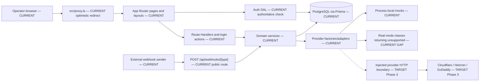
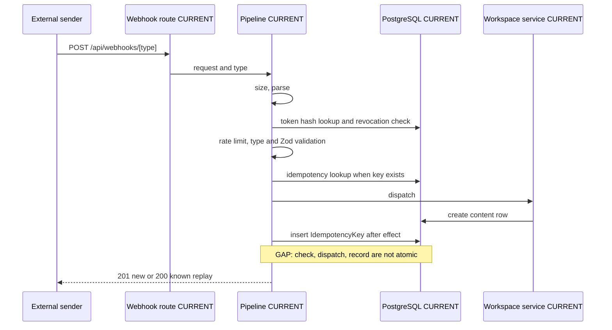
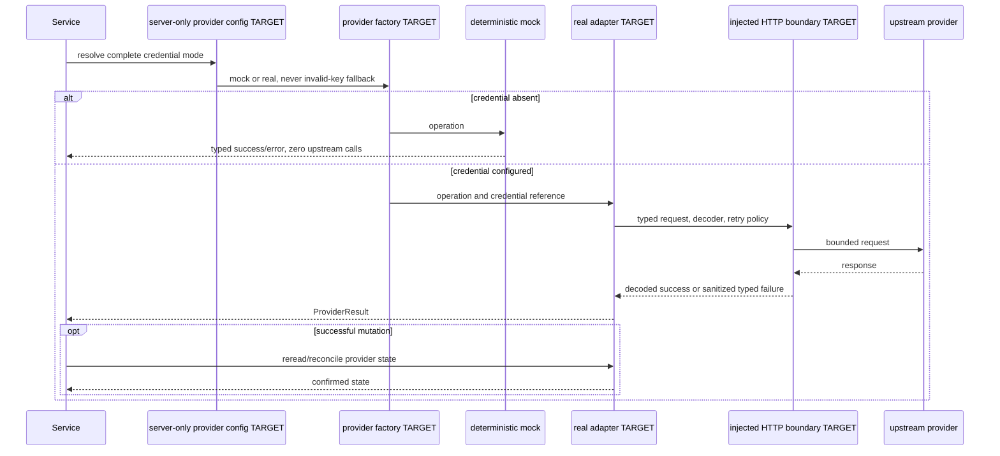

# Inspot Dashboard — Architecture

**Version:** 1.4
**Status:** Draft Q-13 target amendment — independent doc-review pending
**Owner:** Architect
**Date:** 2026-07-14
**Normative inputs:** `docs/prd.md` v3.1, `docs/design.md` v2.0, Q-13, `docs/remediation-plan.md`, `docs/progress.md`, `docs/idea.md`
**Implementation evidence:** repository state on 2026-07-14

## 0. Reading contract

This document separates repository facts from planned work. Every behavioral statement uses one of these labels:

- **CURRENT** — verified in the repository.
- **GAP** — verified divergence between the repository and approved requirements or the intended boundary.
- **TARGET (Phase N)** — planned remediation. A target path or behavior does not exist until its phase implements and verifies it.

The repository is authoritative for **CURRENT**. PRD v3.1, Design v2, accepted Q-1…Q-13, and the remediation plan are authoritative for **TARGET**. Version 1.3 remains the approved pre-Q-13 snapshot; version 1.4 supersedes its Domains/Servers workspace exception but preserves the historical record.

### 0.1 Changelog

- **v1.4 (2026-07-14):** defines the approved but unimplemented Q-13 target: every visible/operable area follows the active workspace; provider credentials remain deployment-scoped; exclusive resource bindings, repair/forward migrations, stale-context preconditions, durable provider leases, workspace-bound UI/cache/cursors, and facet gates are normative.
- **v1.3 (2026-07-14):** reconciles the document with Next.js 16.2.10, `src/proxy.ts`, 12 pages, 29 route files, 42 handlers, 15 Prisma models, active Settings routes, D-20, FR-MSG-003, AC-ALR-008, the verified webhook idempotency race, real-provider stubs, deployment gaps, and the Phase 3 provider target.
- **v1.2 (2026-07-13):** historical workspace revision.

## 1. Scope and system context

**CURRENT:** Inspot Dashboard is one Next.js App Router application backed by PostgreSQL through Prisma. It is a modular monolith deployed as one application container plus one database container. Browser operators use authenticated dashboard routes. External systems use the public webhook endpoint. Domains and Servers currently read deployment-wide provider-account inventory through provider adapters; this is a Q-13 isolation GAP.

**CURRENT:** The architecture has no microservices, queue, Redis dependency, provider-resource binding table, vault integration, or general provider SDK. The in-process webhook rate limiter and mock-provider state assume one application process; mutable mock state is shared across workspaces.

**TARGET (R2.1e, Phase 3):** Keep the modular monolith. Add local provider-resource binding/operation metadata, a validated provider configuration boundary, a thin injected HTTP boundary, complete adapters, typed error mapping, and tests. Do not persist credentials or provider snapshots, and do not add a queue, vault, general SDK, or separate service.



### 1.1 Architectural layers

| Label | Layer | Current responsibility |
| --- | --- | --- |
| CURRENT | `src/app`, `src/components` | App Router layouts/pages, Server Components, interactive Client Components, login actions, REST handlers |
| CURRENT | `src/lib/auth` | Cookie/session primitives and authoritative operator/workspace resolution |
| CURRENT / GAP | `src/lib/services` | Database-content workspace operations; provider orchestration currently omits workspace bindings |
| CURRENT | `src/lib/webhooks` | Public ingest pipeline, dispatch, rate limiting, idempotency lookup/record |
| CURRENT | `src/lib/providers` | DNS/server contracts, factories, deterministic mocks, incomplete real-mode classes |
| CURRENT | `src/lib/db.ts`, Prisma | Prisma client and persisted PostgreSQL state |
| GAP | Cross-layer Prisma imports | Five runtime callers outside the intended service/Auth-DAL rule remain; §4.4 lists them |
| TARGET (Phase 3) | `src/lib/config/providers.ts`, `src/lib/providers/http.ts` | Central server-only provider configuration and thin injected HTTP behavior; both paths are absent now |

## 2. Technology and deployment

### 2.1 Exact current stack

| Label | Component | Declared | Resolved / runtime contract | Evidence |
| --- | --- | --- | --- | --- |
| CURRENT | Next.js | `16.2.10` | `16.2.10` | `package.json`, `pnpm-lock.yaml` |
| CURRENT | React / React DOM | `19.1.0` | `19.1.0` | `package.json`, `pnpm-lock.yaml` |
| CURRENT | Prisma CLI / client / PG adapter | `^7.8.0` | `7.8.0` | `package.json`, `pnpm-lock.yaml` |
| CURRENT | `pg` | `^8.22.0` | `8.22.0` | `package.json`, `pnpm-lock.yaml` |
| CURRENT | Zod | `^4.4.3` | `4.4.3` | `package.json`, `pnpm-lock.yaml` |
| CURRENT | Tailwind CSS | `^4` | `4.3.2` | `package.json`, `pnpm-lock.yaml` |
| CURRENT | TypeScript | `^5` | `5.9.3` | `package.json`, `pnpm-lock.yaml` |
| CURRENT | Vitest | `^4.1.10` | `4.1.10` | `package.json`, `pnpm-lock.yaml` |
| CURRENT | Playwright | `^1.61.1` | `1.61.1` | `package.json`, `pnpm-lock.yaml` |
| CURRENT | ESLint | `^9` | `9.39.5` | `package.json`, `pnpm-lock.yaml` |
| CURRENT | Package manager | `pnpm@11.12.0` | lockfile format `9.0` | `package.json`, `pnpm-lock.yaml` |
| CURRENT | Application image | — | `node:24-slim` in all Docker stages | `Dockerfile` |
| CURRENT | Database image | — | `postgres:16` | `docker-compose.yml` |

**CURRENT:** A developer workstation may use Node 22, but workstation Node is not a deployment contract. The Docker contract is `node:24-slim`.

### 2.2 Deployment gaps

| Label | Finding | Required disposition |
| --- | --- | --- |
| CURRENT | Compose maps application port `3800` to container port `3000` and database port `3832` to `5432`; the runtime runs migrations before `npm run start`. | Preserve unless deployment validation changes the contract. |
| GAP | The repository declares pnpm and contains `pnpm-lock.yaml`, but `Dockerfile` copies nonexistent `package-lock.json` and runs `npm ci`; `playwright.config.ts` also starts `npm run build && npm run start`. | TARGET (Phase 2.0): use one package manager and its lockfile in Docker, CI, and Playwright. Keep frozen-lockfile behavior. |
| GAP | `docker-compose.yml` does not pass `CLOUDFLARE_API_TOKEN`, `HETZNER_DNS_TOKEN`, `GODADDY_API_KEY`, `GODADDY_API_SECRET`, or `HCLOUD_TOKEN` to the application container. | TARGET (Phase 3): wire optional provider variables without values or secrets in source control. |
| CURRENT | `src/instrumentation.ts` imports base env validation at Node server startup. `src/lib/config/env.ts` validates database, pagination, webhook limits, and operator authentication variables. | Preserve fail-fast startup. |
| GAP | Base env validation does not validate provider credentials or complete credential sets. | TARGET (Phase 3): move provider mode selection to centralized, server-only validated configuration. |

## 3. App Router and presentation boundary

### 3.1 Complete current page tree

**CURRENT:** The application contains 12 `page.tsx` files. The `(dashboard)` route group does not add a URL segment.

| Label | URL | File | Boundary and data source |
| --- | --- | --- | --- |
| CURRENT | `/` | `src/app/page.tsx` | Server Component; redirects to `/bookmarks` |
| CURRENT | `/login` | `src/app/login/page.tsx` | Server Component; awaits `searchParams`, renders Client `LoginForm` |
| CURRENT | `/bookmarks` | `src/app/(dashboard)/bookmarks/page.tsx` | Server Component; `requireAuth()` plus workspace-scoped service read |
| CURRENT | `/domains` | `src/app/(dashboard)/domains/page.tsx` | Server Component; `requireAuth()` plus provider aggregation |
| CURRENT | `/servers` | `src/app/(dashboard)/servers/page.tsx` | Authenticated Server Component shell; Client view fetches API |
| CURRENT | `/mail` | `src/app/(dashboard)/mail/page.tsx` | Authenticated Server Component shell; Client view fetches API |
| CURRENT | `/messages` | `src/app/(dashboard)/messages/page.tsx` | Authenticated Server Component shell; Client view fetches API |
| CURRENT | `/logs` | `src/app/(dashboard)/logs/page.tsx` | Authenticated Server Component shell; Client view fetches API |
| CURRENT | `/alerts` | `src/app/(dashboard)/alerts/page.tsx` | Authenticated Server Component shell; Client view fetches API |
| CURRENT | `/settings` | `src/app/(dashboard)/settings/page.tsx` | Server Component under authenticated dashboard layout; links to active settings destinations |
| CURRENT | `/settings/workspace` | `src/app/(dashboard)/settings/workspace/page.tsx` | Server Component; workspace/member service read, Client mutation forms |
| CURRENT | `/settings/webhooks` | `src/app/(dashboard)/settings/webhooks/page.tsx` | Authenticated Server Component shell; Client token management |

### 3.2 Complete current route-handler families

**CURRENT:** `src/app/api` contains 29 `route.ts` files and 42 exported handlers: 14 GET, 12 POST, 7 PATCH, and 9 DELETE.

| Label | Family | Current URL patterns and methods | Files / handlers |
| --- | --- | --- | --- |
| CURRENT | Workspaces | `GET,POST /api/workspaces`; `PATCH,DELETE /api/workspaces/[id]`; `GET,POST /api/workspaces/[id]/members`; `DELETE /api/workspaces/[id]/members/[memberId]`; `POST /api/workspaces/switch` | 5 / 8 |
| CURRENT | Bookmark categories and bookmarks | `POST /api/categories`; `PATCH,DELETE /api/categories/[id]`; `POST /api/bookmarks`; `PATCH,DELETE /api/bookmarks/[id]` | 4 / 6 |
| CURRENT | Domains and DNS records | `GET /api/domains`; `GET,POST /api/domains/[providerId]/[domainId]/records`; `PATCH,DELETE /api/domains/[providerId]/[domainId]/records/[recordId]` | 3 / 5 |
| CURRENT | Servers and power | `GET /api/servers`; `GET /api/servers/[id]`; `POST /api/servers/[id]/power` | 3 / 3 |
| CURRENT | Mail | `GET /api/mail`; `GET /api/mail/[id]` | 2 / 2 |
| CURRENT | Message categories, channels, messages | `GET,POST /api/message-categories`; `PATCH,DELETE /api/message-categories/[id]`; `POST /api/channels`; `PATCH,DELETE /api/channels/[id]`; `GET /api/channels/[id]/messages` | 5 / 8 |
| CURRENT | Logs | `GET /api/logs` | 1 / 1 |
| CURRENT | Alerts and alert categories | `GET /api/alerts`; `GET,POST /api/alert-categories`; `PATCH,DELETE /api/alert-categories/[id]` | 3 / 5 |
| CURRENT | Webhook tokens | `GET,POST /api/webhook-tokens`; `DELETE /api/webhook-tokens/[id]` | 2 / 3 |
| CURRENT | Public webhook ingest | `POST /api/webhooks/[type]` | 1 / 1 |

**GAP:** `src/app/api/channels/[id]/messages/route.ts` exports GET only. No authenticated human-message POST exists, so FR-MSG-003 and AC-MSG-009…014 are not implemented.

**TARGET (Phase 2.7):** Add authenticated `POST /api/channels/[id]/messages` to the existing route file. Derive operator identity from `requireAuth()`, reject blank content and foreign/missing channels, persist origin, and return failure without optimistic success.

**GAP:** No alert-delete handler or `src/app/api/alerts/[id]/route.ts` exists. AC-ALR-008 is not implemented.

**TARGET (Phase 2.5):** Add a workspace-scoped confirmed alert deletion. The minimal proposed route is `DELETE /api/alerts/[id]`; this path is explicitly absent from the current tree. Do not add acknowledge or resolve actions.

### 3.3 Special files and navigation states

| Label | Finding |
| --- | --- |
| CURRENT | `src/app/layout.tsx` is the root layout; `src/app/(dashboard)/layout.tsx` resolves auth/workspace and renders the shell. |
| CURRENT | Only Bookmarks has route-level streaming UI: `src/app/(dashboard)/bookmarks/loading.tsx`. |
| GAP | No `error.tsx`, `global-error.tsx`, or `not-found.tsx` exists under `src/app`. The other dashboard routes have no route-level loading boundary. |
| TARGET (Phase 4) | Add route-appropriate loading, error/retry, and not-found boundaries where Design v2 requires them. Keep error details sanitized. |

### 3.4 Server/Client boundaries, fetching, mutation, navigation

**CURRENT:** Pages and layouts remain Server Components by default. They call `requireAuth()` and may call services directly. Interactive boards, dialogs, filters, pagination, power actions, and settings forms are narrow Client Components marked with `"use client"`.

**CURRENT:** Bookmarks and workspace settings load initial database state in Server Components and pass serializable props to Client Components. Domains aggregates providers in its Server Component. Servers, Mail, Messages, Logs, Alerts, and webhook-token settings fetch their Route Handlers from Client views.

**CURRENT:** Most mutations use Client `fetch()` helpers, then update local state or call `router.refresh()`. Login and logout use Server Actions. Internal navigation uses `next/link`, `redirect()`, and `useRouter`; `/` redirects to `/bookmarks`. After login, the Client applies one string-prefix check, `next.startsWith("/")`, before `router.push()`; this is not a validated target.

**GAP:** The prefix check also accepts protocol-relative values such as `//attacker.example`. The Client neither normalizes the value nor proves that it is a same-origin local path.

**TARGET (Phase 2.1):** Accept only a normalized same-origin local path. Reject `//`, encoded or normalized external forms, backslashes, and control characters where applicable; preserve safe deep links. Test malicious and valid targets.

**GAP:** Several Client sections cannot use route-level streaming because their initial read begins after hydration. This is a documented current boundary, not a claim that Client fetching is always preferred.

**TARGET (Phase 4):** Keep interactivity client-side, but move stable initial reads to Server Components when this removes a loading waterfall without duplicating state. Pass only serializable data and keep server-only modules outside the Client graph.

## 4. Persistence and workspace boundary

### 4.1 Exact current Prisma model inventory

**CURRENT:** `prisma/schema.prisma` defines exactly 15 models:

1. `Operator`
2. `Session`
3. `Workspace`
4. `WorkspaceMember`
5. `Category`
6. `Bookmark`
7. `MessageCategory`
8. `Channel`
9. `Message`
10. `MailItem`
11. `LogEntry`
12. `AlertCategory`
13. `Alert`
14. `WebhookToken`
15. `IdempotencyKey`

### 4.2 Current ownership boundary and Q-13 replacement

| Label | Data family | Ownership and persistence |
| --- | --- | --- |
| CURRENT | Auth and workspace | `Operator`, `Session`, `Workspace`, `WorkspaceMember` persist in PostgreSQL. `Session.activeWorkspaceId` selects the active workspace. |
| CURRENT | Bookmarks | `Category.workspaceId` owns categories; `Bookmark` is a category child. |
| CURRENT | Messages | `MessageCategory.workspaceId` owns categories; `Channel` and `Message` are children. |
| CURRENT | Mail and Logs | `MailItem.workspaceId` and `LogEntry.workspaceId` directly own rows. |
| CURRENT | Alerts | `AlertCategory.workspaceId` currently provides the only workspace path for `Alert`. |
| CURRENT | Webhook tokens | `WebhookToken.workspaceId` owns tokens; `IdempotencyKey` is a token child. Q-9 means tokens are not restricted by event type or source; it does not remove workspace ownership. |
| CURRENT / GAP | Domains and Servers | Provider DTOs only. There are no local bindings, so every workspace sees the same provider-account and mutable mock inventory. |
| TARGET (Q-13, R2.1e) | Domains and Servers | `ProviderResourceBinding` exclusively assigns each real or mock resource to one workspace. Reads and operations start from `(workspaceId, localBindingId)`; a foreign/missing binding returns non-disclosing 404 before provider access. |
| TARGET (Q-13) | Workspace lifecycle | Switching changes all content and operations. Workspace deletion removes idle local bindings and local content but never deletes upstream provider resources. Provider credentials remain deployment-level `.env` secrets. |

### 4.3 Verified ownership gaps

**GAP:** Bookmark categories are scoped correctly, but bookmark child mutations are not. `POST /api/bookmarks` discards the workspace from `requireAuth()` and accepts any `categoryId`. `PATCH` and `DELETE /api/bookmarks/[id]` operate by bookmark id alone. `src/lib/services/bookmarks.ts` therefore permits create, move, update, or delete without proving that the bookmark and target category belong to the active workspace.

**TARGET (Phase 2.1):** Pass `workspaceId` into every bookmark child mutation. Scope bookmark lookup through `category.workspaceId`, validate both source and destination ownership, return a non-disclosing not-found response for foreign ids, and add cross-workspace API/e2e tests.

**GAP:** `PATCH` and `DELETE /api/workspaces/[id]`, `GET` and `POST /api/workspaces/[id]/members`, and `DELETE /api/workspaces/[id]/members/[memberId]` call `requireAuth()` but do not authorize the target workspace or owner role. `src/lib/services/workspaces.ts` accepts arbitrary target ids, so membership in the active workspace does not prevent reading or mutating another workspace by id.

**TARGET (Phase 2.1):** Require target-workspace membership for member-list reads. Require the target workspace's owner role for rename, delete, add-member, and remove-member mutations, as defined by the PRD owner boundaries. Return a non-disclosing response for foreign ids, and add API/e2e isolation tests for member and non-member callers.

**GAP:** `Alert.alertCategoryId` is nullable with `onDelete: SetNull`, but `Alert` has no `workspaceId`. Deleting a category can therefore remove the only workspace ownership path. The current list query filters through `alertCategory.workspaceId`, so a null-category alert becomes inaccessible; a future id-only delete would also lack an ownership predicate.

**TARGET (Phase 2.5):** Add durable workspace ownership to `Alert` and scope list/delete by that field. Keep category optional if reassign-to-uncategorized remains the chosen no-orphan behavior. Backfill category-linked alerts during migration; explicitly disposition any legacy null-category rows whose workspace cannot be inferred before enforcing the relation.

**GAP:** `Message` stores optional `author` text but no explicit origin and no authoring operator relation. The current UI composer is demo-only and does not persist.

**TARGET (Phase 2.7):** Add persisted `operator | webhook` origin. Store the authenticated `operatorId` for operator posts; retain a sanitized available source for webhook posts. Backfill existing persisted messages as webhook-origin, because current operator compose does not write. Render origin in the feed.

### 4.4 Prisma access boundary

**CURRENT:** Exactly 13 files under `src` import `@/lib/db`: seven service modules and six files outside `src/lib/services`.

| Label | Group | Files |
| --- | --- | --- |
| CURRENT | Intended service callers | `services/alerts.ts`, `bookmarks.ts`, `logs.ts`, `mail.ts`, `messages.ts`, `webhookTokens.ts`, `workspaces.ts` |
| CURRENT | Intended authoritative DAL | `src/lib/auth/dal.ts` |
| GAP | Direct callers outside service/DAL rule | `src/app/login/actions.ts`, `src/app/api/workspaces/switch/route.ts`, `src/lib/auth/session.ts`, `src/lib/webhooks/idempotency.ts`, `src/lib/webhooks/pipeline.ts` |

**TARGET (Phase 2):** ADR-012 keeps services and the authoritative auth DAL as runtime Prisma entry points. Move membership lookup, session persistence, webhook token lookup, and idempotency persistence behind narrow service/DAL functions. `src/lib/db.ts` remains the only Prisma client constructor. `prisma/seed.ts` remains an operational bootstrap path, not a request-layer exception.

**CURRENT:** Mail, Logs, Alerts, and Messages use cursor pagination with timestamp/id tie-breakers and `LIST_PAGE_SIZE`. Text search uses Prisma case-insensitive `contains`; no trigram/full-text index exists.

**CURRENT:** The pagination-only substring-search fallback remains explicit. The 500 ms indexed-read objective does not cover substring scans. A future trigram/full-text change requires a measured need and a migration; it is not part of this rewrite.

## 5. Authentication, session, and proxy

### 4.5 Q-13 target relational contract — not implemented

**TARGET (R2.1a/e):** The schema below is normative. The current 15-model schema and two committed migrations do not implement it.

| Model | Required Q-13 ownership and relation |
| --- | --- |
| `WorkspaceMember` | Replace free-form/default role with `WorkspaceRole { OWNER, MEMBER }`; preserve `@@unique([workspaceId, operatorId])`. A workspace and operator must each retain at least one membership, and a workspace must retain at least one owner. |
| `Session` | Add nullable `activeWorkspaceOperatorId`. Replace the direct `Session.activeWorkspaceId → Workspace.id` FK with composite `(activeWorkspaceId, activeWorkspaceOperatorId) → WorkspaceMember(workspaceId, operatorId) ON DELETE SET NULL`. SQL CHECK requires both columns NULL or both non-NULL; the application writes the authenticated `operatorId` shadow. |
| `Category → Bookmark` | `Category` gains `@@unique([id, workspaceId])`. `Bookmark` gains required `workspaceId` and `categoryWorkspaceId`; CHECK `categoryWorkspaceId = workspaceId`; composite FK `(categoryId, categoryWorkspaceId) → Category(id, workspaceId) ON DELETE CASCADE`. |
| `MessageCategory → Channel` | `MessageCategory` gains `@@unique([id, workspaceId])`. `Channel` gains required `workspaceId` and `messageCategoryWorkspaceId`; equality CHECK; composite parent FK with cascade. |
| `Channel → Message` | `Channel` gains `@@unique([id, workspaceId])`. `Message` gains required `workspaceId` and `channelWorkspaceId`; equality CHECK; composite parent FK with cascade. |
| `AlertCategory → Alert` | `AlertCategory` gains `@@unique([id, workspaceId])` and `@@unique([workspaceId, name])`. `Alert` gains required `workspaceId` and nullable `alertCategoryWorkspaceId`; composite `(alertCategoryId, alertCategoryWorkspaceId) → AlertCategory(id, workspaceId) ON DELETE SET NULL`. |
| `WebhookToken → IdempotencyKey` | `WebhookToken` gains `@@unique([id, workspaceId])`. `IdempotencyKey` gains required `workspaceId` and `tokenWorkspaceId`; equality CHECK; composite parent FK with cascade. |
| Existing roots | `Category`, `MessageCategory`, `MailItem`, `LogEntry`, `AlertCategory`, and `WebhookToken` retain required direct `workspaceId`. `Workspace` gains inverse relations for every direct owner, including all new children and provider bindings. |

The Alert optional-pair constraint is strict despite PostgreSQL `MATCH SIMPLE`:

```sql
CHECK (
  ("alertCategoryId" IS NULL AND "alertCategoryWorkspaceId" IS NULL)
  OR
  ("alertCategoryId" IS NOT NULL
   AND "alertCategoryWorkspaceId" IS NOT NULL
   AND "alertCategoryWorkspaceId" = "workspaceId")
)
```

`Session` uses the same both-null-or-both-non-null predicate for `activeWorkspaceId` and `activeWorkspaceOperatorId`. Partial-null rows must fail both constraints. The forward migration must drop these superseded single-column FKs after the compound FKs exist: `Bookmark_categoryId_fkey`, `Channel_messageCategoryId_fkey`, `Message_channelId_fkey`, `Alert_alertCategoryId_fkey`, and `IdempotencyKey_tokenId_fkey`. PostgreSQL 16 verification must prove their absence and exercise populated cascades, `Alert` composite `SET NULL`, and binding `RESTRICT` behavior.

Workspace-leading indexes are required on every scoped lookup path: category/child ordering; channel/message keyset pagination; mail/log/alert time cursors; alert category, severity, and source filters; token/idempotency lookup; and binding workspace/provider/type/mode/lease scans. Existing non-workspace indexes may remain only when a measured global operational query uses them.

### 4.6 `ProviderResourceBinding` target

**TARGET (R2.1e):** `ProviderResourceBinding` is local ownership/operation metadata, not a credential store or provider snapshot.

| Field family | Contract |
| --- | --- |
| Identity | Local `id`; required `workspaceId` with `ON DELETE RESTRICT`; `provider`, `resourceType`, and `mode`; non-secret stable `accountKey`; stable provider `remoteId`; `displayName`; optimistic `version`. Global uniqueness is `(provider, accountKey, resourceType, mode, remoteId)`, which makes one remote resource exclusive to one workspace. |
| Mock identity | `accountKey = 'mock:v1'`; `remoteId = 'mock:v1:<workspaceId>:<provider>:<key>'`. REAL rows cannot use a `mock:` prefix. No mutable module-global mock state remains. |
| Identity validation | Application and SQL enforce UTF-8 bounds: `accountKey` 1–256 bytes, `remoteId` 1–512, `displayName` 1–512; values are trimmed and contain no control characters. Provider/resource-type pairs are restricted by CHECK. |
| Operation lease | State is `IDLE`, `RUNNING`, or `RECONCILE_REQUIRED`. Operation id is unique; kind, credential-free canonical intent, start, expiry, and reconciled status are persisted. Intent is at most 16 KiB and must never contain credentials. A CHECK requires every operation column NULL in `IDLE` and every operation column non-NULL in active states. |
| Indexes | Workspace-leading discovery/list index `(workspaceId, resourceType, provider, mode, id)` plus lease/reconciliation indexes; the global identity unique index is mandatory. |

`Workspace` deletion first requires all bindings `IDLE`, then deletes local binding rows in a controlled transaction; it never sends provider delete calls. The Prisma relation remains `Restrict` so an accidental cascade cannot bypass this gate.

### 4.7 Existing-database repair and forward migration

**TARGET (R2.1a):** Deployment enters maintenance mode before repair. A signed repair manifest covers every existing operator/content row exactly once: desired memberships; all roots (`Category`, `MessageCategory`, `MailItem`, `LogEntry`, `AlertCategory`, `WebhookToken`); every null-category `Alert`; every `Session`, including an explicit null destination; and every orphan disposition (attach or delete with data-loss acknowledgement). Preflight verifies source digest, full coverage, referential validity, reserved-value collisions, and zero guessing.

Repair runs at `SERIALIZABLE` under an advisory lock and writes **only columns that already exist**: membership string roles, root `workspaceId`, existing child parent ids, `Session.activeWorkspaceId`, and `Alert.alertCategoryId`. A null-category Alert is transported through a temporary `AlertCategory` whose id is exactly `q13-repair-uncategorized:<workspaceId>` and whose reserved key is `(workspaceId, '__q13_repair_uncategorized__')`. Any collision aborts before writes.

The committed Q-13 forward migration is one explicit `BEGIN`/`COMMIT` unit:

1. Re-run guards and reserved-id/name collision checks.
2. Create `WorkspaceRole`; remove the legacy role default; convert only `owner`/`member` values.
3. Drop the old Session→Workspace FK, add/derive the operator shadow only for valid memberships, then add the composite membership FK and strict optional-pair CHECK.
4. Add direct child ownership and parent-workspace shadows; derive them from repaired parents; add equality CHECKs, parent composite uniques, and compound FKs; then remove superseded single-column FKs.
5. Add/derive durable Alert ownership from repaired categories. For sentinel Alerts, derive `workspaceId`, null both category columns, delete all sentinels, and assert zero sentinel ids/names/rows.
6. Add workspace-leading indexes, `ProviderResourceBinding`, identity/state CHECKs, and generated mock-resource inserts.
7. Commit only after every invariant query returns zero violations.

If repair commits but the forward migration fails, PostgreSQL rolls back the forward transaction completely. The repaired rows remain compatible with the old binary; maintenance stays enabled, the new binary is prohibited, and operators inspect Prisma/PostgreSQL diagnostics before retrying. No guessed down migration or data rewrite is allowed.

Fresh installation remains an exact historical replay: `init` → historical workspace migration with zero operator/content → Q-13 forward migration with zero workspace/mock rows → updated transactional seed. The seed creates the operator, workspace, `OWNER` membership, and mock bindings. Do not squash, edit, or baseline old migrations.

### 4.8 Canonical mock manifest and migration parity

`prisma/mock-provider-resources.v1.json` is the canonical mock catalog. A deterministic pre-release generator canonicalizes JSON, computes SHA-256, and writes an immutable version/hash header plus a marked SQL `VALUES` region into the checked-in Q-13 migration. The SQL performs `Workspace CROSS JOIN VALUES` inside the migration transaction and uses the exact global identity conflict key. PostgreSQL never imports JSON at runtime.

CI regenerates the SQL region and compares version, SHA-256, and bytes. Prisma's migration checksum remains authoritative. `seed`, `createWorkspace`, and provider adapters read the same JSON. A changed catalog requires a new versioned JSON file and a new forward migration; editing an applied migration is forbidden.

Production order is fixed: maintenance on → preflight → manifest repair → repair verification → `prisma migrate deploy` → `pg_constraint`/index/manifest parity inspection → application smoke → maintenance off. Repair and migration execute with provider credentials unavailable and must make zero network/provider calls.

The mandatory PostgreSQL 16 gate covers fresh replay, repaired replay, forced forward failure/retry, sentinel success/collision/zero-remnant checks, partial-null rejection, composite cascades/`SET NULL`, binding `RESTRICT`, identity length/control/prefix checks, lease-state checks, JSON↔SQL byte parity, Prisma validate/checksum, and zero provider/network access.

**CURRENT:** `src/proxy.ts` is an optimistic redirect layer. It checks only whether the `session` cookie exists. It redirects missing-cookie requests to `/login?next=<pathname>` and excludes login, public webhooks, framework assets, and the favicon from its matcher. It performs no database authorization.

**CURRENT:** `src/lib/auth/dal.ts` is authoritative. `requireOperator()` verifies a live database session and operator. `requireAuth()` additionally verifies `Session.activeWorkspaceId` membership; if invalid or unset, it selects the earliest membership and updates the session. Dashboard layout and authenticated Route Handlers use this server-side result.

**CURRENT:** Session ids are opaque random values stored in PostgreSQL. The cookie is HTTP-only, secure, same-site `lax`, path `/`, and expires after seven days. Logout deletes the database session and cookie. Password verification uses scrypt. Base env validation accepts `OPERATOR_PASSWORD_HASH` as preferred and `OPERATOR_PASSWORD` as a development convenience; if both exist, the hash wins.

**GAP:** Cookie presence in the proxy never proves identity or workspace membership. Any document or test that treats the proxy as authoritative is incorrect.

**GAP:** Active-workspace resolution does not authorize a different workspace id supplied to an administration handler. §4.3 records this target-workspace ownership gap.

**TARGET (Phase 2.1):** Preserve the two-tier design: fast optimistic redirect in `src/proxy.ts`, authoritative database validation in the DAL on every protected request. Add coverage for expired sessions, removed membership, workspace fallback, and switch authorization. Enforce the workspace-administration boundary in §4.3 and the safe login target in §3.4 while preserving valid deep links.

**TARGET (Phase 3):** Add `import "server-only"` guards to database, auth, config, and provider modules where applicable. This prevents accidental import into a Client Component; it does not replace request-time authorization.

## 6. Public webhook architecture

### 6.1 Current ordered pipeline

**CURRENT:** `POST /api/webhooks/[type]` is the only public API Route Handler family that does not require a session. `/login` and its login Server Action are the separate public human-authentication surface. `src/lib/webhooks/pipeline.ts` processes requests in this order:

1. Enforce declared and streamed body-size limits.
2. Parse JSON.
3. Parse Bearer authorization, hash the token, load `WebhookToken`, and reject missing, invalid, or revoked tokens.
4. Apply the process-local fixed-window rate limit by token id.
5. Resolve the type schema and validate the payload with Zod.
6. Check an optional token-scoped idempotency key.
7. Dispatch synchronously to the workspace-scoped Mail, Message, Log, or Alert service.
8. Insert the idempotency record after dispatch.
9. Return `201` for a new effect or `200` for a previously recorded key.

**CURRENT:** The endpoint returns structured errors for 401, 400, 413, and 429. It sets `Retry-After` for its own rate limit. A missing idempotency key intentionally permits duplicate effects under retry.



### 6.2 Idempotency invariant

**CURRENT:** Prisma enforces `@@unique([tokenId, key])` on `IdempotencyKey`.

**GAP:** The code performs check → dispatch → record outside a transaction. Concurrent requests with the same new key can both create effects before one idempotency insert loses the unique race. The losing insert error is swallowed, so uniqueness protects only the key table, not the side effect.

**TARGET (Phase 2.2):** Claim the token/key before dispatch and keep claim, content creation, and final target id under transaction semantics. A duplicate completed claim returns `200` with the stored id; a new claim returns `201` after commit. A failed transaction must not leave a successful-looking claim. Add concurrent same-key tests that prove exactly one effect, replay tests, no-key duplicate tests, and failure/rollback tests.

**CURRENT:** The rate limiter is a module-scope map. It resets on restart and is not shared across replicas.

**TARGET (Phase 2.2):** Keep the in-process limiter for the single-process deployment and test its exact limits. A shared limiter becomes necessary only if deployment topology changes.

## 7. Provider architecture

### 7.1 Current contracts and mode selection

**CURRENT:** Provider operations return exactly one of these `ProviderResult<T>` shapes:

| Label | Shape | Current HTTP mapping |
| --- | --- | --- |
| CURRENT | `{ ok: true, data: T }` | configured success status; `undefined` data becomes 204 |
| CURRENT | `{ ok: false, kind: "error", message: string }` | 502 |
| CURRENT | `{ ok: false, kind: "unsupported", operation: string }` | 501 |

**CURRENT:** DNS factories return Cloudflare, Hetzner DNS, and GoDaddy providers. Server factory returns Hetzner Cloud. Missing credentials select deterministic process-local mocks. Present credentials select real-mode classes.

**GAP:** Every real-mode operation currently returns `unsupported`; no upstream request exists. Credential presence therefore does not mean a working real integration.

**GAP:** Factories read `process.env` directly. No centralized provider schema validates credentials. GoDaddy mode checks only `GODADDY_API_KEY` and ignores `GODADDY_API_SECRET`.

**CURRENT:** DNS and server mocks make zero external requests. Their mutable module state resets at process restart and is shared across all workspaces. Domains aggregation uses `Promise.allSettled`, so one provider failure does not remove healthy providers.

**GAP:** Mock mutations are ephemeral and not workspace-scoped. This is acceptable only as clearly labelled provider-account demo state; it must never be described as durable workspace content.

### 7.2 Target provider modes and configuration

**TARGET (Phase 3):** Add a centralized `server-only` provider configuration module. Resolve each provider independently:

- Cloudflare DNS requires its complete credential.
- Hetzner Cloud requires its complete credential.
- Hetzner DNS requires its complete credential.
- GoDaddy requires both key and secret.
- A complete absent credential set selects mock and causes zero upstream calls.
- A complete configured set selects real mode.
- An incomplete set fails configuration explicitly; it does not silently choose mock.
- Invalid or revoked real credentials produce typed provider authentication failure and never fall back to mock.

**TARGET (Phase 3):** Keep configuration values in environment variables. Never persist provider credentials in Prisma, return them through APIs, render them, or log them. `docker-compose.yml` may reference variable names but must not contain values.

### 7.3 Target HTTP boundary

**TARGET (Phase 3):** Add `src/lib/providers/http.ts`. This path is absent now. Keep it thin and provider-neutral. Inject `fetch`, timeout, sleeper, clock, and random source. Use `AbortSignal` for deadlines. Parse provider envelopes through typed decoders and return sanitized metadata only.

**TARGET (Phase 3):** Provider adapters own provider-specific URL construction, authentication headers, payloads, response envelopes, pagination, and DTO mapping. The HTTP boundary owns transport timeout, retry scheduling, `Retry-After` parsing, safe body limits, and redaction. Do not build a general external-service SDK.

### 7.4 Target result and HTTP mapping

| Label | Target `ProviderResult` category | Route response |
| --- | --- | --- |
| TARGET (Phase 3) | success | operation-specific 2xx |
| TARGET (Phase 3) | `auth` | 502; provider-account authentication is not operator authentication |
| TARGET (Phase 3) | `rate_limit` | 429 plus sanitized `Retry-After` |
| TARGET (Phase 3) | `not_found` | 404 |
| TARGET (Phase 3) | `validation` | 422 |
| TARGET (Phase 3) | `conflict` | 409 |
| TARGET (Phase 3) | `upstream` or malformed response | 502 |
| TARGET (Phase 3) | `timeout` | 504 |
| TARGET (Phase 3) | `unsupported` | 501 |

**TARGET (Phase 3):** Client responses expose a stable category and safe message, never upstream response bodies, credentials, authorization headers, or sensitive query values.

### 7.5 Target timeout and retry policy

**TARGET (Phase 3):** Retry only network failures and HTTP 408, 425, 429, and 5xx. Honor `Retry-After` in delta-seconds and HTTP-date forms. Use at most three total attempts with capped exponential backoff and jitter.

**TARGET (Phase 3):** Never retry authentication, authorization, validation, unsupported, not-found, or conflict results. Reads may retry. Mutations retry only when the provider operation and idempotency mechanism make replay safe.

**TARGET (Phase 3):** Do not retry DNS create, server reboot/restart, or any ambiguous commit without provider-supported idempotency or an explicit reconciliation/readback algorithm. After a successful mutation, reread provider state as required by AC-REAL. If transport fails after a possible commit, reconcile before deciding whether another mutation is safe.

### 7.6 Target observability, redaction, and tests

**TARGET (Phase 3):** Structured provider logs contain only `provider`, `operation`, result `category`, safe status, attempts, duration, timeout/retry flags, and sanitized request id. Redact credentials, authorization headers, sensitive query values, and upstream bodies before logging or returning an error.

**TARGET (Phase 3):** Inject test seams for fetch, time, sleep, and randomness. Required coverage:

- unit tests for timeout, retry eligibility, backoff cap/jitter, both `Retry-After` forms, typed parsing, and redaction;
- provider fixture contract tests for success and every supported error envelope;
- mutation readback/reconciliation tests for AC-REAL;
- invalid/revoked credential tests proving typed auth and no mock fallback;
- optional real-account smoke tests outside normal CI, with no secrets in artifacts.

### 7.7 Q-11 rollout

| Label | Order | Provider | Exit evidence |
| --- | --- | --- | --- |
| TARGET (Phase 3.1) | 1 | Cloudflare DNS | list zones/records; create/update/delete confirmed by reread; AC-REAL-CF-001…004 |
| TARGET (Phase 3.2) | 2 | Hetzner Cloud | list/status; start/stop/restart confirmed by polling; AC-REAL-HC-001…004 |
| TARGET (Phase 3.3) | 3 | Hetzner DNS | list zones/records; mutations confirmed by reread; AC-REAL-HD-001…004 |
| TARGET (Phase 3.4) | 4 | GoDaddy DNS | list domains/records; mutations confirmed by reread; AC-REAL-GD-001…004 or evidenced account/API ineligibility plus dated explicit user exclusion |

**TARGET (Phase 3):** Credentials arrive incrementally through `.env`. Missing credentials alone do not exclude GoDaddy or satisfy its release gate.

## 8. Request sequences

### 8.1 Authenticated dashboard read and mutation — CURRENT

```mermaid
sequenceDiagram
    participant Browser
    participant Proxy as src/proxy.ts
    participant Layout as Dashboard layout
    participant DAL as Auth DAL
    participant Page as Server or Client view
    participant Route as Authenticated Route Handler
    participant Service
    participant Store as PostgreSQL or provider mock/stub
    Browser->>Proxy: navigation with cookie
    Proxy->>Layout: cookie exists; optimistic pass
    Layout->>DAL: requireAuth()
    DAL->>Store: validate session, operator, membership
    DAL-->>Layout: operator and active workspace
    Layout->>Page: render
    alt Server initial read
        Page->>Service: workspace id or provider inventory request
        Service->>Store: query
        Store-->>Page: serializable data
    else Client read or mutation
        Browser->>Route: fetch API
        Route->>DAL: requireAuth()
        Route->>Service: validated input and workspace id
        Service->>Store: read or mutation
        Route-->>Browser: JSON / no-content
        Browser->>Layout: router.refresh when server state must refresh
    end
```

**GAP:** Bookmark child mutations and workspace administration bypass target-workspace ownership or role predicates inside this sequence; §4.3 defines both corrections.

### 8.2 Real-provider read or mutation — TARGET (Phase 3)



## 9. Current-versus-target project tree

**CURRENT:** The complete page and Route Handler families are in §3. This focused tree shows architectural boundaries and every new path proposed by v1.3.

```text
src/
├── proxy.ts                                             [CURRENT]
├── instrumentation.ts                                  [CURRENT]
├── app/
│   ├── layout.tsx                                      [CURRENT]
│   ├── page.tsx                                        [CURRENT]
│   ├── login/{page.tsx,login-form.tsx,actions.ts}      [CURRENT]
│   ├── (dashboard)/{layout,bookmarks,domains,servers,
│   │   mail,messages,logs,alerts,settings}/...          [CURRENT]
│   ├── api/channels/[id]/messages/route.ts             [CURRENT GET; TARGET Phase 2.7 POST]
│   ├── api/alerts/route.ts                              [CURRENT GET]
│   ├── api/alerts/[id]/route.ts                         [TARGET Phase 2.5; ABSENT]
│   └── api/webhooks/[type]/route.ts                     [CURRENT POST]
└── lib/
    ├── auth/{dal,password,session}.ts                   [CURRENT]
    ├── config/env.ts                                    [CURRENT base config]
    ├── config/providers.ts                              [TARGET Phase 3; ABSENT]
    ├── db.ts                                            [CURRENT]
    ├── services/...                                     [CURRENT]
    ├── webhooks/{pipeline,dispatch,idempotency,
    │   ratelimit}.ts                                    [CURRENT]
    └── providers/
        ├── result.ts                                    [CURRENT narrow result]
        ├── http.ts                                      [TARGET Phase 3; ABSENT]
        ├── dns/{index,types,mock,cloudflare,hetzner,
        │   godaddy}.ts                                  [CURRENT mocks + real stubs; TARGET Phase 3 adapters]
        └── servers/{index,types,mock,hetzner}.ts        [CURRENT mock + real stub; TARGET Phase 3 adapter]
```

## 10. Architecture decisions

| ADR | Label | Decision |
| --- | --- | --- |
| ADR-001 | CURRENT | Use one Next.js modular monolith and PostgreSQL. No queue, microservices, Redis dependency, vault, provider database, or general provider SDK. |
| ADR-002 | CURRENT | Use database-backed opaque sessions and scrypt password verification. Logout invalidates the database session. |
| ADR-003 | CURRENT | `src/proxy.ts` performs optimistic cookie-presence redirects; `requireOperator()` and `requireAuth()` are authoritative. Never authorize from proxy presence alone. |
| ADR-004 | CURRENT | Domains, DNS records, and Servers are read-through provider DTOs, not Prisma models. |
| ADR-005 | CURRENT | Use one public `POST /api/webhooks/[type]` pipeline for mail, message, log, and alert ingest. |
| ADR-006 | CURRENT | Use a token-keyed in-process rate limiter while deployment remains one application process. |
| ADR-007 | GAP | `@@unique([tokenId,key])` exists, but current check → dispatch → record is non-atomic. Atomic claim/dispatch semantics exist only as TARGET (Phase 2.2). |
| ADR-008 | CURRENT | Providers return in-band `success`, generic `error`, or `unsupported`; Route Handlers map generic errors to 502 and unsupported to 501. |
| ADR-009 | CURRENT | Use keyset pagination. Keep substring search as an explicit pagination-only fallback without a numeric latency guarantee. |
| ADR-010 | CURRENT | Share Zod validation where contracts overlap; keep request-specific validation near its boundary. |
| ADR-011 | CURRENT / GAP | Carry active workspace on `Session.activeWorkspaceId`; the DAL verifies active membership, and URLs have no workspace segment. Target-workspace membership and owner authorization for workspace administration remain missing until Phase 2.1. |
| ADR-012 | GAP | Intended runtime Prisma callers are services and the authoritative auth DAL. Five current exceptions are recorded in §4.4 and must move behind those boundaries. |
| ADR-013 | CURRENT | Category-child cascades apply to Bookmarks and Messages. Alert category deletion uses `SetNull`, but current Alert ownership is incomplete; TARGET (Phase 2.5) adds durable workspace ownership. |
| ADR-014 | CURRENT | New operators join through workspace administration; public self-registration and extended RBAC remain out of scope. |
| ADR-015 | TARGET (Phase 3) | Select each provider independently from a complete credential set. Absent selects zero-network mock; configured invalid/revoked returns typed auth; never fall back. |
| ADR-016 | TARGET (Phase 3) | Centralize timeout, safe retry, `Retry-After`, decoding seams, and redaction in a thin injected HTTP boundary. |
| ADR-017 | TARGET (Phase 3) | Expand provider failures to typed, sanitized categories and map them consistently as defined in §7.4. |
| ADR-018 | CURRENT | Deploy one application plus PostgreSQL. Domains/Servers are provider-account inventory; mock mutations are process-local, restart-ephemeral, and independent of workspace lifecycle. |

## 11. Decision and requirement traceability

### 11.1 Accepted Q decisions

| Decision | Label | Architectural consequence |
| --- | --- | --- |
| Q-1 | TARGET (Phase 4) | Visible UI is Russian-only under the PRD allowlist; current mixed copy remains a UI gap. |
| Q-2 | CURRENT | Light theme is primary; dark theme and a switcher are deferred. |
| Q-3 | TARGET (Phase 4) | `specs/prototype/`, `specs/inspot-design/`, and `specs/ui.md` govern design subject to explicit PRD exceptions. |
| Q-4 | GAP / TARGET (Phases 2.7, 4.3) | FR-MSG-003 requires persisted operator posting and visible operator/webhook origin; current compose is demo-only. |
| Q-5 | CURRENT | Mail remains read-only. No compose/send route is planned for this iteration. |
| Q-6 | CURRENT | Servers exposes inventory/status and start, stop, restart only. No lifecycle expansion is planned. |
| Q-7 | GAP / TARGET (Phase 2.5) | Alerts keeps view, organization, and confirmed deletion; deletion is missing, acknowledge/resolve remain excluded. |
| Q-8 | CURRENT | Webhook to a missing channel returns 4xx; auto-create stays disabled and AC-MSG-008 inactive. |
| Q-9 | CURRENT | Webhook tokens are not restricted by event type/source; they remain workspace-owned. |
| Q-10 | CURRENT | No automatic retention. Growth risk R-5 remains accepted. |
| Q-11 | TARGET (Phase 3) | Roll out Cloudflare DNS → Hetzner Cloud → Hetzner DNS → GoDaddy through incremental env credentials. |
| Q-12 | TARGET (Phase 4.4) | Add an optional idempotent `db:seed:demo`, separate from production bootstrap. |

### 11.2 Key normative traces

| Requirement | CURRENT / GAP | TARGET and verification owner |
| --- | --- | --- |
| D-20 | Database content is workspace-owned; Domains/Servers are provider-account inventory. Bookmark child, workspace-administration authorization, and Alert `SetNull` gaps violate the intended boundary. | Phases 2.1 and 2.5: cross-workspace authorization, isolation, and migration tests. |
| FR-WS-001..003; AC-WS-003..007 | Workspace administration authenticates the caller but does not authorize the target workspace or owner role. | Phase 2.1: membership-gated reads, owner-only mutations, non-disclosing foreign-id responses, and API/e2e isolation tests. |
| AC-AUTH-001..003 | Proxy and DAL responsibilities are separated, but the login `next` prefix check accepts protocol-relative values. | Phase 2.1: malicious-target rejection and valid deep-link tests against normalized same-origin local paths. |
| FR-MSG-003; AC-MSG-009…014 | No operator POST, explicit origin, or persisted operator attribution. | Phases 2.7 and 4.3: API, service, schema, UI, and failure-state tests. |
| AC-ALR-008 | No alert delete route or UI action. | Phase 2.5: confirmed workspace-scoped delete; acknowledge/resolve absent. |
| FR-REAL-001; AC-REAL-CF/HC/HD/GD-001…004 | Real-mode classes exist but every operation returns unsupported. | Phase 3 in Q-11 order: fixture contracts, optional real smoke, reread/reconciliation, secret inspection. |
| NFR-SEC-002 | Webhook tokens are hashed and raw token is revealed only at creation; provider secrets are read from env names but provider config/redaction is incomplete. | Phases 2.2 and 3: response/log inspection, server-only guards, typed sanitized provider failures. |
| PRD v3 / Design v2 | Approved normative inputs; implementation still has known UI and behavior deltas. | Phases 2–4; do not mark product complete before Phase 5 acceptance. |

## 12. Residual risks and dependencies

| Priority | Label | Risk / dependency | Required control |
| --- | --- | --- | --- |
| High | GAP | Concurrent same-key webhooks can duplicate effects. | Phase 2.2 atomic claim and concurrency tests. |
| High | GAP | Bookmark child ids can cross workspace boundaries. | Phase 2.1 ownership predicates and isolation tests. |
| High | GAP | Authenticated operators can target workspace-administration ids without target membership or owner authorization. | Phase 2.1 target-workspace predicates, owner checks, and isolation tests. |
| High | GAP | Alert `SetNull` can erase the only workspace ownership path. | Phase 2.5 schema migration, legacy-null disposition, scoped delete/list tests. |
| High | GAP | Docker cannot build from the declared pnpm lock contract as written. | Phase 2.0 package-manager alignment and clean-container CI. |
| High | GAP | Real-mode provider classes are stubs; configured credentials do not deliver real value. | Phase 3 AC-REAL implementation and evidence. |
| Medium | GAP | Provider config is unvalidated, GoDaddy selection ignores the secret, and compose passes no provider variables. | Phase 3 complete-set validation and deployment wiring. |
| Medium | GAP | The login `next` prefix check accepts protocol-relative or externally normalized targets. | Phase 2.1 same-origin normalization and malicious/valid target tests. |
| Medium | CURRENT | Mock mutations and rate counters reset on restart; mock state is shared across workspaces. | Keep behavior explicit; do not use mocks as persistence or tenant data. |
| Medium | GAP | Five runtime Prisma callers bypass the intended service/DAL boundary. | Phase 2 boundary cleanup with unchanged external contracts. |
| Medium | GAP | Most routes lack App Router loading/error/not-found boundaries. | Phase 4 state implementation and accessibility tests. |
| Accepted | CURRENT | No automatic retention; database growth risk R-5 remains. | Monitor storage operationally; do not invent retention without a new decision. |
| Dependency | TARGET (Phase 3) | Real smoke tests require credentials and eligible accounts in Q-11 order. | Keep them optional outside normal CI; never expose secrets in artifacts. |
| Dependency | TARGET (Phase 3.4) | GoDaddy account/API eligibility may block integration. | Require real evidence plus dated user exclusion; missing credentials alone are insufficient. |
| Non-blocking | CURRENT | OQ-8 leaves uploaded bookmark assets undecided. | Preserve reference-value behavior; do not add an asset pipeline without a sourced requirement. |

## 13. Verification contract for this document

| Label | Check |
| --- | --- |
| CURRENT | Stack values must match `package.json`, `pnpm-lock.yaml`, `Dockerfile`, `docker-compose.yml`, and `playwright.config.ts`. |
| CURRENT | Page, route-file, handler, method, model, and database-importer counts must match the repository. |
| CURRENT | Every current path in §§3 and 9 must exist. |
| TARGET | Every absent future path must carry `TARGET (Phase N)` and `ABSENT`. |
| GAP | Webhook atomicity, Bookmark ownership, workspace-administration authorization, login target validation, Alert ownership, human message POST, alert deletion, provider stubs, and deployment mismatch must remain visible until code and tests close them. |
| TARGET | Phase 2.1 must prove membership-gated workspace reads, owner-only workspace mutations, non-disclosing foreign-id responses, and malicious/valid login-target handling. |
| TARGET | Phase 3 retry, redaction, error mapping, readback/reconciliation, and Q-11 order must trace to FR-REAL/AC-REAL and NFR-SEC-002. |
| CURRENT | Phase 1 remains in progress until ordinary doc review passes; Phases 2–5 remain pending. |
