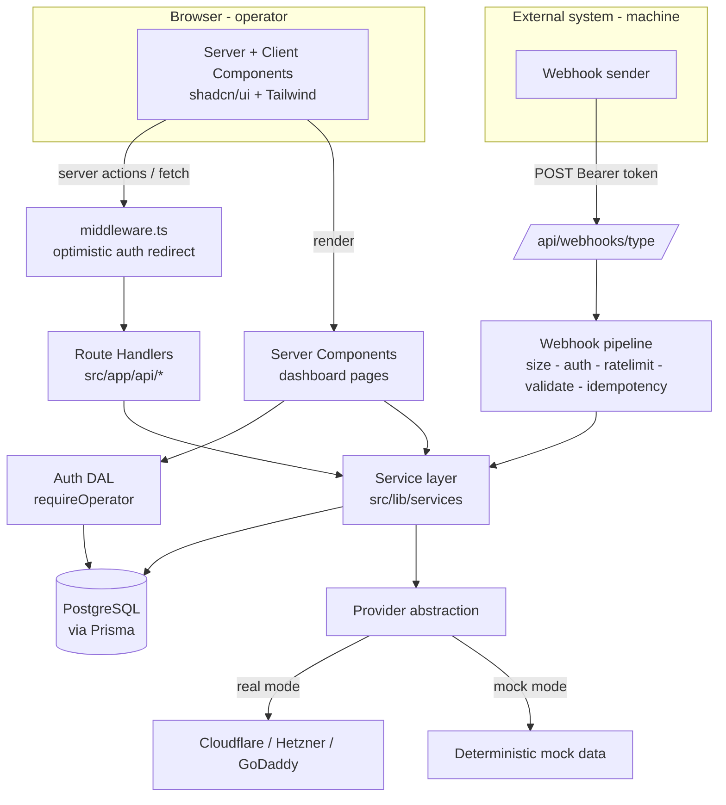
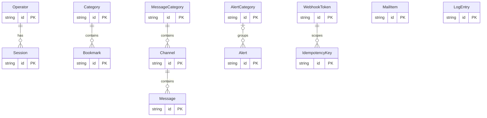
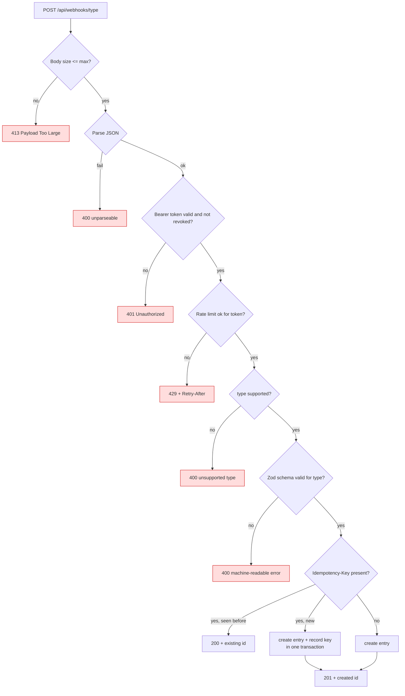

# Architecture Blueprint — inspoter

**Version:** 1.1
**Status:** Draft for doc-review (v1.1 addresses doc-review findings F1–F7)
**Owner:** Architect
**Date:** 2026-07-12
**Traces to:** `docs/prd.md` v2.1 (authoritative requirements), `docs/progress.md` (Decisions log), `specs/idea.md`
**Consumed by:** planner, ui-ux-designer, implementors, tester

**Changelog:**

- **v1.1 (2026-07-12):** Doc-review fixes. F1 — AQ-1 resolved per progress.md line 43 (both `OPERATOR_PASSWORD_HASH` and `OPERATOR_PASSWORD` supported); §5.2 env validation + §9 updated. F2 — auth DAL named as a sanctioned Prisma caller (§1.1, ADR-012). F3 — ADR-004 read-through latency trade-off stated. F4 — `Message` index gains `id` tiebreaker. F5 — `validation/dns.ts` added to tree. F6 — `DnsRecordInput`/`DnsRecordPatch` DTOs defined (§4.1). F7 — AQ-4 marked resolved-with-configurable-default.
- **v1.0 (2026-07-12):** Initial blueprint.

This document is the authoritative design reference. Every component traces to an FR/AC/NFR or a decision D-ID from the PRD. The technology stack is fixed by HC-1 / NFR-STACK-001 / D-6 and is **not** re-litigated here — this blueprint decides only _how_ to arrange that fixed stack.

---

## 1. System Overview

`inspoter` is a **single deployable Next.js 15 (App Router) application** backed by PostgreSQL via Prisma. It is a single-instance, self-hosted control panel (HC-2, NFR-DEPLOY-001) with seven sections plus a unified webhook ingest API.

The system is intentionally a **modular monolith**, not a set of services. Justification (Simplicity First, HC-2): the deployment target is one Docker host serving one operator or a small team. Microservices, message queues, and Redis would add operational surface with no requirement to justify them. In-process constructs (in-memory rate limiter, synchronous webhook ingest) are correct precisely _because_ there is exactly one application process.

### 1.1 Architectural layers

```
┌──────────────────────────────────────────────────────────────────────┐
│  Presentation (src/app, src/components)                                │
│  ─ Server Components (data fetch, no interactivity)                     │
│  ─ Client Components ("use client": forms, dialogs, list actions)      │
│  ─ shadcn/ui primitives + Tailwind                                     │
└───────────────┬──────────────────────────────────┬───────────────────┘
                │ (server actions / fetch)          │
┌───────────────▼──────────────┐   ┌────────────────▼───────────────────┐
│  Route Handlers (src/app/api) │   │  Server Actions (colocated)        │
│  ─ REST for section CRUD      │   │  ─ mutations from forms             │
│  ─ /api/webhooks/[type]       │   │                                     │
└───────────────┬──────────────┘   └────────────────┬───────────────────┘
                │                                    │
┌───────────────▼────────────────────────────────────▼──────────────────┐
│  Service layer (src/lib/services)                                       │
│  ─ business rules, validation orchestration, no framework types        │
│  ─ with the auth DAL, the only sanctioned callers of Prisma/providers   │
└───────┬───────────────────────────────┬───────────────────┬───────────┘
        │                               │                   │
┌───────▼─────────┐   ┌─────────────────▼──────┐   ┌────────▼───────────┐
│ Prisma / db.ts  │   │ Provider abstraction   │   │ Webhook pipeline   │
│ (PostgreSQL)    │   │ (src/lib/providers)    │   │ (src/lib/webhooks) │
│                 │   │ ─ DnsProvider          │   │ ─ auth (Bearer)    │
│ persisted       │   │ ─ ServerProvider       │   │ ─ rate limit (mem) │
│ entities        │   │ ─ real | mock (env)    │   │ ─ idempotency      │
└─────────────────┘   └────────┬───────────────┘   └────────────────────┘
                               │ HTTPS (real mode only)
                      ┌────────▼─────────────────────┐
                      │ Cloudflare / Hetzner / GoDaddy│
                      └───────────────────────────────┘
```

Note: the auth Data Access Layer (`requireOperator()`, §5.3) reads the `Session`/`Operator` tables directly via Prisma; it is the single sanctioned Prisma caller outside the service layer (ADR-012).

### 1.2 Component diagram (Mermaid)



### 1.3 Requirement-to-layer traceability (summary; full map in §11)

| Concern                       | PRD source               | Where it lives                                        |
| ----------------------------- | ------------------------ | ----------------------------------------------------- |
| Shell + nav                   | FR-SHELL-001             | `app/(dashboard)/layout.tsx`, `components/shell`      |
| Auth                          | FR-AUTH-001, NFR-SEC-001 | `middleware.ts`, `lib/auth`, `login/`                 |
| Bookmarks CRUD                | FR-BM-001..003           | `app/(dashboard)/bookmarks`, `lib/services/bookmarks` |
| Domains / DNS (proxy)         | FR-DOM-001..002          | `lib/providers/dns`, `app/(dashboard)/domains`        |
| Servers                       | FR-SRV-001..002          | `lib/providers/servers`, `app/(dashboard)/servers`    |
| Mail / Msg / Log / Alert view | FR-MAIL/MSG/LOG/ALR      | `lib/services/*`, matching pages                      |
| Webhook ingest                | FR-WH-001..002           | `app/api/webhooks/[type]`, `lib/webhooks`             |
| Provider abstraction          | FR-PROV-001              | `lib/providers`                                       |

---

## 2. Data Model

### 2.1 What is persisted vs. what is a provider DTO

**Decision (ADR-004): Domains, DnsRecords and Servers are NOT persisted. They are read-through provider DTOs.**

- The registrar/cloud provider is the source of truth for domains, DNS records, and server state (AC-DOM-004..009, AC-SRV-001..008 all say "submitted to the provider" / "the provider's actual state").
- A local cache would introduce staleness, cache-invalidation logic, and a sync job — none of which the PRD requires, and all of which fight AC-DOM-009 / AC-SRV-008 ("displayed state reflects the provider's actual, unchanged state"). Simplicity First rejects the cache.
- Mock mode (AC-PROV-001) returns the same DTO shapes deterministically, so the UI is exercisable with zero DB rows for these sections.

Consequence: `Domain`, `DnsRecord`, `Server` are TypeScript types returned by the provider layer (`src/lib/providers/**/types.ts`), never Prisma models.

### 2.2 Persisted entities (Prisma) and relationships



### 2.3 Prisma schema (entity + index level)

IDs use `cuid()`. Timestamps default to `now()`. Cascade / SetNull choices satisfy the no-orphan invariant (D-12, AC-BM-004, AC-MSG-003, AC-ALR-002).

```prisma
// --- Auth (FR-AUTH-001) ---
model Operator {
  id           String    @id @default(cuid())
  username     String    @unique
  passwordHash String                       // scrypt hash; never returned (NFR-SEC-002)
  createdAt    DateTime  @default(now())
  sessions     Session[]
}

model Session {
  id         String   @id                   // opaque random token (the cookie value)
  operatorId String
  operator   Operator @relation(fields: [operatorId], references: [id], onDelete: Cascade)
  expiresAt  DateTime
  createdAt  DateTime @default(now())
  @@index([expiresAt])
}

// --- Bookmarks (FR-BM-001..003, Slice 1) ---
model Category {
  id        String     @id @default(cuid())
  name      String
  position  Int        @default(0)
  bookmarks Bookmark[]
  createdAt DateTime   @default(now())
  updatedAt DateTime   @updatedAt
}

model Bookmark {
  id          String   @id @default(cuid())
  categoryId  String
  category    Category @relation(fields: [categoryId], references: [id], onDelete: Cascade) // AC-BM-004 cascade
  name        String
  url         String
  icon        String?                        // reference value (A-2 / OQ-8): emoji | icon-name | URL
  description String?
  position    Int      @default(0)
  createdAt   DateTime @default(now())
  updatedAt   DateTime @updatedAt
  @@index([categoryId])                      // grouped display AC-BM-012
}

// --- Messages (FR-MSG-001..002) ---
model MessageCategory {
  id        String    @id @default(cuid())
  name      String
  channels  Channel[]
  createdAt DateTime  @default(now())
  updatedAt DateTime  @updatedAt
}

model Channel {
  id                String          @id @default(cuid())
  messageCategoryId String
  messageCategory   MessageCategory @relation(fields: [messageCategoryId], references: [id], onDelete: Cascade) // AC-MSG-003
  name              String
  messages          Message[]
  createdAt         DateTime        @default(now())
  updatedAt         DateTime        @updatedAt
  @@index([messageCategoryId])
}

model Message {
  id        String   @id @default(cuid())
  channelId String
  channel   Channel  @relation(fields: [channelId], references: [id], onDelete: Cascade)
  content   String
  author    String?                          // source label from webhook payload
  createdAt DateTime @default(now())
  @@index([channelId, createdAt, id])        // NFR-PERF-001 keyset pagination (id tiebreaker for equal createdAt) + AC-MSG-004 chronological
}

// --- Mail (FR-MAIL-001..002) ---
model MailItem {
  id         String   @id @default(cuid())
  sender     String
  subject    String
  body       String
  receivedAt DateTime @default(now())
  createdAt  DateTime @default(now())
  @@index([receivedAt, id])                  // sort + keyset pagination (AC-MAIL-004/005)
  @@index([sender])                          // equality filter (AC-MAIL-003, NFR-PERF-002)
}

// --- Logs (FR-LOG-001..002) ---
model LogEntry {
  id        String   @id @default(cuid())
  level     String                           // e.g. info|warn|error (validated by zod, stored as string)
  source    String
  message   String
  timestamp DateTime @default(now())
  createdAt DateTime @default(now())
  @@index([timestamp, id])                   // sort + keyset pagination (AC-LOG-003/004)
  @@index([level])                           // equality filter (AC-LOG-002)
  @@index([source])                          // equality filter (AC-LOG-002)
}

// --- Alerts (FR-ALR-001..003) ---
model AlertCategory {
  id        String   @id @default(cuid())
  name      String
  alerts    Alert[]
  createdAt DateTime @default(now())
  updatedAt DateTime @updatedAt
}

model Alert {
  id              String         @id @default(cuid())
  alertCategoryId String?
  alertCategory   AlertCategory? @relation(fields: [alertCategoryId], references: [id], onDelete: SetNull) // D-12: reassign to uncategorized, no orphan (AC-ALR-002)
  severity        String
  source          String
  message         String
  timestamp       DateTime       @default(now())
  createdAt       DateTime       @default(now())
  @@index([timestamp, id])                   // sort + keyset pagination (AC-ALR-005/006)
  @@index([alertCategoryId])                 // filter by category (AC-ALR-004)
  @@index([severity])                        // filter by severity (AC-ALR-004)
}

// --- Webhook (FR-WH-001..002) ---
model WebhookToken {
  id              String           @id @default(cuid())
  name            String
  tokenHash       String           @unique   // sha256 of secret; raw secret shown once (AC-WH-008), never stored
  tokenPrefix     String                      // first chars, for UI identification only
  createdAt       DateTime         @default(now())
  revokedAt       DateTime?                    // AC-WH-009 revoke -> 401
  lastUsedAt      DateTime?
  idempotencyKeys IdempotencyKey[]
}

model IdempotencyKey {
  id         String       @id @default(cuid())
  tokenId    String
  token      WebhookToken @relation(fields: [tokenId], references: [id], onDelete: Cascade)
  key        String                          // client-supplied Idempotency-Key
  targetType String                          // mail | message | log | alert
  targetId   String                          // id of the created entry, returned on replay
  createdAt  DateTime     @default(now())
  @@unique([tokenId, key])                    // AC-WH-004 per-token scoping; DB uniqueness = race-safe dedup
}
```

### 2.4 Pagination & indexing strategy (NFR-PERF-001, NFR-PERF-002, D-11)

- **Keyset (cursor) pagination**, not `OFFSET`, for Mail / Logs / Alerts / Messages. Cursor = `(sortField, id)`; the composite indexes above make each page a bounded index range scan that stays under the 500ms target at 100k rows (NFR-PERF-002, A-3). Default page size **50, configurable** via env `LIST_PAGE_SIZE` (NFR-PERF-001). The `id` tiebreaker in every keyset index (e.g. `Message(channelId, createdAt, id)`) prevents skipped/duplicated rows when `sortField` values collide.
- **Equality/range filters** (level, source, sender, severity, alertCategory, timestamp ranges) are served by the B-tree indexes above → within the NFR-PERF-002 budget.
- **Substring/text-search filters** (AC-MAIL-003 subject text, AC-LOG-002 text query, AC-ALR-004 text query): **Decision (ADR-009) — pagination-only fallback for MVP; no `pg_trgm`.** Rationale: adopting `pg_trgm` requires a Postgres extension in the Docker image and GIN indexes that complicate migrations, for a self-hosted low-100k-row dataset (A-3). D-11/R-6 explicitly permit the pagination-only fallback. Text filters run as `ILIKE %term%` bounded by keyset pagination (NFR-PERF-001), carrying no numeric latency guarantee (exactly as NFR-PERF-002 allows). **Upgrade path documented:** if datasets grow, add `CREATE EXTENSION pg_trgm` + GIN indexes on `MailItem.subject`, `LogEntry.message`, `Alert.message` via a later migration — no schema/model change required, satisfying AC forward-compatibility.

---

## 3. Webhook Ingest API

### 3.1 Endpoint shape — single unified handler (D-3)

**Decision (ADR-005): one route file, `POST /api/webhooks/[type]`**, where `type ∈ {mail, message, log, alert}`. The `[type]` path segment is the discriminator (D-3, §7 sub-decision). One handler = one security pipeline = minimal duplicated attack surface (NFR-SEC-003). An unknown segment falls through to a `400 unsupported type` branch (AC-WH-006).

Rejected alternative: four bespoke endpoints — duplicates auth/ratelimit/idempotency/size code four times, contradicting D-3.

### 3.2 Processing pipeline (ordered; fail-closed)



Order rationale: cheap/abuse-blocking checks first (size → parse → auth → rate limit) before doing DB work, per NFR-SEC-003 (unrestricted resource consumption). Note: size check precedes auth so oversized junk is rejected without a DB token lookup.

### 3.3 Authentication

- Header `Authorization: Bearer <secret>`. The handler computes `sha256(secret)` and looks up `WebhookToken.tokenHash` (unique index). Missing / no-match / `revokedAt != null` → **401** (AC-WH-001, AC-WH-009). Raw secrets are never stored or logged (NFR-SEC-002).
- This is the **only** unauthenticated-by-session route (NFR-SEC-001, AC-AUTH-001 exception); it is excluded from the session middleware matcher (§5.3).

### 3.4 Idempotency (AC-WH-004, AC-WH-010, D-8)

- Client sends optional `Idempotency-Key` header.
- **With key:** the create + `IdempotencyKey` insert run in a **single Prisma transaction**. The `@@unique([tokenId, key])` constraint makes concurrent duplicates race-safe: the loser catches the unique-violation, re-reads the stored `targetId`, and returns **200** with the existing id. First writer returns **201**. Scoped per token — same key under a different token is a separate entry (AC-WH-004, F-3).
- **Without key:** always a fresh create; may duplicate on retry (at-least-once, AC-WH-010). No dedup attempted.

### 3.5 Rate limiting (AC-WH-005, NFR-SEC-003)

**Decision (ADR-006): in-process fixed-window counter, keyed by `tokenId`.** A `Map<tokenId, {count, windowStart}>` in module scope. Over-limit → **429** with `Retry-After`. Config via env `WEBHOOK_RATE_LIMIT` (default 120/min per token, per progress.md line 43) and `WEBHOOK_RATE_WINDOW_MS`.

Justification & explicit limits: the deployment is single-instance single-process (HC-2, NFR-DEPLOY-001), so one in-memory counter _is_ the global counter — no Redis needed (Simplicity First). Documented limitations, accepted per R-4: (1) counters reset on process restart; (2) not shared across replicas — but horizontal scaling is out of scope. If multi-instance is ever adopted, swap this one module for a shared store; nothing else changes.

### 3.6 Body-size & parse limits (AC-WH-011)

- Read `Content-Length`; if it exceeds `WEBHOOK_MAX_BODY_BYTES` (default 64 KB) → **413** before reading the body. Also cap the actual read to guard against a lying/absent header. Unparseable JSON → **400**. Nothing created in either case (AC-WH-011, N-14).

### 3.7 Error format (AC-WH-002, machine-readable)

All webhook errors share one shape:

```json
{
  "error": {
    "code": "VALIDATION_FAILED",
    "message": "human summary",
    "details": [{ "path": "subject", "issue": "required" }]
  }
}
```

`code` is a stable enum (`UNAUTHORIZED`, `RATE_LIMITED`, `UNSUPPORTED_TYPE`, `VALIDATION_FAILED`, `PAYLOAD_TOO_LARGE`, `UNPARSEABLE`, `CHANNEL_NOT_FOUND`). `details` is the Zod issue list. HTTP status carries the primary signal; `code` disambiguates for machines.

### 3.8 Per-type payload contracts (Zod, `src/lib/validation/webhooks.ts`)

| type      | required fields                     | optional   | on success             | notable AC                                                                               |
| --------- | ----------------------------------- | ---------- | ---------------------- | ---------------------------------------------------------------------------------------- |
| `log`     | level, source, message              | timestamp  | 201 + id (AC-LOG-005)  |                                                                                          |
| `alert`   | category, severity, source, message | timestamp  | 201 + id (AC-ALR-007)  | category resolved/created by name → `AlertCategory`                                      |
| `mail`    | sender, subject, body               | receivedAt | 201 + id (AC-MAIL-006) |                                                                                          |
| `message` | channelId, content                  | author     | 201 + id (AC-MSG-005)  | **channel must exist → else 400 `CHANNEL_NOT_FOUND`** (AC-MSG-006, D-10; no auto-create) |

AC-MSG-008 (auto-create) is inactive (OQ-6) and not implemented.

### 3.9 Token management (FR-WH-002)

- Authenticated operator-only REST: `POST /api/webhook-tokens` generates `crypto.randomBytes(24)`, returns the raw secret **once** (AC-WH-008), stores only `sha256` + prefix. `GET` lists tokens **without** secrets (NFR-SEC-002). `DELETE /:id` sets `revokedAt` (AC-WH-009).

---

## 4. Provider Abstraction (FR-PROV-001)

### 4.1 Interfaces (`src/lib/providers`)

All operations return a discriminated `ProviderResult<T>` so callers never see thrown provider errors (AC-PROV-003, AC-DOM-003, AC-SRV-003):

```ts
type ProviderResult<T> =
  | { ok: true; data: T }
  | { ok: false; kind: "error"; message: string } // provider errored/unreachable (N-1, N-2)
  | { ok: false; kind: "unsupported"; operation: string }; // AC-PROV-003
```

```ts
interface DnsProvider {
  readonly id: "cloudflare" | "hetzner" | "godaddy";
  readonly mode: "real" | "mock";
  listDomains(): Promise<ProviderResult<Domain[]>>; // AC-DOM-001
  listRecords(domainId: string): Promise<ProviderResult<DnsRecord[]>>; // AC-DOM-004
  createRecord(
    domainId: string,
    input: DnsRecordInput,
  ): Promise<ProviderResult<DnsRecord>>; // AC-DOM-005
  updateRecord(
    domainId: string,
    recordId: string,
    input: DnsRecordPatch,
  ): Promise<ProviderResult<DnsRecord>>; // AC-DOM-006
  deleteRecord(
    domainId: string,
    recordId: string,
  ): Promise<ProviderResult<void>>; // AC-DOM-007
}

interface ServerProvider {
  readonly id: "hetzner";
  readonly mode: "real" | "mock";
  listServers(): Promise<ProviderResult<Server[]>>; // AC-SRV-001
  getServer(id: string): Promise<ProviderResult<Server>>; // status poll (D-9)
  power(
    id: string,
    action: "start" | "stop" | "restart",
  ): Promise<ProviderResult<void>>; // AC-SRV-004..006
}
```

DTOs (`src/lib/providers/**/types.ts`):

- `Domain { id; name; provider }` (AC-DOM-001)
- `DnsRecord { id; type; name; value; ttl }` (AC-DOM-004)
- `DnsRecordInput { type; name; value; ttl }` — full record fields for a create (AC-DOM-005); validated by `validation/dns.ts` (AC-DOM-008) before reaching the provider
- `DnsRecordPatch { value?; ttl? }` — editable fields for an update (AC-DOM-006)
- `Server { id; name; type; status: 'running' | 'stopped' | ... }` (AC-SRV-001)

### 4.2 Real-vs-mock selection by env (AC-PROV-002, no code change)

A factory reads env at call time:

```
getDnsProviders(): DnsProvider[]   // one entry per provider; real if its creds present, else mock
getServerProvider(): ServerProvider // Hetzner real if HCLOUD_TOKEN present, else mock
```

- `CLOUDFLARE_API_TOKEN`, `HETZNER_DNS_TOKEN`, `GODADDY_API_KEY`/`SECRET`, `HCLOUD_TOKEN` — presence toggles real vs mock per provider (AC-PROV-002). Keys are read from env only, never persisted, never returned in any API response or UI (NFR-SEC-002).

### 4.3 Mock contract (AC-PROV-001, AC-DOM-002, AC-SRV-002, N-13)

- Mock implementations return **deterministic** representative data with **zero network calls**. Server mocks implement a deterministic status transition so power actions are testable: `power('start')` → subsequent `getServer` reports `running` within the D-9 bound; `stop` → `stopped`; `restart` → `running` (AC-SRV-004..006 note, mock determinism). State held in a process-local map keyed by server id.

### 4.4 Per-provider error isolation (AC-DOM-003, N-1)

The Domains service calls `getDnsProviders()` and awaits all with `Promise.allSettled`-style aggregation, mapping each provider to `ProviderResult`. Healthy providers' domains render; a failed provider yields a per-provider error indicator — never a whole-section crash. Same pattern for `unsupported` operations (AC-PROV-003).

---

## 5. Authentication (FR-AUTH-001, resolves OQ-5 at architecture level)

### 5.1 Mechanism decision (ADR-002): custom lightweight session, not NextAuth/Auth.js

| Option                                                    | Verdict                                                                                                                                                                                                                                                                                                        |
| --------------------------------------------------------- | -------------------------------------------------------------------------------------------------------------------------------------------------------------------------------------------------------------------------------------------------------------------------------------------------------------- |
| **NextAuth / Auth.js**                                    | Rejected. Built for multi-provider OAuth and multi-user flows; for a single env-seeded operator it adds a dependency, config surface, and adapter tables far exceeding the need. Fighting the library to do env-seeded single-credential login is more code than doing it directly. Violates Simplicity First. |
| **Custom session cookie + DB `Session` + DAL** (SELECTED) | ~100 lines, full control, exactly meets AC-AUTH-001..005. Server-side session store gives real logout invalidation (AC-AUTH-004).                                                                                                                                                                              |

### 5.2 Design

- **Env contract & bootstrap (AC-AUTH-005; AQ-1 resolved per progress.md line 43):** `src/lib/config/env.ts` requires `OPERATOR_USERNAME` **and exactly one** of two password variables:
  - `OPERATOR_PASSWORD_HASH` — **preferred**; a pre-computed scrypt hash, used as-is (no plaintext secret in env).
  - `OPERATOR_PASSWORD` — plaintext convenience form; hashed with scrypt **in memory at startup**, and the app emits a **warning to the log** recommending the pre-hashed variable.
    If **both** are present, `OPERATOR_PASSWORD_HASH` wins (with a warning that `OPERATOR_PASSWORD` is ignored). If the username is missing **or neither** password variable is present, the app **fails fast** at boot (throws / blocks all login with a clear message; never serves an unauthenticated dashboard — AC-AUTH-005, N-8b).
- **First-boot seeding:** on first boot with no `Operator` row, seed exactly one operator from env, storing the resolved scrypt hash in `Operator.passwordHash` (`prisma/seed.ts` or an idempotent boot check). Re-seeding is a no-op if the operator exists.
- **Password hashing:** `scrypt` from Node's built-in `crypto` (no native build dependency in the Docker image; Simplicity First). Store `salt:hash` in `Operator.passwordHash`.
- **Login (AC-AUTH-002/003):** a Server Action verifies username + scrypt-compared password. Success → create `Session` (random `id = crypto.randomBytes(32)`, `expiresAt`), set an **httpOnly, Secure, SameSite=Lax** cookie holding the opaque session id. Invalid → error, no session (AC-AUTH-003).
- **Logout (AC-AUTH-004):** delete the `Session` row and clear the cookie; subsequent requests fail the DAL check → redirect to login.

### 5.3 Enforcement — two-tier (middleware + Data Access Layer)

Following Next.js 15 security guidance:

1. **`src/middleware.ts` (optimistic):** cheap cookie-presence check; redirects requests without a session cookie to `/login`. Matcher **excludes** `/login`, `/api/webhooks/:path*`, and static assets (AC-AUTH-001 exception for the webhook API, NFR-SEC-001). This runs on every navigation but does no DB work.
2. **DAL `requireOperator()` (authoritative):** in `src/lib/auth/dal.ts`, called by the `(dashboard)` server layout and by every non-webhook API route handler. It validates the session id against the DB (exists + not expired) via Prisma and is the real gate — middleware alone is never trusted for authorization. Returns the operator or redirects/401s. This DAL is the one sanctioned Prisma caller outside the service layer (ADR-012).

This split keeps DB lookups out of the (Edge-constrained) middleware while guaranteeing no dashboard data is returned unauthenticated (AC-AUTH-001, M-3).

---

## 6. Project Structure & Layer Dependency Rules

```
inspot-dashboard/
├── prisma/
│   ├── schema.prisma
│   ├── migrations/
│   └── seed.ts                         # operator bootstrap (AC-AUTH-005)
├── src/
│   ├── middleware.ts                   # optimistic auth redirect (§5.3)
│   ├── app/
│   │   ├── layout.tsx                  # root: html/body/providers
│   │   ├── page.tsx                    # redirect -> /bookmarks
│   │   ├── globals.css
│   │   ├── login/
│   │   │   ├── page.tsx
│   │   │   └── actions.ts              # login server action (AC-AUTH-002/003)
│   │   ├── (dashboard)/
│   │   │   ├── layout.tsx              # shell + requireOperator() guard (FR-SHELL-001)
│   │   │   ├── bookmarks/page.tsx      # Slice 1
│   │   │   ├── domains/page.tsx        # placeholder in Slice 1 (AC-SHELL-003)
│   │   │   ├── servers/page.tsx        # placeholder …
│   │   │   ├── mail/page.tsx
│   │   │   ├── messages/page.tsx
│   │   │   ├── logs/page.tsx
│   │   │   └── alerts/page.tsx
│   │   └── api/
│   │       ├── categories/route.ts     # + [id]/route.ts
│   │       ├── bookmarks/route.ts      # + [id]/route.ts
│   │       ├── webhook-tokens/route.ts # + [id]/route.ts (FR-WH-002)
│   │       └── webhooks/[type]/route.ts# unified ingest (FR-WH-001)
│   ├── components/
│   │   ├── ui/                         # shadcn/ui primitives
│   │   ├── shell/                      # nav, sidebar, section placeholder
│   │   └── bookmarks/                  # category/bookmark forms, cards (client)
│   └── lib/
│       ├── db.ts                       # Prisma client singleton
│       ├── config/env.ts               # env parse + fail-fast (AC-AUTH-005)
│       ├── auth/                       # session.ts, password.ts, dal.ts
│       ├── services/                   # bookmarks.ts, mail.ts, logs.ts, alerts.ts, messages.ts, webhookTokens.ts
│       ├── providers/
│       │   ├── result.ts               # ProviderResult<T>
│       │   ├── dns/                    # index.ts(factory), cloudflare.ts, hetzner.ts, godaddy.ts, mock.ts, types.ts
│       │   └── servers/                # index.ts(factory), hetzner.ts, mock.ts, types.ts
│       ├── webhooks/                   # pipeline.ts, ratelimit.ts, idempotency.ts, dispatch.ts
│       └── validation/                 # bookmarks.ts, webhooks.ts, dns.ts (Slice 2, AC-DOM-008) (zod schemas)
├── tests/                              # unit + integration (Vitest)
├── Dockerfile
├── docker-compose.yml                  # app + postgres (NFR-DEPLOY-001)
└── .env.example
```

### 6.1 Dependency rules (enforced by review; one-directional)

```
app/ (pages, components, route handlers, server actions)
   └─→ lib/services/ ──→ lib/providers/  (no db)
                     └─→ lib/db.ts (Prisma)
   └─→ lib/auth/dal ──→ lib/db.ts        (sanctioned Prisma caller for session/operator)
lib/validation/ , lib/config/  : leaf modules, no upward imports
```

- **The service layer and the auth DAL (`lib/auth/dal.ts`) are the only sanctioned Prisma callers; routes/components/actions never touch Prisma directly.** (Rationale: a single locus for business rules plus one narrow auth gate; keeps Prisma out of the client bundle boundary and centralizes testing.)
- **Providers MUST NOT import `db.ts`** — they are pure integration adapters returning DTOs.
- **UI components MUST NOT import provider/service internals** — they receive DTOs as props / from server components.
- Zod schemas in `lib/validation` are the single source of input validation, reused by both REST routes and the webhook pipeline.

---

## 7. Implementation Sequence

Aligned with the vertical-slice plan (D-1, HC-4) and PRD Slice tags.

### 7.0 Scaffolding (progress.md task 11 — before Slice 1)

Next.js 15 App Router + TS (`strict`), Tailwind, `shadcn/ui` init; Prisma init + `docker-compose.yml` (app + Postgres) + Dockerfile (NFR-DEPLOY-001); `lib/db.ts` singleton; `lib/config/env.ts`; root layout. **Exit check:** M-7 — documented Docker startup serves the login screen.

### 7.1 Slice 1 — tracer bullet (AC-SHELL-001..004, AC-AUTH-001..005, AC-BM-001..014)

1. **Auth:** env parse + fail-fast, `Operator`/`Session` models, seed, password/session/dal, login page + action, logout, `middleware.ts`. (Verifies AC-AUTH-*, M-3.)
2. **Shell:** `(dashboard)/layout.tsx` with nav to all seven sections, client-side routing, "Coming soon" placeholder for the six non-Bookmarks sections, responsive at 375/1440px. (AC-SHELL-001..004.)
3. **Bookmarks:** `Category` + `Bookmark` models, `services/bookmarks.ts`, REST routes + zod validation, UI (grouped display, CRUD dialogs, empty state, icon fallback). (AC-BM-001..014, M-1, M-2, M-8.)

Slice 1 has **zero provider and zero webhook dependency** (Alternative B rationale) — it needs only env-seeded operator creds.

### 7.2 Later slices (recommended order + rationale)

Two independent tracks; the recommended linear order interleaves lowest-risk first:

- **Slice 2 — Provider foundation + Domains** (FR-PROV-001, FR-DOM-001..002): build `ProviderResult`, DNS factory, mock + three real adapters, `validation/dns.ts` (AC-DOM-008), Domains/DNS UI (read-through proxy). Establishes the provider pattern used by Servers. (AC-PROV-001..003, AC-DOM-001..009, M-5.)
- **Slice 3 — Servers** (FR-SRV-001..002): `ServerProvider` (Hetzner + deterministic mock), power actions with confirmation + status polling (D-9). Reuses Slice 2's provider machinery. (AC-SRV-001..008.)
- **Slice 4 — Webhook backbone + Logs** (FR-WH-001..002, FR-LOG-001..002): build the full ingest pipeline (auth, ratelimit, idempotency, size limits, error format) + token management, with **Logs** as the first and simplest consumer (flat entry, no relations). Delivers the reusable ingest core. (AC-WH-001..011, AC-LOG-001..005, M-4, M-6.)
- **Slice 5 — Alerts** (FR-ALR-001..003): adds `AlertCategory` + category filtering; reuses ingest core (`alert` type). (AC-ALR-001..007.)
- **Slice 6 — Mail** (FR-MAIL-001..002): list + detail view + filter/sort; `mail` ingest type. (AC-MAIL-001..006.)
- **Slice 7 — Messages** (FR-MSG-001..002): most complex data model (category → channel → message, keyset pagination per channel, channel-targeted ingest with 4xx on missing channel). Last because it exercises the deepest relations. (AC-MSG-001..007.)

Rationale for ordering: provider track (2,3) and ingest track (4–7) are independent; within the ingest track, complexity rises Logs → Alerts → Mail → Messages, so the webhook backbone is proven on the simplest payload first. This order is a recommendation for the planner; PRD does not fix later-slice order.

---

## 8. Architecture Decision Records (ADR-style, concise)

| ID          | Decision                                                                                                                                              | Alternatives considered                       | Rationale / trace                                                                                                                                                                                                                                                                                                                               |
| ----------- | ----------------------------------------------------------------------------------------------------------------------------------------------------- | --------------------------------------------- | ----------------------------------------------------------------------------------------------------------------------------------------------------------------------------------------------------------------------------------------------------------------------------------------------------------------------------------------------- |
| **ADR-001** | Modular monolith, single Next.js process; no queue/Redis.                                                                                             | Microservices; background workers.            | Single-instance self-hosted (HC-2, NFR-DEPLOY-001); Simplicity First. In-process constructs are correct at one process.                                                                                                                                                                                                                         |
| **ADR-002** | Custom session-cookie auth (DB `Session` + DAL), scrypt hashing.                                                                                      | NextAuth/Auth.js; stateless JWT cookie.       | Single env-seeded operator (D-7, OQ-5); library overkill; DB session gives real logout invalidation (AC-AUTH-004). scrypt = no native build dep.                                                                                                                                                                                                |
| **ADR-003** | Two-tier enforcement: optimistic middleware + authoritative DAL.                                                                                      | Middleware-only auth; per-page ad-hoc checks. | Keeps DB out of Edge middleware; DAL guarantees AC-AUTH-001 / NFR-SEC-001; webhook path excluded from matcher.                                                                                                                                                                                                                                  |
| **ADR-004** | Domains/DnsRecords/Servers are read-through provider DTOs, not persisted.                                                                             | Local cache/mirror of provider state.         | Provider is source of truth (AC-DOM-009, AC-SRV-008); cache adds staleness/sync with no requirement. **Accepted trade-off:** read-through incurs provider-call latency on every Domains/Servers view; acceptable at single-user scale (A-3) and explicitly outside the NFR-PERF-002 DB-read budget (which covers DB-backed list sections only). |
| **ADR-005** | One unified webhook handler `/api/webhooks/[type]`.                                                                                                   | Four per-section endpoints.                   | D-3, §7 sub-decision: shared auth/validate/idempotency/ratelimit surface; `type` discriminator.                                                                                                                                                                                                                                                 |
| **ADR-006** | In-process fixed-window rate limiter keyed by token.                                                                                                  | Redis / DB-backed limiter.                    | Single process = single global counter (NFR-SEC-003); Simplicity First; default 120/min/token (progress.md line 43); documented reset-on-restart limit (R-4).                                                                                                                                                                                   |
| **ADR-007** | Idempotency via `@@unique(tokenId,key)` + transactional create; 201 new / 200 replay.                                                                 | App-level check-then-insert (racy).           | DB constraint is race-safe; per-token scoping (AC-WH-004, D-8, F-3); no-key = at-least-once (AC-WH-010).                                                                                                                                                                                                                                        |
| **ADR-008** | `ProviderResult<T>` discriminated union (ok/error/unsupported); no thrown provider errors.                                                            | Throwing + try/catch at UI.                   | Per-provider error isolation (AC-DOM-003, AC-SRV-003) and graceful unsupported (AC-PROV-003, N-1).                                                                                                                                                                                                                                              |
| **ADR-009** | Text-search = pagination-only fallback for MVP; no `pg_trgm`.                                                                                         | `pg_trgm` GIN / full-text now.                | D-11/R-6 permit fallback; avoids Postgres extension in image; low-100k rows (A-3). Upgrade path documented (§2.4).                                                                                                                                                                                                                              |
| **ADR-010** | Keyset (cursor) pagination on `(sortField,id)` composite indexes; page size 50 configurable.                                                          | OFFSET/LIMIT pagination.                      | OFFSET degrades at depth; keyset holds the 500ms budget at 100k rows (NFR-PERF-001/002).                                                                                                                                                                                                                                                        |
| **ADR-011** | Zod schemas in `lib/validation` shared by REST + webhook.                                                                                             | Duplicate per-route validation.               | Single validation source; machine-readable errors (AC-WH-002, AC-BM-005/007/008).                                                                                                                                                                                                                                                               |
| **ADR-012** | The service layer and the auth DAL (`lib/auth/dal.ts`) are the only sanctioned Prisma callers; routes/components/actions never touch Prisma directly. | Direct Prisma in route handlers.              | Testability, single business-rule locus plus one narrow auth gate, clean layer boundary (§6.1).                                                                                                                                                                                                                                                 |
| **ADR-013** | Alert→category `onDelete: SetNull` (reassign); Bookmark/Channel/Message `onDelete: Cascade`.                                                          | App-level orphan handling.                    | DB enforces no-orphan invariant (D-12, AC-BM-004, AC-MSG-003, AC-ALR-002).                                                                                                                                                                                                                                                                      |

---

## 9. Open Questions (for the user / coordinator)

Architect-level items. The PRD's product Open Questions (OQ-1..OQ-9) remain tracked in the PRD.

- **AQ-1 (env password form) — RESOLVED** (coordinator, progress.md line 43): support **both** `OPERATOR_PASSWORD_HASH` (preferred, used as-is) and `OPERATOR_PASSWORD` (plaintext, hashed in memory at startup with a log warning). Applied in the §5.2 env contract. No longer open.
- **AQ-2 (webhook token count, ties to OQ-7/A-4):** schema supports N tokens already; MVP UI may expose just one. Deferred to Slice 4 per progress.md line 48. Not a Slice 1 blocker.
- **AQ-3 (Alert category on ingest):** webhook `alert.category` is a name; blueprint assumes upsert-by-name for sender convenience. Deferred to Slice 5 per progress.md line 48. Not a Slice 1 blocker.
- **AQ-4 (rate-limit default) — RESOLVED (configurable default)** (coordinator, progress.md line 43): default **120 req/min per token**, configurable via env (`WEBHOOK_RATE_LIMIT`); real-world calibration remains an accepted post-launch task (R-4). Applied in §3.5 / ADR-006.

Only AQ-2 and AQ-3 remain open, and both are scoped to later slices (Slice 4 / Slice 5); **none blocks Slice 1** (PRD Appendix A).

---

## 10. Data Flow (traceable, input → output)

**Bookmark create (Slice 1):** client form → Server Action / `POST /api/bookmarks` → `requireOperator()` (DAL) → zod validate (name, http(s) URL — AC-BM-007/008) → `services/bookmarks.create()` → Prisma insert → revalidate → UI shows new bookmark without full reload (AC-BM-006).

**Domains read (Slice 2):** `domains/page.tsx` (server) → `services/domains.list()` → `getDnsProviders()` → each adapter `listDomains()` (real HTTPS or mock) → aggregate `ProviderResult[]` → render domains from healthy providers + per-provider error badge (AC-DOM-001/003).

**Server power action (Slice 3):** client confirm dialog (AC-SRV-007) → `POST` route → DAL → `ServerProvider.power()` → provider 2xx → poll `getServer()` until status = target within bound (D-9) → UI reflects actual state; on provider reject → error surfaced, state unchanged (AC-SRV-008, N-2).

**Webhook ingest (Slice 4+):** external `POST /api/webhooks/log` → pipeline (size→parse→Bearer auth→ratelimit→type→zod→idempotency) → `services/logs.create()` in txn → 201 + id → later the authenticated operator opens Logs and sees the entry (AC-WH-003/007, AC-LOG-005, end-to-end M-4).

---

## 11. Full FR → Component Traceability

| FR               | Component(s)                                                                   | Key ACs                            |
| ---------------- | ------------------------------------------------------------------------------ | ---------------------------------- |
| FR-SHELL-001     | `app/(dashboard)/layout.tsx`, `components/shell`                               | AC-SHELL-001..004                  |
| FR-AUTH-001      | `middleware.ts`, `lib/auth/*`, `login/`, `lib/config/env.ts`, `prisma/seed.ts` | AC-AUTH-001..005                   |
| FR-BM-001        | `services/bookmarks`, `categories/route.ts`, `components/bookmarks`            | AC-BM-001..005                     |
| FR-BM-002        | `services/bookmarks`, `bookmarks/route.ts`, `validation/bookmarks`             | AC-BM-006..011                     |
| FR-BM-003        | `bookmarks/page.tsx`, `components/bookmarks`                                   | AC-BM-012..014                     |
| FR-DOM-001       | `providers/dns`, `services/domains`, `domains/page.tsx`                        | AC-DOM-001..003                    |
| FR-DOM-002       | `providers/dns`, `services/domains`, `validation/dns`                          | AC-DOM-004..009                    |
| FR-SRV-001       | `providers/servers`, `servers/page.tsx`                                        | AC-SRV-001..003                    |
| FR-SRV-002       | `providers/servers`, server power route + poll                                 | AC-SRV-004..008                    |
| FR-MAIL-001      | `services/mail`, `mail/page.tsx` (keyset pagination)                           | AC-MAIL-001..005                   |
| FR-MAIL-002      | `webhooks/[type]` (`mail`), `services/mail`                                    | AC-MAIL-006                        |
| FR-MSG-001       | `services/messages`, `messages/*` (keyset per channel)                         | AC-MSG-001..004, 007               |
| FR-MSG-002       | `webhooks/[type]` (`message`), `services/messages`                             | AC-MSG-005..006 (008 inactive)     |
| FR-LOG-001       | `services/logs`, `logs/page.tsx`                                               | AC-LOG-001..004                    |
| FR-LOG-002       | `webhooks/[type]` (`log`)                                                      | AC-LOG-005                         |
| FR-ALR-001       | `services/alerts`, `AlertCategory`                                             | AC-ALR-001..002                    |
| FR-ALR-002       | `services/alerts`, `alerts/page.tsx`                                           | AC-ALR-003..006                    |
| FR-ALR-003       | `webhooks/[type]` (`alert`)                                                    | AC-ALR-007                         |
| FR-WH-001        | `webhooks/[type]/route.ts`, `lib/webhooks/*`                                   | AC-WH-001..007, 010, 011           |
| FR-WH-002        | `webhook-tokens/route.ts`, `services/webhookTokens`                            | AC-WH-008..009                     |
| FR-PROV-001      | `lib/providers/*` (factory + mock)                                             | AC-PROV-001..003                   |
| NFR-DEPLOY-001   | `Dockerfile`, `docker-compose.yml`                                             | M-7                                |
| NFR-SEC-001..003 | middleware+DAL, webhook pipeline, env secret handling                          | AC-AUTH-001, AC-WH-001/002/005/011 |
| NFR-PERF-001/002 | keyset pagination + composite indexes (§2.4)                                   | M-6                                |
| NFR-A11Y-001     | shadcn/ui a11y defaults, keyboard/focus on shell+Bookmarks                     | M-8                                |

```

```
